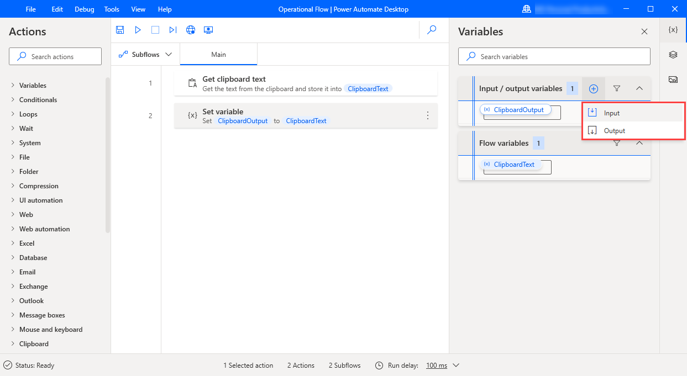
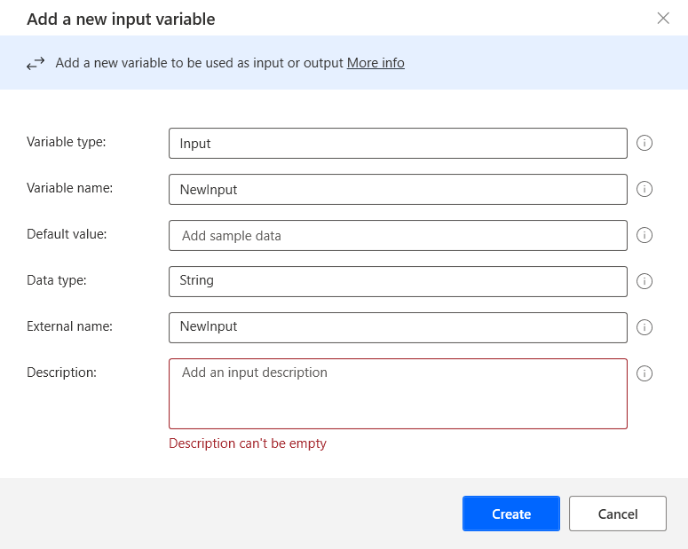

# Input and output variables

**Power Automate Desktop** enables data exchange with the **Power Automate** platform through the input and output variables.

These variables are passed to and from PAD, allowing the transfer of any data and the creation of more sophisticated flows. Ιn **Power Automate**, any input variables will be added to the UI action as fields.

To create an input or output variable, click on the **+**  button in the **Variables** pane and select the respective option.

  
In the **Edit variable** dialog, populate the following fields:
- **Variable type** — Defines if the variable is input or output.
- **Variable name** — The name of the variable in the flow.
- **Default value** — The value which the variable holds if none is assigned.
- **Data type** — The type of the variable (integer/string/datetime etc.).
- **External name** — The name used outside the flow. This is the name that will appear in Power Automate.
- **Description** — A description of the variable. This is a mandatory field and will appear in Power Automate.

