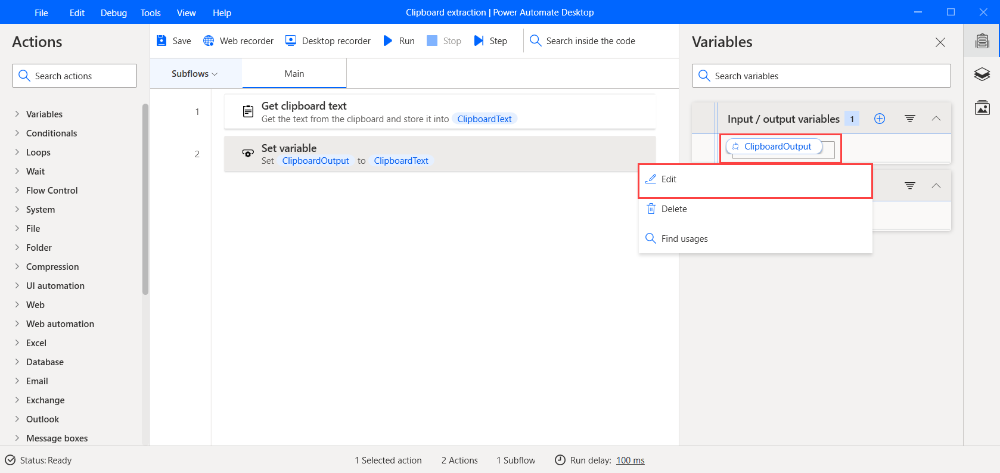
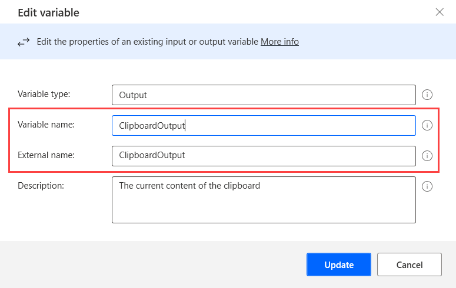

# Renaming a variable

To update the name of a flow variable, right-click on its name in the **Variables** pane and select **Rename**. The name of the variable will be updated in all its occurrences.

Although a variable's name can be updated manually through a deployed action, the name will be changed only in this specific action and not globally. 

To update the name of an input/output variable globally, right-click on its name in the **Variables** pane and select **Edit**.

In the **Edit variable** window, populate the **Variable name** and **External name** fields for the internal and external variable name, respectively. 

