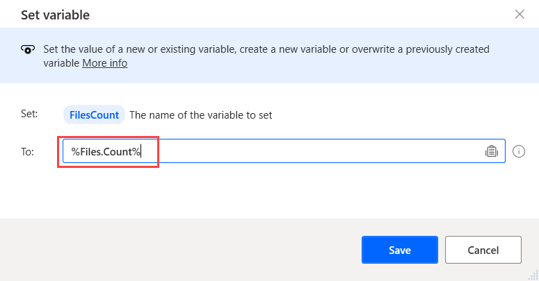

# Datatype properties

Some of the built-in data types have properties that are associated with the value stored in the variable. 

A property may contain a part of the information stored in the variable, like the day of a date, or an extra attribute describing the variable, like the size of a list.

The value of these properties can be accessed directly through the following notation: **%VariableName.PropertyName%**.

For example, if you have a list of files called **Files**, you can get the number of the stored files using the expression: **%Files.Count%**

The data types that have properties are displayed in the following lists.

## Texts
- **Length** - The length of the stored text in characters.
## Dates
- **Year** - The year part of the datetime value.
- **Month** - The month part of the datetime value.
- **Day** - The day part of the datetime value.
- **DayOfWeek** - The name of the day (Sunday, Monday etch).
- **DayOfYear** - The day of the year part of the datetime value (1-365/6).
- **Hour** - The hour part of the datetime value.
- **Minute** - The minute part of the datetime value.
- **Second** - The seconds part of the datetime value.
## Lists
- **Count** - The number of items stored into the list.
## Files
- **FullName** - The full path to the file.
- **RootPath** - The root path of the file, for example **C:\\**.
- **Directory** - The directory where the file is stored.
- **Name** - The name of the file, including the extension.
- **NameWithoutExtension** - The name of the file without its extension.
- **Extension** - The extension of the file.
- **Size** - The size of the file in bytes.
- **CreationTime** - The date when the file was created.
- **LastAccessed** - The date when the file was last accessed.
- **LastModified** - The date when the file was last modified.
- **IsHidden** - This property is true if the file is hidden or false if the file is visible.
- **IsSystem** - This property is true if the file is a system file or false if it isn't.
- **IsReadOnly** - This property is true if the file is read only or false if it isn't.
- **IsArchive** - This property is true if the file is an archive or false if it isn't.
- **Exists** - This property is true if the file exists or false if the file doesn't exist.
## Folders
- **FullName** - The full path to the folder.
- **RootPath** - The root path of the folder, for example, **C:\\**.
- **Parent** - The parent directory of the folder.
- **Name** - The name of the folder.
- **CreationTime** - The date when the folder was created.
- **LastModified** - The date when the folder was last modified.
- **IsHidden** - This property is true if the folder is hidden or false if the folder is visible.
- **Exists** - This property is true if the folder exists or false if the folder doesn't exist.
## Mail messages
- **MailFolder** - The name folder the email message is retrieved from.
- **Uid** - The unique identifier of the message.
- **From** - The sender of the email message.
- **To** - A list of values containing the recipients of the message.
- **Cc** - A list of values containing additional recipients for the message (carbon copy).
- **Date** - The date and time in which the message was sent.
- **Subject** - The subject of the message.
- **Body** - The body of the message. The body can be in plain text or in HTML form.
- **BodyText** - If the previous property contains HTML, this property contains the body of the message in plain text form.
- **Attachments** - A list of files that represent the saved attachments of the email message (if any).
## FTP files
- **FullName** - The full path to the file.
- **Directory** - The directory where the file is stored on the FTP Server.
- **Name** - The name of the file, including the extension.
- **NameWithoutExtension** - The name of the file without its extension.
- **Extension** - The extension of the file.
- **Size** - The size of the file in bytes.
- **LastModified** - The date when the file was last modified.
## FTP folders
- **FullName** - The full path to the folder.
- **Parent** - The parent directory of the folder.
- **Name** - The name of the folder.
- **LastModified** - The date when the folder was last modified.
## Data tables
- **RowsCount** - The number of rows of the data table.
- **Columns** - A list that contains the names of the columns of the data table.
## Data rows
- **ColumnsCount** - The number of columns that the data row holds.
## Custom dialog instances
- **LastButtonPressed** - The name of the button that was last pressed on the dialog.
- **DialogWasForciblyClosed** - This property is true if the dialog was closed by a close window command or by pressing the **Cancel** button, false otherwise.
- **Handle** - The handle of the Window belonging to this specific Custom Dialog.