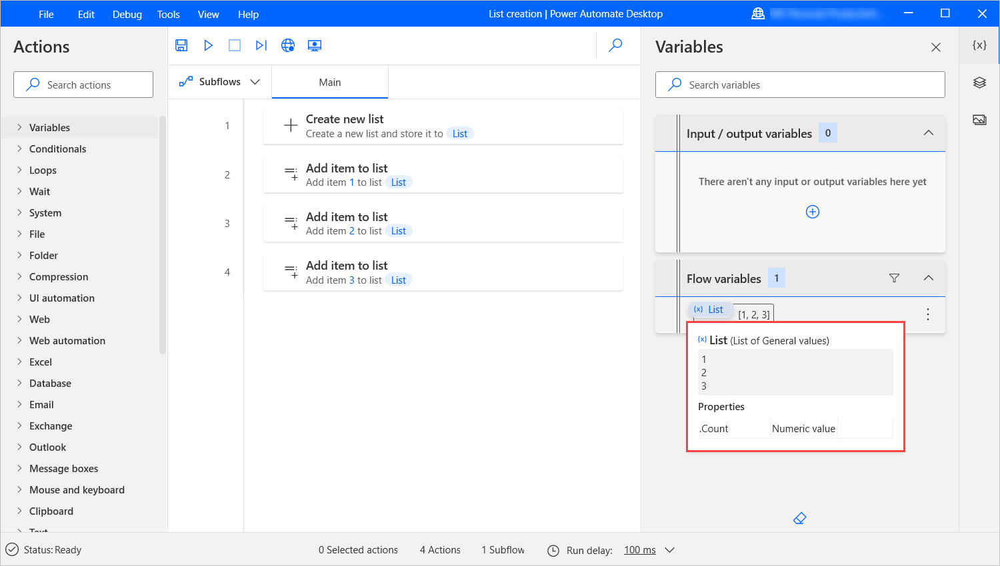
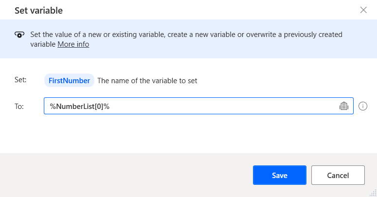

# Lists

Lists are collections of items. Depending on the types of the individual list items, there can be lists of text values, lists of numbers, lists of files, etc. The list data type is the equivalent of a single-dimension array in programming terms. 

You can create a list through the **Create new list** action and add an item to that list through the **Add item to list** action. 

You can also create a list through actions that generate lists as output. For example, the **Read text from file** action returns a list if you select to store the file’s contents as a list and **Get files in folder** action returns a list of files.

To retrieve a specific item of a list, use the following notation: **%VariableName\[ItemNumber\]%**

In the example below, the flow stores the first number of the previously displayed list to a new variable. Keep in mind that the index should be 0 for the first item of the list.

A common practice is to use a **For each** action to iterate through the items of a list.