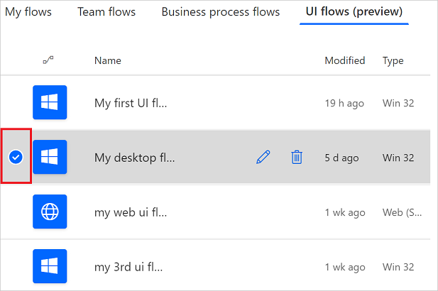
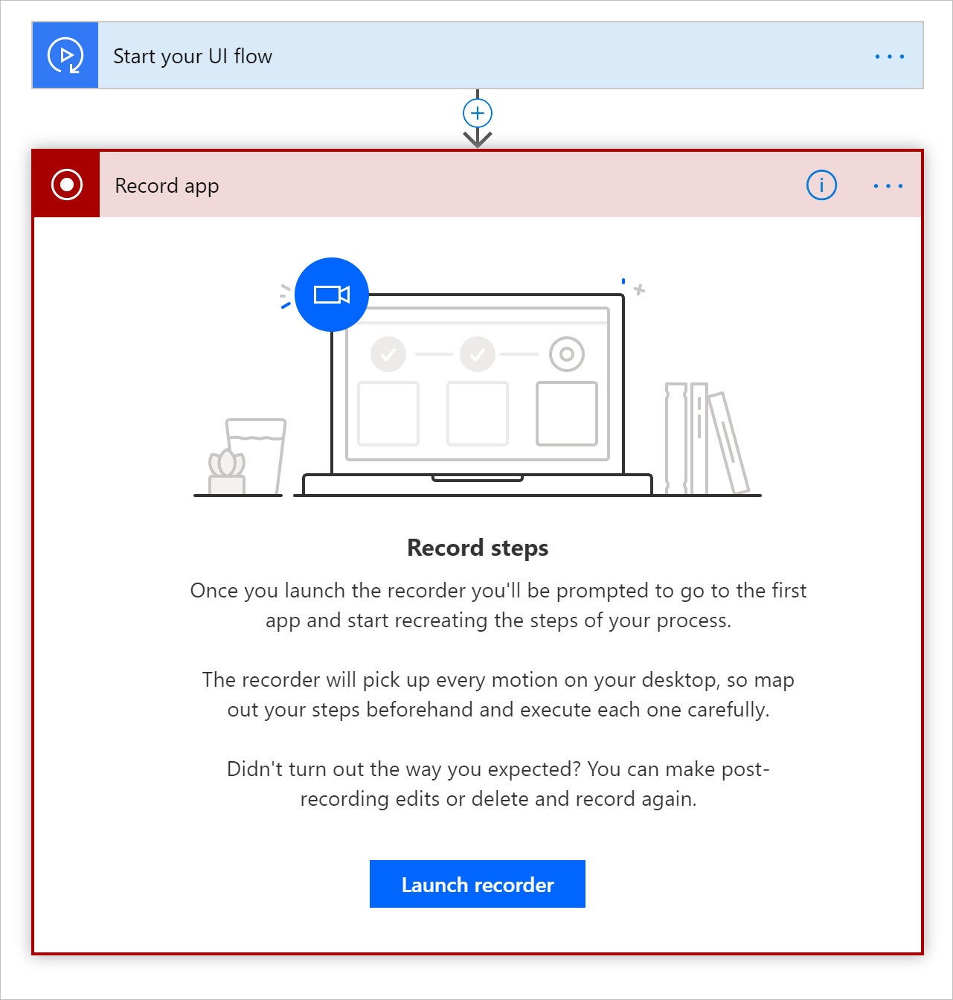
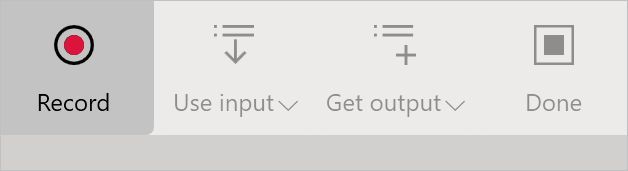

# Edit desktop UI flows

[This topic is pre-release documentation and is subject to change.]

[!INCLUDE [view-pending-approvals](../includes/cc-rebrand.md)]

Desktop UI flows automate Windows desktop applications. Please refer to the [Known issues](create-desktop.md#known-issues-and-solutions) to learn more about issues you might run into, workarounds for those issues, and scenarios that are not supported in this preview release.

## Prerequisites
A desktop UI flow. [Create a desktop UI flow now](create-desktop.md#create-and-test-desktop-ui-flows) if you don't have one to edit.

## Edit actions


You can edit your recording to:

-   Modify the value for actions that support it.
-   Delete a step.
-   Delete the entire recording.
-   Change the order of actions with drag and drop. Do exercise caution with this
    as it may break the consistency of your recording.

Advanced parameters let you change:

-  The delay after the action is performed. For example, you can add a one second delay by changing PT0S to PT1S. This can be useful when the target application has a slow response time that doesn’t complete before the next step of your UI flow.
-   The [selector](edit-desktop.md#set-the-selector) for the target user interface element.

## Add a recording

You may want to record your UI flow in multiple sessions. After you've completed your first recording you can proceed as follows:

1. Sign into [Power Automate](https://flow.microsoft.com).
1. Select **My flows** > **UI flows(preview)**.
1. Select the UI flow that you want to edit.
   
1. Select **Edit**. 
1. Select **New step**.

   

1. Select **Record app** from the list of actions.

   

1. Select **Launch recorder**.

   

   The recorder control displays at the top of your screen.

   

1. Start the app that you want to record.

     >[!TIP]
     >As your mouse hovers over controls in the app, you'll notice that a blue outline highlights each control. Always wait for the blue highlight before you select a control.
     >
     >If the blue highlight doesn't display around the element, it might not be recorded properly.

1. Select **Record** from the recorder control.

1. Perform the steps in the user interface of the app you are recording, and then select **Done** on the recorder control.
1. Select **Save**, and then test your UI flow.

## Add a manual action

Once you've recorded an application with at least one action, you can manually add
any of the following actions for that application.

| **Action**          | **Comment**                                                       |
|---------------------|-------------------------------------------------------------------|
| Close application   |                                                                   |
| Right click         |                                                                   |
| Send keys           | Send keys and key combinations, such as CTRL + C.                             |
| Left click          |                                                                   |
| Get text            | Read the text from a user interface element and then use it as an output. |
| Enter text          |                                                                   |
| Get element enabled | Check if a user interface element is enabled or disabled.         |
| Clear element       | Clear the value in an editable user interface element.             |
| Wait for seconds    | Wait before continuing to the next step.                           |

Follow these steps to add a manual action:

1. Sign into [Power Automate](https://flow.microsoft.com).
1. Select **My flows** > **UI flows(preview)**.
1. Select the UI flow that you want to edit.
   
1. Select **Edit**. 
1. Select the recording card that contains the steps to which you want to add a new step.
   The card expands and displays the recorded steps.

   

1. Select **Add an action** on the recording card, just below the last recorded step.
   You'll see the list of manual actions listed earlier in the walkthrough. 

1. Select the action you want to add. Here, I've selected **Get element enabled**, but you can select any action that makes sense for your scenario.

   

Once the action is added, you will need to set the **Selector** in the action’s
advanced options.


### Set the selector

The selector identifies the user interface element onto which the action is performed during playback. We recommend that you copy/paste this information from a separate step targeting the same user interface element, if possible.

The format of the selector is:

```json
{  
   "type":"WinUIA",
   "parameters":{  
      "elementStack":[  

      ],
      "elementXPath":""
   }
}
```

You need to provide the data for the the **elemementStack** and **elementXPath** fields of the  selector element.

Here is an example of what the **elemementStack** might look like.


You can capture the **elementXPath** using the [WinAppDriver UI
Recorder](https://blogs.windows.com/windowsdeveloper/2018/06/20/introducing-winappdriver-ui-recorder/).


Remove the first element (everything before /Window) before using the result in **elementXPath** of the selector.

Test your UI flow to confirm that your selector works correctly.


## Enable coordinate-based playback

Coordinate-based playback uses relative screen coordinate offset as a fallback that helps UI flows find target objects that the default Windows UI automation framework is unable to find during playback. 

Here are some of the reasons why the default Windows UI automation framework might not find target objects during playback:

- The legacy application that you're automating might not use  programming technologies that support the Windows UI automation framework.
- The application or its controls may not have a unique UI automation XPath, name, or IDs. 
- The application has dynamic controls whose names or IDs could change. 
- The application has controls that do not have names, IDs, unique identifiers, etc.

>[!TIP]
>Use the same resolution and maximize the target application during recording to improve the accuracy of coordinate-based playback.

Follow these steps after you've recorded a UI flow script:

1. Expand the step that launches or attaches the application.
   
   This is usually the first step of the recording script.
1. Select **Show advanced options**.
1. Find **Use coordinate playback** properties.
1. Select **Yes** from the list to enable coordinate-based playback.

>[!TIP]
> You can enable or disable **Use coordinate playback** for each application to apply the setting to all steps performed on that application.  


>[!WARNING]
>With coordinate-based playback, the automation may select controls that are not part of the target application due to a variety of reasons, for example, when the UI of the target applications changes dramatically.


## Next steps

- Learn how to [run the UI flow](run-ui-flow.md) you just edited.

- If you want to do more with UI flows, you can also try out UI flows with [input and output](inputs-outputs-web.md) parameters.

