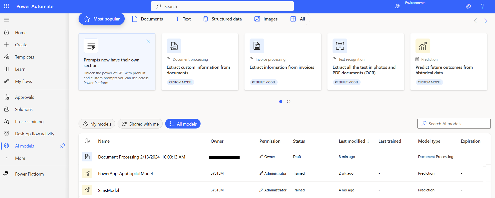

# Use AI Builder in Power Automate

AI Builder is a new Microsoft Power Platform capability that enables you to add intelligence to your automated processes, predict outcomes, and help improve business performance. AI Builder is a turnkey solution that brings the power of Microsoft AI through a point-and-click experience and is directly integrated into Power Apps and Power Automate. More information: [What is AI Builder?](/ai-builder/)

You can build AI models by using the **AI Builder** option from the left navigation pane of [Power Automate](https://flow.microsoft.com). More information: [AI model types](/ai-builder/model-types)

Use your AI Builder models in your flows to add intelligence to your organization. More information: [Use AI Builder in Power Automate](/ai-builder/use-in-flow-overview)

[!INCLUDE[footer-include](includes/footer-banner.md)]