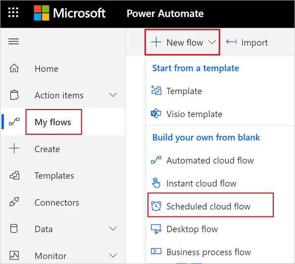
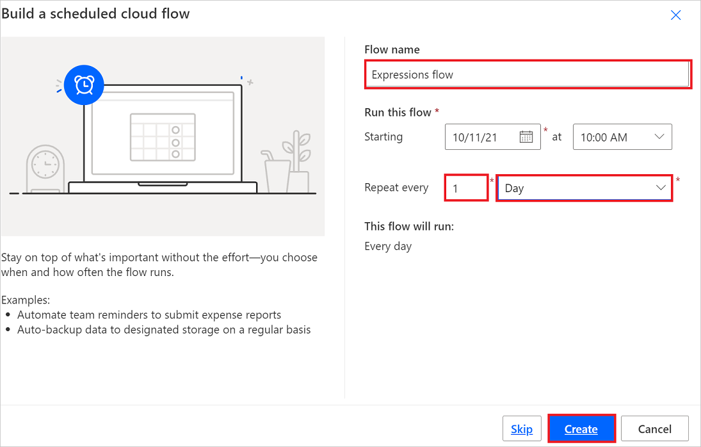
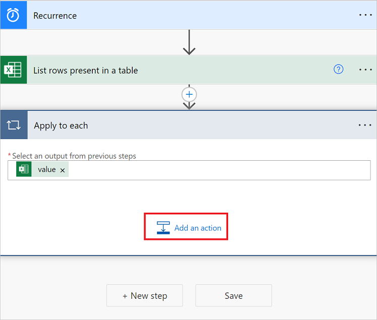

# Use expressions in conditions to check multiple values

In this walkthrough, you'll learn to use expressions and **Conditions** to compare multiple values in **Advanced mode**.

When you create a cloud flow, you can use the [**Condition**](add-condition.md#add-a-condition) card in basic mode to quickly compare a single value with another value. However, there're times when you need to compare multiple values. For example, you may want to check the value of a few columns in a spreadsheet or database table.

You can use any combination of the following logical expressions in your conditions.

Expression|Description|Example
--------|-----------|-------
|[and](#use-the-and-expression)|Takes two arguments and returns true if both values are true.<br><b>Note</b>: Both arguments must be Booleans.|This expression returns false: <br>and(greater(1,10),equals(0,0))
|[or](#use-the-or-expression)|Takes two arguments and returns true if either argument is true. <br><b>Note</b>: Both arguments must be Booleans.|This expression returns true:<br>or(greater(1,10),equals(0,0))
|equals|Returns true if two values are equal.|For example, if parameter1 is someValue, this expression returns true:<br>equals(parameters('parameter1'), 'someValue')
|[less](#use-the-less-expression)|Takes two arguments and returns true if the first argument is less than the second argument. <br><b>Note</b>: The supported types are integer, float, and string.|This expression returns true:<br>less(10,100)
|lessOrEquals|Takes two arguments and returns true if the first argument is less than or equal to the second argument. <br><b>Note</b>: The supported types are integer, float, and string.|This expression returns true:<br>lessOrEquals(10,10)
|[greater](#use-the-greater-expression)|Takes two arguments and returns true if the first argument is greater than the second argument. <br><b>Note</b>: The supported types are integer, float, and string.|This expression returns false:<br>greater(10,10)
|greaterOrEquals|Takes two arguments and returns true if the first argument is greater than or equal to the second argument. <br><b>Note</b>: The supported types are integer, float, and string.|This expression returns false:<br>greaterOrEquals(10,100)
|[empty](#use-the-empty-expression)|Returns true if the object, array, or string is empty.|This expression returns true:<br>empty('')
|not|Returns the opposite of a boolean value. |This expression returns true:<br>not(contains('200 Success','Fail'))
|if|Returns a specific value if the expression results in true or false.|This expression returns "yes":<br>if(equals(1, 1), 'yes', 'no')

## Prerequisites

Here's what you'll need to complete this walkthrough.

* Access to Power Automate.
* Your own spreadsheet with the tables described later in this walkthrough. Be sure to save your spreadsheet in a location such as Dropbox or Microsoft OneDrive so that Power Automate can access it.
* Microsoft 365 Outlook (While we use Outlook here, you can use any supported email service in your flows.)

## Use the or expression

Sometimes your workflow needs to take an action if the value of an item is valueA **or** valueB. For example, you may be tracking the status of tasks in a spreadsheet table. Assume that the table has a column named *Status* and the possible values in the *Status* column are:

* **completed**
* **blocked**
* **unnecessary**
* **not started**

Here's an example of what the spreadsheet might look like:


Given the preceding spreadsheet, you want to use Power Automate to remove all rows with a *Status* column that's set to *completed* or *unnecessary*.

Let's create the flow.

### Start with a blank flow

1. Sign into [Power Automate](https://flow.microsoft.com).

    

1. Select **My flows**.

    
1. Select **New flow** > **Scheduled cloud flow**.

    

### Add a trigger to your flow

1. Give your flow a name.

1. Set the schedule to run the flow once daily.

1. Select the **Create** button to move on to the next step.

    


### Select the spreadsheet and get all rows

1. Select **New step**.

    
1. Search for **rows**, and then select **Excel Online (Business)**.

    Note: Select the "get a row" action that corresponds to the spreadsheet that you're using. For example, if you're using Google Sheets, select **Google Sheets - Get rows**.

1. Select the **List rows present in a table** action.

    

1. Select the **Location**, **Document Library**, **File**, and **Table** that contains your data.

    

### Check the status column of each row

1. Select **New step**.

1. Search for **apply to each**, and then select the **Apply to each** control.

    

1. Add the **Value** token to the **Select an output from previous steps** box.

   This **value** token represents the spreadsheet table and all of its data.

    

1. Select **Add an action** on the **Apply to each** card.

   

1. Search for **condition**, and then select the **Condition** control.

1. Add the following **or** expression. This **or** expression checks the value of each row in the table. If the value of the **status** column is *completed* **or** *unnecessary*, the **or** expression evaluates to "true".

    Your **Condition** card resembles this image:

    

### Delete matching rows from the spreadsheet

1. Select **Add an action** on the **If yes** branch of the condition.

    The **If yes** branch runs if the **or** condition evaluates to **true**.

1. Search for **Delete a row**, select **Excel Online (Business)**, and then select **Delete a row**.

    

1. On the **Delete a row** card, set the **Location**, **Document Library**, **File**, and **Table** boxes exactly as you set these boxes on the **List rows present in a table** card earlier in this walkthrough. 

1. Select **_PowerAppsId_** in the **Key Column** list, and then insert the **_PowerAppsId_** dynamic value into the **Key Value** box.

    

1. Be sure to save your flow!

### Run the flow with the or expression

The flow runs after you save it. If you created the spreadsheet shown earlier in this walkthrough, here's what the it looks like after the run completes:


Notice all data from rows that had "completed" or "unnecessary" in the **Status** column were deleted.

## Use the and expression

Assume you have a spreadsheet table with two columns. The column names are Status and Assigned. Assume also that you want to delete all rows if the Status column's value is "blocked" and the Assigned column's value is "John Wonder".  To accomplish this task, follow all steps earlier in this walkthrough, however, when you edit the **Condition** card in advanced mode, use the **and** expression shown here:

````@and(equals(item()?['Status'], 'blocked'), equals(item()?['Assigned'], 'John Wonder'))````

Your **Condition** card resembles this image:


### Run the flow with the and expression
If you followed along, your spreadsheet resembles this image:


After your flow runs, your spreadsheet resembles this image:


## Use the empty expression
Notice that there are several empty rows in the spreadsheet now. To remove them, use the **empty** expression to identify all rows that don't have any text in the Assigned and Status columns.

To accomplish this task, follow all steps listed in **Use the and expression** section earlier in this walkthrough, however, when you edit the **Condition** card in advanced mode, use the empty expression this way:

````@and(empty(item()?['Status']), empty(item()?['Assigned']))````

Your **Condition** card resembles this image:


After your flow runs, the spreadsheet resembles this image:


Notice extra lines are removed from the table.

## Use the greater expression
Imagine you've bought baseball tickets for your coworkers and you're using a spreadsheet to ensure you're reimbursed by each person. You can quickly create a cloud flow that sends a daily email to each person who hasn't paid the full amount.

Use the **greater** expression to identify the employees who haven't paid the full amount. You can then automatically send a friendly reminder email to those who haven't paid in full.

Here's a view of the spreadsheet:


Here's the implementation of the **greater** expression that identifies all persons who have paid less than the amount due from them:

````@greater(item()?['Due'], item()?['Paid'])````

## Use the less expression
Imagine you've bought baseball tickets for your coworkers, and you're using a spreadsheet to ensure you're reimbursed by each person by the date to which everyone agreed. You can create a cloud flow that sends a reminder email to each person who hasn't paid the full amount if the current date is less than one day before the due date.

Use the **and** expression along with the **less** expression since there are two conditions being validated:


|          Condition to validate          | expression to use |                    Example                     |
|-----------------------------------------|-------------------|------------------------------------------------|
|   Has the full amount due been paid?    |      greater      |   @greater(item()?['Due'], item()?['Paid'])    |
| Is the due date less than one day away? |       less        | @less(item()?['DueDate'], addDays(utcNow(),1)) |

## Combine the greater and less expressions in an and expression
Use the **greater** expression to identify the employees who have paid less than the full amount due and use the **less** expression to determine if the payment due date is less than one day away from the current date. You can then the **Send an email** action to send friendly reminder email to those who haven't paid in full and the due date is less than one day away.

Here's a view of the spreadsheet table:


Here's the implementation of the **and** expression that identifies all persons who have paid less than the amount due from them and the due date is less than one day away from the current date:

````@and(greater(item()?['Due'], item()?['Paid']), less(item()?['dueDate'], addDays(utcNow(),1)))````

## Use functions in expressions

Some expressions get their values from runtime actions that might not yet exist when a cloud flow starts to run. To reference or work with these values in expressions, you can use functions that the Workflow Definition Language provides. More information: [Functions reference for Workflow Definition Language in Power Automate](/azure/logic-apps/workflow-definition-language-functions-reference)


[!INCLUDE[footer-include](includes/footer-banner.md)]