# Use expressions in conditions to check multiple values

In this walkthrough, you'll learn to use expressions and **Conditions** to compare multiple values in **expression function**.

When you create a cloud flow, you can use the [**Condition**](add-condition.md#add-a-condition) card in basic mode to quickly compare a single value with another value. However, there're times when you need to compare multiple values. For example, you may want to check the value of a few columns in a spreadsheet or database table.

You can use any combination of the following logical expressions in your conditions.

Expression|Description|Example
--------|-----------|-------
|[and](#use-the-and-expression)|Takes two arguments and returns true if both values are true.<br><b>Note</b>: Both arguments must be Booleans.|This expression returns false: <br>and(greater(1,10),equals(0,0))
|[or](#use-the-or-expression)|Takes two arguments and returns true if either argument is true. <br><b>Note</b>: Both arguments must be Booleans.|This expression returns true:<br>or(greater(1,10),equals(0,0))
|equals|Returns true if two values are equal.|For example, if parameter1 is someValue, this expression returns true:<br>equals(parameters('parameter1'), 'someValue')
|[less](#use-the-less-expression)|Takes two arguments and returns true if the first argument is less than the second argument. <br><b>Note</b>: The supported types are integer, float, and string.|This expression returns true:<br>less(10,100)
|lessOrEquals|Takes two arguments and returns true if the first argument is less than or equal to the second argument. <br><b>Note</b>: The supported types are integer, float, and string.|This expression returns true:<br>lessOrEquals(10,10)
|[greater](#use-the-greater-expression)|Takes two arguments and returns true if the first argument is greater than the second argument. <br><b>Note</b>: The supported types are integer, float, and string.|This expression returns false:<br>greater(10,10)
|greaterOrEquals|Takes two arguments and returns true if the first argument is greater than or equal to the second argument. <br><b>Note</b>: The supported types are integer, float, and string.|This expression returns false:<br>greaterOrEquals(10,100)
|[empty](#use-the-empty-expression)|Returns true if the object, array, or string is empty.|This expression returns true:<br>empty('')
|not|Returns the opposite of a boolean value. |This expression returns true:<br>not(contains('200 Success','Fail'))
|if|Returns a specific value if the expression results in true or false.|This expression returns "yes":<br>if(equals(1, 1), 'yes', 'no')

## Prerequisites
* Access to Power Automate.
* A spreadsheet with the tables described later in this walkthrough. Be sure to save your spreadsheet in a location such as Dropbox or Microsoft OneDrive so that Power Automate can access it.
* Microsoft Office 365 Outlook (While we use Office 365 Outlook, you can use any supported email service in your flows.)

## Use the or expression
Sometimes your workflow needs to take an action if the value of an item is valueA **or** valueB. For example, you may be tracking the status of tasks in a spreadsheet table. Assume that the table has a column named *Status* and the possible values in the *Status* column are:

* **Completed**
* **Blocked**
* **Unnecessary**
* **Not started**

Here's an example of what the spreadsheet might look like:

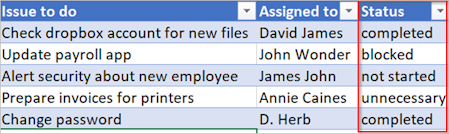

Given the preceding spreadsheet, you want to use Power Automate to remove all rows/excel records for below conditions: 
* *Status* column that's set to *completed* or *unnecessary*.
* Remove all the *empty* rows.
* Delete all rows where the *Status* column's value is *Blocked* and the *Assigned* column's value is *John Wonder*.

Let's create the flow.

### Start with a Scheduled cloud flow
1. Sign into [Power Automate](https://flow.microsoft.com).

    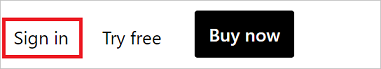
1. Select the **My flows** tab from left menu.

    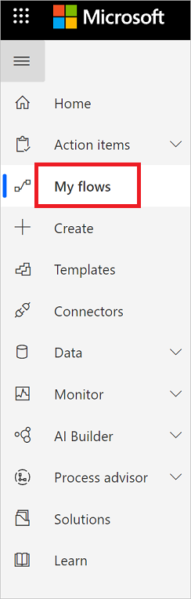
1. Select **New** > Click on **Scheduled cloud flow**.
    

### Add a trigger to your flow
1. Give your flow a name. Specify when your flow should start by editing **Starting** boxes, and specify the flow's recurrence by editing **Repeat every** boxes, Select 1 as Interval, Day as frequency then click on **Create**.

    
1. Verify schedule run.

    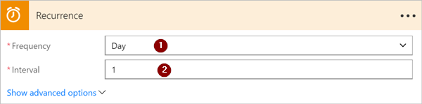

### Select the spreadsheet and get all rows
1. Select **New step** > In the **Choose an action** box enter **excel** in the **Search connectors and actions** field and then select **Excel Online(Business)**.

    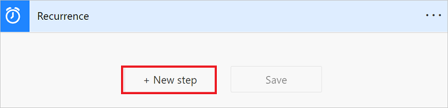
1. Search for **rows** in the field and then select **Excel - List rows present in a table**.
   Select the **Location** and **Document Library** from the dropdown list.
	 Select the folder icon in the **File name** box, browse to, and then select the spreadsheet that contains your data.
	 Select the table that contains your data from the **Table name** list.
   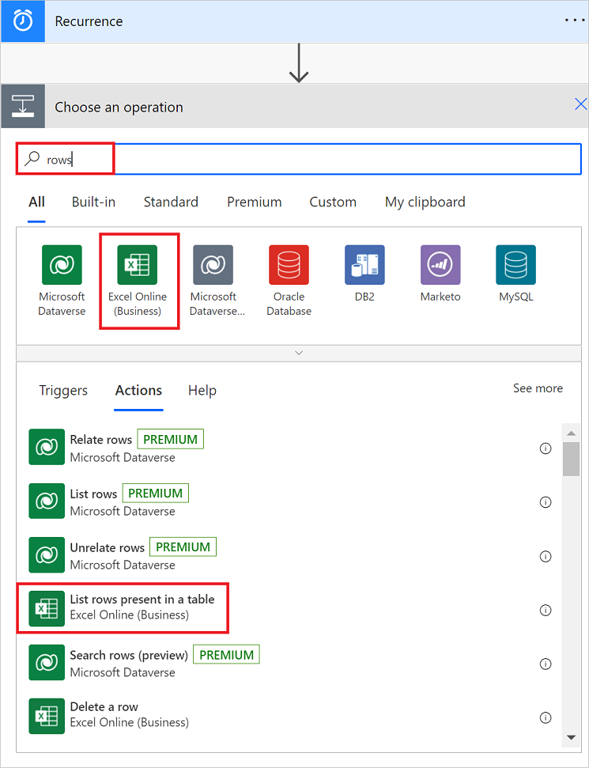

    Note: Select the "get rows" action that corresponds to the spreadsheet that you're using. For example, if you're using **Google Sheets**, select **Google Sheets - Get rows**.  

### Check the status column of each row using Apply to each control action
1. Select **New step** > In the **Choose an action** box enter **Apply to each** in the **Search connectors and actions** and then select **Apply to each control** action.

    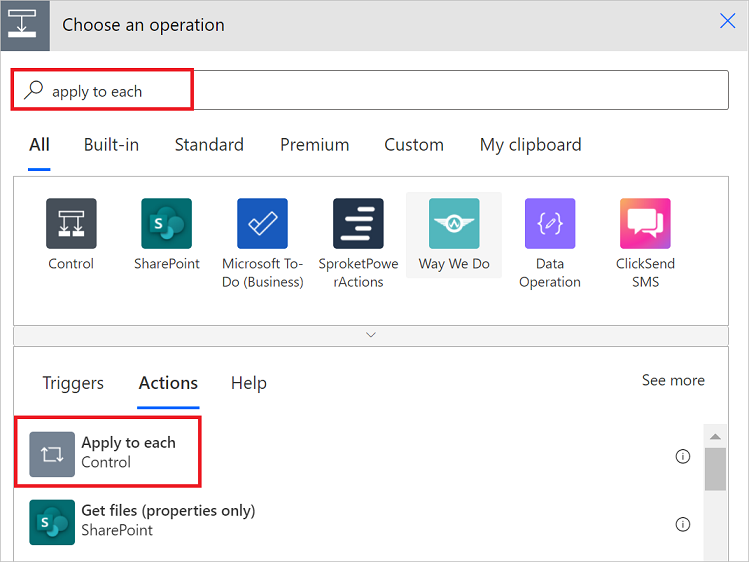
1. Add the **Value** token to the **Select an output from previous steps** box.

    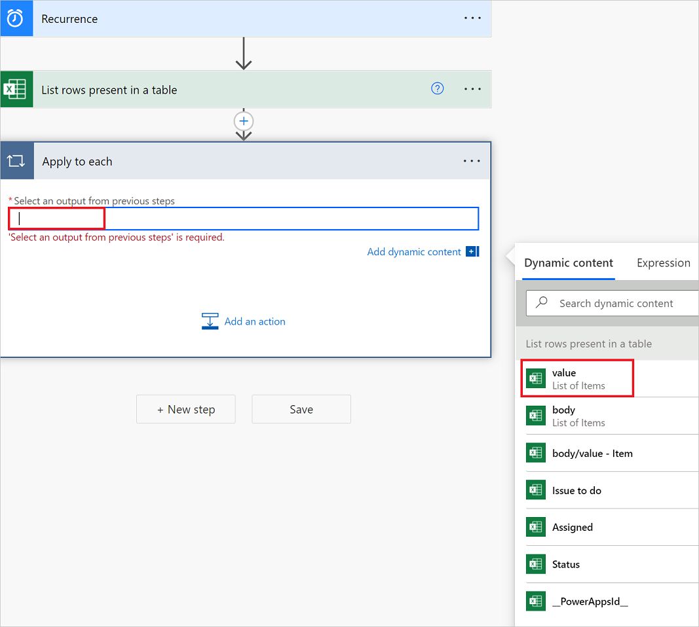
1. Click on **Add an action** button in the **Apply to each control**  action > then in the **Choose an action** box enter **condition** in the **Search connectors and actions** box and select **Condition as an action**.

1. As per scenario add the expression in condition below scenarion one by one.

    * Add the following **or** expression. This **or** expression checks the value of each row in the table (a row is known as an item when accessed in a expression). If the value of the **status** column is *completed* **or** *unnecessary*, the **or** expression evaluates to "true".

      The **or** expression appears as shown here:
       
       bool(or(equals(items('Apply_to_each')?['Status'], 'Unnecessary'), equals(items('Apply_to_each')?['Status'], 'Completed')))
      Output of the above expression is Boolean value so that can compare in the condition e.g. bool(‘true’)
      
    *  Assume also that you want to delete all rows if the Status column's value is "blocked" and the Assigned column's value is "John Wonder". To accomplish this task, use the and expression shown here:
    
        bool(and(equals(item('Apply_to_each')?['Status'], 'blocked'), equals(item('Apply_to_each')?['Assigned'], 'John Wonder')))
        Output of the above expression is Boolean value so that can compare in the condition e.g. bool(‘true’)


    * There are several empty rows in the spreadsheet now. To remove them, Assuming you wanted to remove empty by useing the empty expression. empty expression will  to identify all rows that don't have any text in the Assigned and Status columns. To accomplish this task, use the and expression shown here:
     bool(and(empty(item('Apply_to_each')?['Status']), empty(item('Apply_to_each')?['Assigned'])))
     Output of the above expression is Boolean value so that can compare in the condition e.g. bool(‘true’)
     
     * For this scenario we have created nested expression: 
         Bool(or(or(equals(item()?['status'], 'unnecessary'), equals(item()?['status'], 'completed')),or(and(equals(item('Apply_to_each')?['Status'], 'blocked'),  
         equals(item('Apply_to_each')?['Assigned'], 'John Wonder')), and(empty(item('Apply_to_each')?['Status']), empty(item('Apply_to_each')?['Assigned'])))))


    Your **Condition** card resembles this image:

    

### Delete matching rows from the spreadsheet using - Delete a row action
1. If condition matches then Select **Add an action** on the **YES** branch condition.
1. Search for **Delete a row** and then select **Delete a row**.

    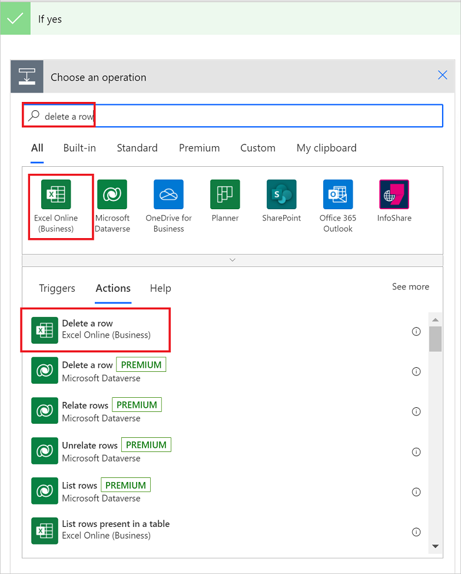
1. In the **File name** box, search for, and select the spreadsheet file that contains the data you want to delete.
   In the **Table name** list, select the table that contains your data.
   
   In **Key Value** click on  **Add a dynamic value** and then select “RowNo” from the “List rows present in a table”.

    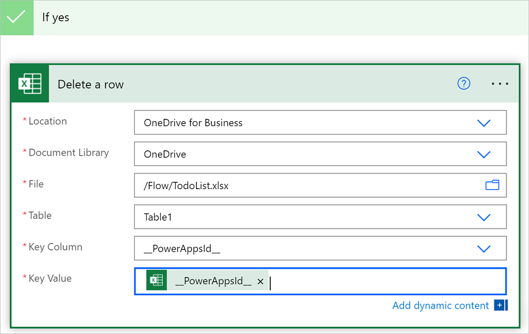

### Save the flow
1. Click on the **Save** button in the bottom of the screen.

    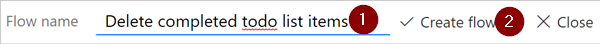

### Run the flow with the or expression
The flow runs after you save it. If you created the spreadsheet shown earlier in this walkthrough, here's what the it looks like after the run completes:

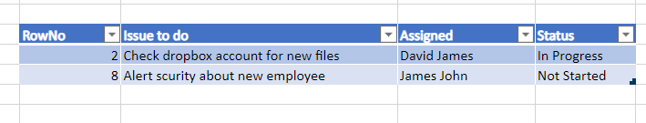

Notice all data from rows that had all the three scenario listed above were deleted in **Excel online sheet**.

## Use the greater expression
Imagine you've bought baseball tickets for your coworkers and you're using a spreadsheet to ensure you're reimbursed by each person. You can quickly create a cloud flow that sends a daily email to each person who hasn't paid the full amount.

Use the **greater** expression to identify the employees who haven't paid the full amount. You can then automatically send a friendly reminder email to those who haven't paid in full.

Here's a view of the spreadsheet:


Here's the implementation of the **greater** expression that identifies all persons who have paid less than the amount due from them:

````@greater(item()?['Due'], item()?['Paid'])````

## Use the less expression
Imagine you've bought baseball tickets for your coworkers, and you're using a spreadsheet to ensure you're reimbursed by each person by the date to which everyone agreed. You can create a cloud flow that sends a reminder email to each person who hasn't paid the full amount if the current date is less than one day before the due date.

Use the **and** expression along with the **less** expression since there are two conditions being validated:


|          Condition to validate          | expression to use |                    Example                     |
|-----------------------------------------|-------------------|------------------------------------------------|
|   Has the full amount due been paid?    |      greater      |   @greater(item()?['Due'], item()?['Paid'])    |
| Is the due date less than one day away? |       less        | @less(item()?['DueDate'], addDays(utcNow(),1)) |

## Combine the greater and less expressions in an and expression
Use the **greater** expression to identify the employees who have paid less than the full amount due and use the **less** expression to determine if the payment due date is less than one day away from the current date. You can then the **Send an email** action to send friendly reminder email to those who haven't paid in full and the due date is less than one day away.

Here's a view of the spreadsheet table:

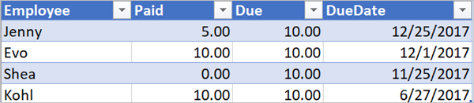

Here's the implementation of the **and** expression that identifies all persons who have paid less than the amount due from them and the due date is less than one day away from the current date:

````@and(greater(item()?['Due'], item()?['Paid']), less(item()?['dueDate'], addDays(utcNow(),1)))````

## Use functions in expressions

Some expressions get their values from runtime actions that might not yet exist when a cloud flow starts to run. To reference or work with these values in expressions, you can use functions that the Workflow Definition Language provides. More information: [Functions reference for Workflow Definition Language in Power Automate](https://docs.microsoft.com/azure/logic-apps/workflow-definition-language-functions-reference)
