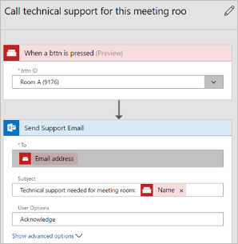
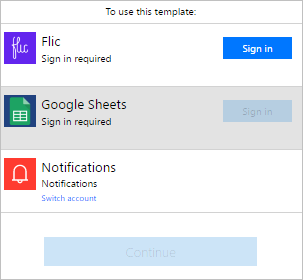
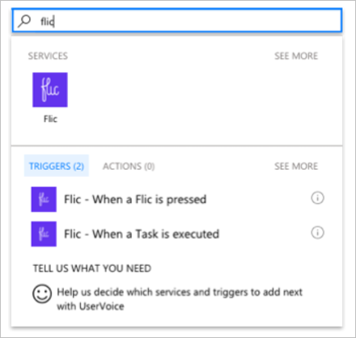

<properties
    pageTitle="Start button flows with physical buttons | Microsoft Flow"
    description="Start button flows with physical buttons from bttn and Flic."
    services=""
    suite="flow"
    documentationCenter="na"
    authors="msftman"
    manager="anneta"
    editor=""
    tags=""/>

<tags
   ms.service="flow"
   ms.devlang="na"
   ms.topic="article"
   ms.tgt_pltfrm="na"
   ms.workload="na"
   ms.date="04/24/2017"
   ms.author="deonhe"/>

# Start button flows with physical buttons

It's easy to trigger Microsoft Flow buttons from the Microsoft Flow mobile app on [Android](https://aka.ms/flowmobiledocsandroid) and [iOS](https://aka.ms/flowmobiledocsios), or from [Microsoft Flow](https://flow.microsoft.com).

We've now added new triggers that allow you to create flows that can be triggered by touching a physical button. That's right, you can call your helpdesk, send an email to your team, block your calendar, or reorder supplies by pressing a physical button that executes a flow. Currently, Microsoft Flow partners with [Bttn by The Button Corporation](https://my.bt.tn/) (bttn) and [Flic by Shortcut Labs](https://flic.io/) (flic), two of the leading physical button manufacturers. Visit their websites to learn more about their products, and then integrate your physical buttons with your button flows.

## Prerequisites

To use physical buttons with Microsoft Flow, you must have:

- Access to [Microsoft Flow](https://flow.microsoft.com).

- Access to [bttn](https://my.bt.tn/) or [Flic](https://flic.io/).

- [Registered](https://my.bt.tn/) one or more bttns on bttn's website, or

- Paired one or more Flic buttons by using Flic's [Android](https://play.google.com/store/apps/details?id=io.flic.app) or [iOS](https://itunes.apple.com/us/app/flic-app/id977593793?ls=1&mt=8) mobile app.

Note: Configure your physical buttons by following the manufacturer's instructions, and then create flows that use the bttn or flic triggers.

## Create a flow that uses a bttn physical button

In this walk-through, we use a helpdesk template to create a flow that's triggered by a single touch of a [bttn](https://my.bt.tn/). When the flow triggers, it generates a support request to the helpdesk. The support request provides the helpdesk with location information about the room where help is needed.

Note: While we use a preconfigured template in this walk-through, you are free to use the blank template, which gives you full control over all aspects of your flow.

This screenshot displays some of the bttn templates that are available for you to get started quickly building flows for your bttn. Templates are available for your flows to easily connect to Zendesk, Google, and SharePoint, among others:

>[AZURE.NOTE]Configure all bttn properties, including name, location, email address, and so on, on the [bttn website](https://my.bt.tn/) before you create your flow.

For the purposes of this walkthrough, give your bttn a name that represents a conference room in a typical office building.

The settings for your bttn should resemble this screenshot (from the bttn website):

Now that you've registered and configured your bttn, let's get started creating our flow.

1. Sign into [Microsoft Flow](https://flow.microsoft.com).

     

     Note: Alternatively, you can create your flow from the Microsoft Flow mobile app, which is available on Android, iOS and Windows Phone (Beta).

1. Enter **bttn** into the search box, and then select the search icon.

   After you select the search icon, all templates that use bttn are displayed.

   

1. Select a template.

   Here, I have selected the **Use Bttn to call technical support for meeting room** template.

   

1. Provide your credentials for the services that your selected template uses.

     

     Provide valid credentials to connect to the Office 365 Outlook and the bttn services to use this template.

1. Enter **bttn** into the search box, and then select the **bttn - When a bttn is pressed** trigger.

     

1. Select the **bttn ID** list, and then select the **bttn ID** you want to use from the **When a bttn is pressed** card.

     

1. Your flow should now resemble this screenshot.

     

1. Press the button on your bttn.

1. View your flow's run history to confirm that it ran successfully. You can check history on the Microsoft Flow website or on your mobile device.

## Create a flow that uses a flic physical button

In this walkthrough, we use a [Flic by Shortcut Labs](https://flic.io/) (flic) physical button to track the amount of time a consultant spends at each client. The consultant will need to push the button when she arrives, and then when she leaves a client. The flow gets triggered with each push of the button, and then saves the time information in Google Sheets. ******************

Note: While we use a preconfigured template in this walk-through, you are free to use the blank template, which gives you full control over all aspects of your flow.

This screenshot displays some of the flic templates that are available for you to get started quickly building flows to use with flic buttons.

### Configure Flic button properties

Configure all flic button properties by using flic's mobile app for [Android](https://play.google.com/store/apps/details?id=io.flic.app) or [iOS](https://itunes.apple.com/us/app/flic-app/id977593793?ls=1&mt=8) before you create your flow.

You can program Flic buttons for clicks, double-clicks, and hold. This screenshot shows a sample of what your Flic configuration process might be like:

Ater you've configured the properties for a flic button, you can access your registered Flics by signing into the Flic service through [Microsoft Flow](https://flow.microsoft.com).

## Create a flow that uses Flic buttons

Now that you've registered and configured your flic, let's get started creating our flow.

1. Sign into [Microsoft Flow](https://flow.microsoft.com).

     

1. Enter **flic** into the search box, and then select the search icon.

     

1. Select the **Track your working hours with Flic smart button** template.

     

1. Review the template's details, and then create a Google Sheet with a **ClickType** column, and a **Timestamp** column.

   

     You will use this Google Sheet later in this walkthrough.

    You name columns in Google Sheets by entering the column name at the top of the column. So, your Google Sheet should appear like this:

    

1. Provide your credentials for the services that your selected template uses, and then select **Continue**.

     **Continue** is enabled after you sign into all required services for the template.

     

1. Enter **flic** into the search box, and then select the **Flic - When a Flic is pressed** trigger.

     

1. Select the Flic you want to use in the flow from the **Flic button** list on the **Flic - When a Flic is pressed** card.

     

   On the **Insert row** card:

1. Select the Google Sheet you created earlier from the **File** list.

1. Select the worksheet from the **Worksheet** list.

   Note: Two boxes will appear on the **Insert row** card after you select the worksheet. These boxes represent each of the two columns in the Google Sheet you created earlier.

1. Select the **ClickType** box, and then enter select the **Click type** token.

1. Select the **Timestamp** box, and then enter select the **Click time** token.

     

1. Confirm that the **Send me an email notification** card looks like this screenshot.

     

Congrats, you've configure your flic successfully.

For extra credit, consider extending the flow to automatically record your location (latitude and longitude) when the Flic button is pressed.

## More information

- [Share button flows](./share-buttons.md)
- Learn to use [button trigger tokens](./introduction-to-button-trigger-tokens.md) to send real-time data when your button flows are executed
- [Install the Flow app for Android](https://play.google.com/store/apps/details?id=com.microsoft.flow)
- [Install the Flow app for iOS](https://appsto.re/us/5M0qbb.i)
