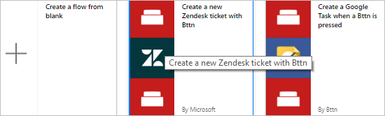
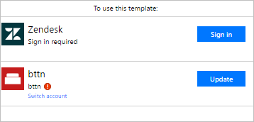
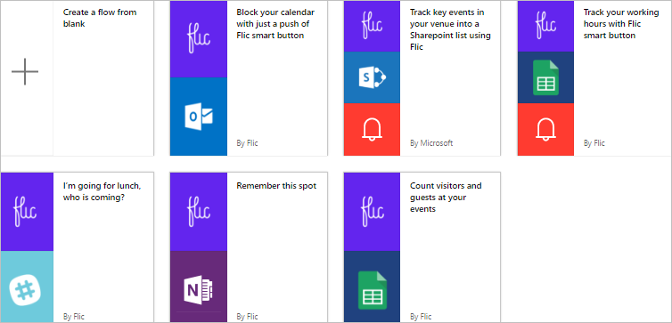

<properties
    pageTitle="Start button flows with physical buttons | Microsoft Flow"
    description="Start button flows with physical buttons from bttn and Flic."
    services=""
    suite="flow"
    documentationCenter="na"
    authors="msftman"
    manager="anneta"
    editor=""
    tags=""/>

<tags
   ms.service="flow"
   ms.devlang="na"
   ms.topic="article"
   ms.tgt_pltfrm="na"
   ms.workload="na"
   ms.date="04/24/2017"
   ms.author="deonhe"/>

# dfdd

## Start button flows with physical buttons

It's easy to trigger Microsoft Flow buttons from the Microsoft Flow mobile app on [Android](https://play.google.com/store/apps/details?id=com.microsoft.flow) and [iOS](https://appsto.re/us/5M0qbb.i), or from [Microsoft Flow](https://flow.microsoft.com). Now, you can also trigger your flows by touching a physical button. That's right, you can call your helpdesk, send an email to your team, block your calendar, reorder supplies, or even order a pizza, by pressing a physical button that executes a flow. Any button flow can be launched using a physical button from one of the two leading physical button manufacturers. Currently, Microsoft Flow partners with [bttn](https://my.bt.tn/) and [Flic](https://flic.io/), two of the leading physical button manufacturers. Visit their websites to learn more about their products, and then integrate your phsical buttons with your button flows.

## Prerequisites

To use physical buttons with Microsoft Flow, you must have:

- Access to [Microsoft Flow](https://flow.microsoft.com).

- Access to [bttn](https://my.bt.tn/) or [Flic](https://flic.io/)

- Registered one or more physical buttons on [bttn](https://my.bt.tn/) or [Flic](https://flic.io/).

Note: You must register your physical buttons and follow the instructions provided by the physical button's manufacturer before you can create flows that use the connectors from bttn and flic.

<!ADI: mainly shows the relevant connectors and refers to the partner website (bttn) and app (Flic).->

## Available Connectors

## Create a flow that uses a bttn physical button

Create flows that integrate with bttn physical buttons by using an existing template or the blank template:

1. Sign into [Microsoft Flow](https://flow.microsoft.com).

     

1. Enter **bttn** into the search box, and then select the search icon.

   After you select the search icon, all templates that use bttn are displayed.

   

1. Select a template to create your flow.

   Here, I have selected the Zendesk template

   

1. Provide your credentials for the services that your selected template uses.

     

   For example, you must provide valid credentails to connect to the Zendesk service.

   

1. Configure your flow by adding triggers, actions, and conditions as you would when you create any other flow. You can learn all about button flows here.

1. More stuff **blah blah ..I need to be able to register a button in order to see what comes next exactly.*************************

## Create a flow that uses a flic physical button

Create flows that integrate with flic physical buttons by using an existing template or the blank template:

     

1. Sign into [Microsoft Flow](https://flow.microsoft.com).

     

1. Enter **flic** into the search box.

     

1. Select a template to create your flow.

     

1. Provide your credentials for the services that your selected template uses.

For example, if you select a template that uses Zendesk, you must provide valid credentails to connect to the Zendesk service.

     

1. Configure your flow by adding triggers, actions, and conditions as you would when you create any other flow.

1. More stuff **blah blah ..I need to be able to register a button in order to see what comes next exactly.*************************

## More information

- [Share button flows](./share-buttons.md)
- Learn to use [button trigger tokens](./introduction-to-button-trigger-tokens.md) to send real-time data when your button flows are executed
- [Install the Flow app for Android](https://play.google.com/store/apps/details?id=com.microsoft.flow)
- [Install the Flow app for iOS](https://appsto.re/us/5M0qbb.i)
