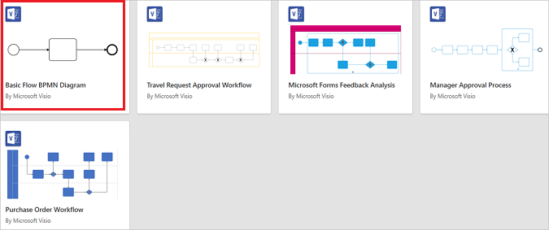
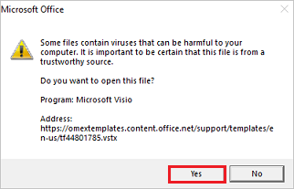
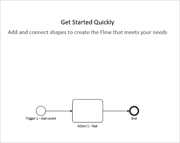
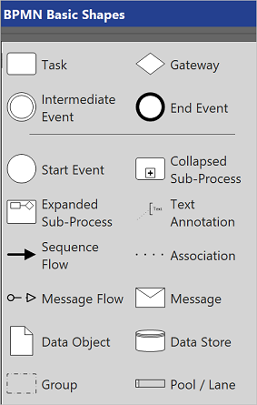
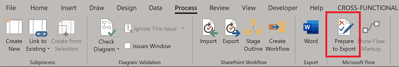
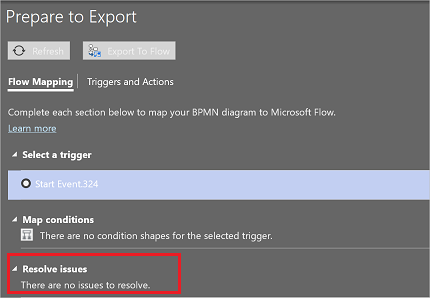
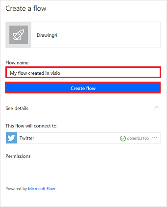

# Design flows with Microsoft Visio

The Power Automate designer is a rich tool in which you can configure every detail of your logic. However, sometimes you may want to just sketch your flow logic before you start building your flow. To do this, use Microsoft Visio directly from within Power Automate.

>[!TIP]
> Many processes share a common model but have minor variations throughout an organization. You can save time within your organization by using Visio to create a master workflow model that others will then adjust with specialized parameters.

## Prerequisites

- A Power Automate account.
- The Microsoft Visio desktop app (English version).
- Expertise in using Microsoft Visio.

## Design a workflow in Visio

1. Sign into [Power Automate](https://flow.microsoft.com).

1. From the left pane, select **Templates**.

    >[!div class="mx-imgBorder"]
    >

1. From the menu at the top, select **Visio**.

    >[!div class="mx-imgBorder"]
    > 

1. From the list of **Visio** templates, select **Basic Flow BPMN Diagram**.

    >[!div class="mx-imgBorder"]
    > 

     >[!IMPORTANT]
     >Visio warns you that files from the Internet could harm your device. If you are comfortable, select **YES** on the warning message.

    >[!div class="mx-imgBorder"]
    >

1. The Visio designer opens.

    >[!div class="mx-imgBorder"]
    >

1. Use the BPMN basic shapes to [design your workflow](https://support.office.com/article/design-a-microsoft-flow-in-visio-35f0c9a9-912b-486d-88f7-4fc68013ad1a).

    >[!div class="mx-imgBorder"]
    >

## Prepare to export your workflow to Power Automate

Follow these steps to prepare your workflow so that you can export it to Power Automate.

1. Select the **Process** tab.
1. Select **Prepare to Export** from the **Power Automate** group of icons.

    >[!div class="mx-imgBorder"]
    >

   The **Prepare to Export** group opens.

    >[!div class="mx-imgBorder"]
    >

1. On the **Flow Mapping** tab of the **Prepare to Export** group, map your BPMN diagram to Power Automate controls.

1. On the **Triggers and Actions** tab of the **Prepare to Export** group, select each shape, and then select either a trigger or an action to map your BPMN diagram to Power Automate triggers and actions. This mapping is to represent that shape in Power Automate.

You can export your workflow when no issues remain on the **Prepare to Export** control.

>[!div class="mx-imgBorder"]
> 

## Export your workflow
1. Select the **Export to Flow** button to export your workflow diagram to Power Automate.
1. Name your flow and then select the **Create flow** button.

    >[!div class="mx-imgBorder"]
    >

1. You should see a success report similar to this one.

    >[!div class="mx-imgBorder"]
    >

You can now run or make edits to your flow from the Power Automate designer, just like any other flow.

>[!TIP]
> Use the sharing and commenting capabilities in Visio to collaborate with multiple stakeholders and create a complete workflow quickly.

### More information

- [Get started with Power Automate](getting-started.md) 
- [Build multi-step flows](multi-step-logic-flow.md)
- [Design a cloud flow with Microsoft Visio](https://support.office.com/article/design-a-microsoft-flow-in-visio-35f0c9a9-912b-486d-88f7-4fc68013ad1a)

[!INCLUDE[footer-include](includes/footer-banner.md)]
