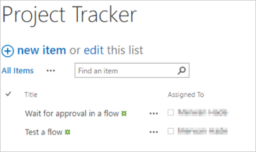
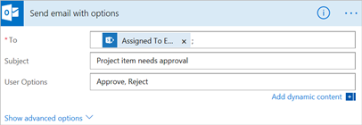
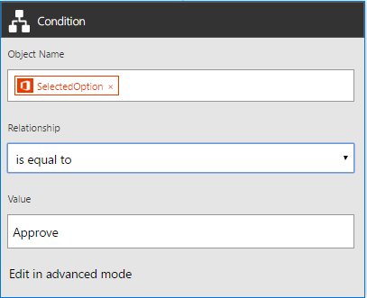

# Wait for approval in Power Automate

Create a cloud flow that, if you create an item in SharePoint, sends approval email and then notifies you whether the item was approved or rejected. To follow this tutorial, create a SharePoint list as a trigger action. You can alternatively use another data source such as Dropbox or OneDrive.

## Prerequisites

Create a SharePoint list that's named **Project Tracker**, add a column named **Title**, and then add a person or group column named **Assigned To**.

   

[!INCLUDE [sharepoint-detailed-docs](includes/sharepoint-detailed-docs.md)]

## Add an event to trigger the flow

1. Sign in to [Power Automate](https://make.powerautomate.com).

1. Select **My flows** in the top navigation bar, and then select **Create from blank**.

1. Select the **Search hundreds of connectors and triggers** box, enter **new item**, and then navigate to **SharePoint - when an item is created**.

1. If prompted, sign into SharePoint.

1. Under **Site Address**, enter the URL of the SharePoint site that contains your list.

1. Under **List Name**, select the list you created earlier. If you're following along, the name is **Project Tracker**.

    

## Add the resulting action

1. Select the **New step** button, and then select **Add an action.**

1. In the **Search all connectors and actions** box, type or paste **send email**, and then select **Office 365 Outlook - Send email with options**.

1. If prompted, sign into Office 365 Outlook.

1. Select the **To** field, and then select the **Assigned to Email** token.

    The user in the **Assigned To** column receives the email to approve or reject items. When you create an item to test the flow, specify yourself in this field. That way, you not only approve or reject the item, but also receive the notification email.

    You can customize the **Subject** and **User Options** fields to suit your needs.

    

## Add a condition

1. Select the **New step** button, and then select **Add a condition**.

1. Select the first box, and then select the **SelectedOption** token.

1. Select the last box, and then type **Approve**.

    

1. In the **If yes** area, select **Add an action**.

1. In the **Search all connectors and actions** box, type or paste **send email**, and then select **Office 365 Outlook - Send an email**.

1. In the **To** field, enter a recipient such as **Created by Email**.

1. In the **Subject** box, specify a subject.

    For example, select **Assigned To DisplayName**, type **has approved** with a space on each side, and then select **Title**.

1. In the **Body** box, specify an email body such as **Ready to proceed with the next phase of the project.**

    The person who created the item in the SharePoint list will be notified whether the project was approved or rejected.

  1. In the **If no** area, repeat the previous steps, except change the **Subject** and **Body** to reflect that the project was rejected.

## Finish and test your flow

Give your flow a name, and then select **Create flow**.

An approval email is sent to the recipient that you specified. When the recipient selects **Approve** or **Reject** in that email, you receive email that indicates the response.

## Related information

* [Single approver modern approvals walkthrough](modern-approvals.md)
* [Create sequential approvals](sequential-modern-approvals.md)
* [Create parallel approvals](parallel-modern-approvals.md)
* [Approve requests on the go](mobile-approvals.md)

[!INCLUDE[footer-include](includes/footer-banner.md)]
