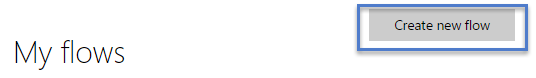
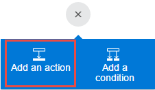
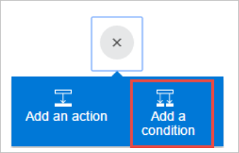
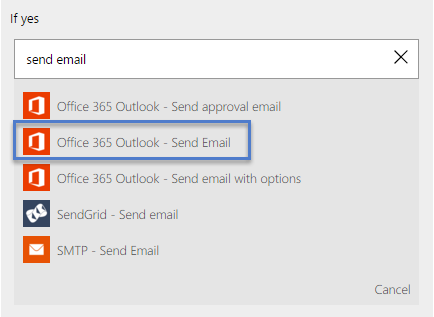
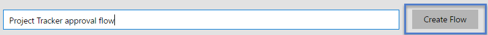

<properties
    pageTitle="Wait for approval in a flow | Microsoft Flow"
    description="Flows can wait for external events, such as users indicating approval in email."
    services=""
    suite="flow"
    documentationCenter="na"
    authors="merwanhade"
    manager="stepsic"
    editor=""
    tags=""/>

<tags
   ms.service="flow"
   ms.devlang="na"
   ms.topic="article"
   ms.tgt_pltfrm="na"
   ms.workload="na"
   ms.date="04/24/2016"
   ms.author="merwanhade"/>

# Wait for approval in a flow #

Create a flow that performs one or more tasks only after a user indicates either approval or declension in email. This tutorial uses a simple SharePoint list as a starting action, which can be substituted with other services such as Dropbox or OneDrive. 

**Prerequisites
- Create a simple SharePoint Online list with two columns - Title and a Person or Group column called **Assigned To**. This tutorial uses a list called **Project Tracker**.

   

## Request approval in email ##

1. In [flow.microsoft.com](https://flow.microsoft.com), select **My flows** in the top navigation bar.
	

1. In the **My flows** page, select the **Create new flow** button.  
	
1. In the box that shows **How would you like to start?**, type in or paste **when a new item is created** , and then select **SharePoint Online - when a new item is created**. 
	
	

1. In the **Site url** field, type in or paste the site url of where your list is located. 

	

1. In the **List name** field, select a list such as **Project Tracker**. 

	

1. Select the **+** buton and then select **Add an action.**

	

1. In the box that shows **What would you like to do next?**, type in or paste **Send approval email** and then select **Office 365 Outlook - Send approval email**. 

	

1. In the **To** field, select the output **Assigned to EMail** from the list of **Outputs from When a new item is created**. Note - you can customize the Subject and the User Options to suit your needs. 
	
	

1. Select the **+** button and then select **Add a condition**. 

	

1. In the **Object Name** field, select the output **SelectedOption** from the list of **Outputs from Send approval email**. In the **Value field** type in or paste **Approve**.

	

1. In the box that shows **If yes** select **Add an action**. 

	

1. In the box that shows **What would you like to do next?**, type in or paste **Send email**

	

1. In the **Subject** field, enter a subject such as **Assigned To Title** has accepted the **Title** project. In the **Body** field, enter an email body such as **Ready to proceed with the next phase of the project.** In the **To** field, enter a recipient such as **Created by EMail**. The person creating the list item in SharePoint will be notified that the Project Assignee has approved the project. 

	

1. Follow steps 12-15 in the box that shows **If no**. Remember to change the **Subject** and **Body** to reflect that the project assignee has declined the project.
 
	 
	 
1. That's it! Provide a flow name and click  **Create flow**.  

	 
