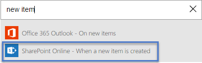
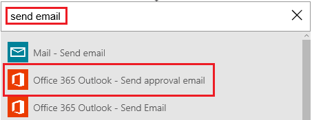
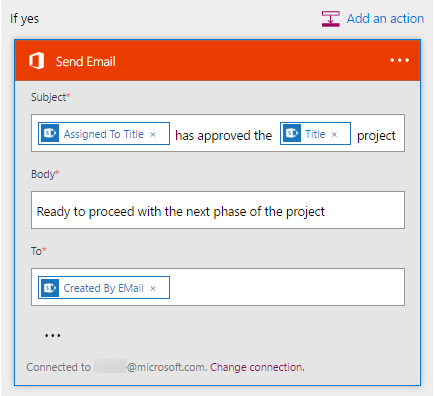
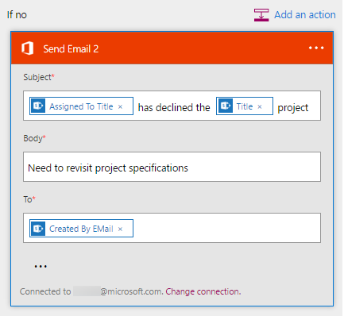

<properties
    pageTitle="Wait for approval in a flow | Microsoft Flow"
    description="Flows can wait for an external event to occur, such as a user approving or rejecting a change, before performing an action, such as sending notification of the decision."
    services=""
    suite="flow"
    documentationCenter="na"
    authors="merwanhade"
    manager="erikre"
    editor=""
    tags=""/>

<tags
   ms.service="flow"
   ms.devlang="na"
   ms.topic="article"
   ms.tgt_pltfrm="na"
   ms.workload="na"
   ms.date="04/24/2016"
   ms.author="merwanhade"/>

# Wait for approval in Microsoft Flow #
Create a flow that, if you create an item in SharePoint, sends approval mail and then notifies you whether the item was approved or rejected. To follow this tutorial exactly, create a simple SharePoint list as a trigger action, but you can use another data source such as Dropbox or OneDrive.

**Prerequisites**

- Create a simple SharePoint Online list that's named **Project Tracker** with a column named **Title**, and add a Person or Group column named **Assigned To**.

   

## Add an event to trigger the flow ##
1. In [flow.microsoft.com](https://flow.microsoft.com), select **My flows** in the top navigation bar, and then select **Create new flow**.
	
1. In the **How would you like to start?** box, type or paste **new item**, and then select **SharePoint Online - when a new item is created**.

	

1. If prompted, sign in to SharePoint Online.

1. Under **Site url**, type or paste the URL of the site that contains your list.

	

1. Under **List name**, select a list such as **Project Tracker**.

	

## Add the resulting action ##
1. Select the **+** button, and then select **Add an action.**

	

1. In the **What would you like to do next?** box, type or paste **send email**, and then select **Office 365 Outlook - Send approval email**.

	

1. If prompted, sign in to Office 365 Outlook.

1. Select the **To** field, and then select **Assigned to EMail**.

	The user in the **Assigned To** column will receive the mail to approve or reject the item. When you create an item to test the flow, you'll specify yourself in this field. That way, you'll not only approve or reject the item but also receive the notification mail.

	**Note**: You can customize the **Subject** and **User Options** fields to suit your needs.

	

## Add a condition ##
1. Select the **+** button, and then select **Add a condition**.

	

1. In the **Object Name** field, select **SelectedOption**.
1. In the **Value field**, type or paste **Approve**.

	
1. In the **If yes** area, select **Add an action**.

	

1. In the **What would you like to do next?** box, type or paste **send email**, and then select **Office 365 Outlook - Send Email**.

	

1. In the **Subject** box, specify a subject.

	For example, select **Assigned To DisplayName**, type **has approved** with a space on each side, and then select **Title**.

1. In the **Body** box, specify an email body such as **Ready to proceed with the next phase of the project.**

1. In the **To** field, enter a recipient such as **Created by EMail**.

	The person who created the item in the SharePoint list will be notified whether the project was approved or rejected.

	

1. In the **If no** area, repeat the last five steps except change the **Subject** and **Body** to reflect that the project was rejected.

	 

## Finish and test your flow ##
1. Give your flow a name, and then select **Create flow**.

 	

1. Create an item in your SharePoint list.

	An approval mail is sent to the recipient that you specified. When the recipient selects **Approve** or **Reject** in that mail, you receive email that indicates the response.
