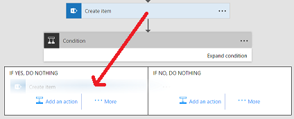

# Add a condition to a flow
Specify that a flow performs one or more tasks only if a particular condition is true. For example, specify that you'll get an email only if a tweet that contains a keyword is retweeted at least 10 times.

**Prerequisites**

* [Create a flow](get-started-logic-template.md) from a template - this tutorial will [use this template](https://flow.microsoft.com/galleries/public/templates/e78571e5c70e4806a18eeacba5a897c8/) as the example

## Add a condition
1. In [flow.microsoft.com](https://flow.microsoft.com), select **My Flows** in the top navigation bar.
2. In the list of flows, select a flow that you have created. This tutorial uses an example with a Twitter trigger and a SharePoint action.
3. Under the last action, select the **New step** button.
4. Select **Add a condition**.
   
    
5. Select an empty area in **Object name**, and select **Add dynamic content** to open the dynamic content menu.
6. Select the **Retweet count** parameter to add it to the box.
7. In the **Relationship** box, select **is greater than or equal to**.
8. In the **Value** box, type **10**.
   
    
9. Click on the header of action you want inside of condition (such as **Create item**) and drag it underneath the text that reads **IF YES**. When you release the cursor, the action should move into that box.
   
    
10. Save the flow.

## Edit in advanced mode
You can also select the **Edit in advanced mode** link to write more advanced conditions. You can use any expression from the *Workflow definition language* here. [Learn more about](https://msdn.microsoft.com/library/azure/mt643789.aspx) what functions are available.

