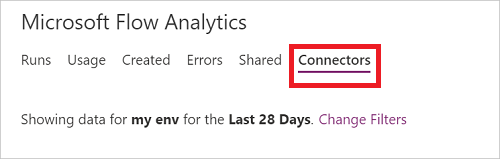
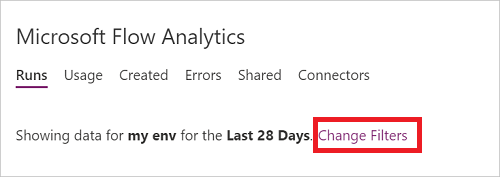
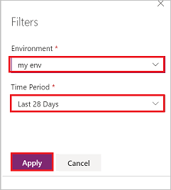

# Sharing and Connectors Admin Analytics Reports

Organizations need insights into how how app are used, and who's using them. The Admin analytics sharing and connectors reports provide insight into how users are using Microsoft Flow within your tenant. 

From a sharing perspective, you can learn who your app champions are and then empower them to provide even more automated solutions for your organization. The connectors report identifies Microsoft, third party, and custom connectors that are in use within your organization.

## View shared flows reports

1. Sign into the [Power Platform Admin Center](https://admin.powerplatform.microsoft.com/)
1. Select **Analytics** from the navigation bar on the left.
1. Select the **Shared** tab and view the list of flows that are shared on in your organization.
 
    

## View connectors report

1. Sign into the [Power Platform Admin Center](https://admin.powerplatform.microsoft.com/)
1. Select **Analytics** from the navigation bar on the left.
1. Select the **Connectors** tab and view the list of connectors in use in your organization.
 
    

## Filter views

The results in these reports are based on the environment you've selected. To change the environment:

1. Select the **Change Filters** link.
    
    

1. Select the **Environment** and the **Time Period** for which you're interested in viewing reports.
1. Select the **Apply** button.

    

## Learn more

- Get [started](getting-started.md) with Microsoft Flow

