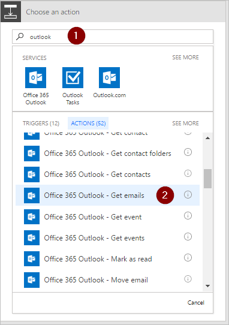
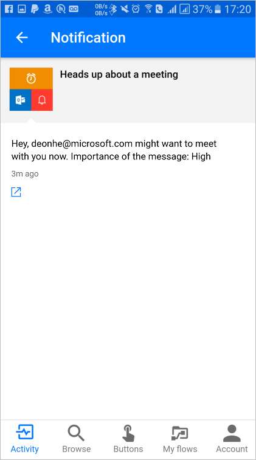

# Use the apply to each action in Microsoft Flow to process a list of items periodically
[!INCLUDE [view-pending-approvals](includes/cc-rebrand.md)]
Many triggers can immediately start a flow based on an event such as when a new email arrives in your inbox. These triggers are great, but sometimes you want to run a flow that queries a data source on a predefined schedule, taking certain actions based on the properties of the items in the data source. To do this, your flow can be started on a schedule (such as once per day) and use a loop action such as **Apply to each** to process a list of items. For example, you could use **Apply to each** to update records from a database or list of items from Microsoft SharePoint.

In this walk-through, we'll create a flow that runs every 15 minutes and does the following:

1. Gets the last 10 unread messages in your Office 365 Outlook Inbox.
2. Checks each of the 10 messages to confirm if any has **meet now** in the subject.
3. Checks if the email is from your boss or was sent with high importance.
4. Sends a push notification and marks as read any email that has **meet now** in the subject and is either from your boss or was sent with high importance.

This diagram shows the details of the flow we'll create in this walk-through:

## Prerequisites
Here are the requirements for successfully performing the steps in this walk-through:

* An account that's registered to use [Microsoft Flow](https://flow.microsoft.com).
* An Office 365 Outlook account.
* The Microsoft Flow mobile app for [Android](https://aka.ms/flowmobiledocsandroid), [iOS](https://aka.ms/flowmobiledocsios), or [Windows Phone](https://aka.ms/flowmobilewindows).
* Connections to Office 365 Outlook and the push notification service.

## Create a flow
1. Sign into [Microsoft Flow](https://flow.microsoft.com):
2. Select the **My flows** tab, and then create a flow from a blank:
   
    
3. Enter "schedule" into the search box to search for all services and triggers that are related to scheduling.
4. Select the **Schedule - Recurrence** trigger to indicate that your flow will run on a schedule that you'll provide next:
   
    
5. Set the schedule to run every 15 minutes:
   
    
6. Select **+ New step**, **Add an action**, and then type **outlook** into the search box to search for all actions related to Microsoft Outlook.
7. Select the **Office 365 Outlook - Get emails** action:
   
    
8. This will open the **Get emails** card. Configure the **Get emails** card to select the top 10 unread emails from the Inbox folder. Don't include attachments because they won't be used in the flow:
   
    
   
   > [!NOTE]
   > So far, you've created a simple flow that gets some emails from your inbox. These emails will be returned in an array; the **Apply to each** action requires an array, so this is exactly what's needed.
   > 
   > 

## Add actions and conditions
1. Select **+ New step**, **More**, and then **Add an apply to each** action:
   
    
2. Insert the **Body** token into the **Select an output from previous steps** box on the **Apply to each** card. This pulls in the body of the emails to be used in the **Apply to each** action:
   
    
3. Select **Add a condition**:
   
    
4. Configure the **Condition** card to search the subject of each email for the words "meet now":
   
   * Insert the **Subject** token into the **Object Name** box.
   * Select **contains** in the **Relationship** list.
   * Enter **meet now** into the **Value** box.
     
     
5. Select **More**, and then select **Add a condition** from the **IF YES, DO NOTHING** branch. This opens the **Condition 2** card; configure that card like this:
   
   * Insert the **Importance** token into the **Object Name** box.
   * Select **is equal to** in the **Relationship** list.
   * Enter **High** into the **Value** box.
     
     
6. Select **Add an action** under the **IF YES, DO NOTHING** section. This will open the **Choose an action** card, where you'll define what should happen if the search condition (the **meet now** email was sent with high importance) is true:
   
    
7. Search for **notification**, and then select the **Notifications - Send me a mobile notification** action:
   
    
8. On the **Send me a mobile notification** card, provide the details for the push notification that will be sent if the subject of an email contains "meet now", and then select **Add an action**:
   
    
9. Enter **read** as the search term, and then select the **Office 365 Outlook - Mark as read** action. This will mark each email as read after the push notification is sent:
   
    
10. Add the **Message Id** token to the **Message Id** box of the **Mark as read** card. You may need to select **See more** to find the **Message Id** token. This indicates the Id of the message that will be marked as read:
    
     
11. Going back to the **Condition 2** card, on the **IF NO, DO NOTHING** branch:
    
    * Select **Add an action**, and then type **get manager** into the search box.
    * Select the **Office 365 Users - Get manager** action from the search results list.
    * Enter your *full* email address into the **User** box of the **Get Manager** card.
      
      
12. Select **More**, and then select **Add a condition** from the **IF NO** branch. This opens the **Condition 3** card; configure the card to check if the email sender's email address (the From token) is the same as your boss' email address (the Email token):
    
    * Insert the **From** token into the **Object Name** box.
    * Select **contains** in the **Relationship** list.
    * Enter **Email** token into the **Value** box.
      
      
13. Select **Add an action** under the **IF YES, DO NOTHING** section of the **Condition 3** card. This will open the **IF YES** card, where you'll define what should happen if the search condition (the email was sent from your boss) is true:
    
     
14. Search for **notification**, and then select the **Notifications - Send me a mobile notification** action:
    
     
15. On the **Send me a mobile notification 2** card, provide the details for the push notification that will be sent if the email is from your boss, and then select **Add an action**:
    
     
16. Add the **Office 365 Outlook - Mark as read** action. This will mark each email as read after the push notification is sent:
    
     
17. Add the **Message Id** token to the **Mark as read 2** card. You may need to select **See more** to find the **Message Id** token. This indicates the Id of the message that will be marked as read:
    
     
18. Name your flow, and then create it:
    
     

If you followed along, your flow should look similar to this diagram:

## Run the flow
1. Send yourself a high-importance email that includes **meet now** in the subject (or have someone in your organization send you such an email).
2. Confirm the email is in your inbox and it's unread.
3. Sign into Microsoft Flow, select **My flows**, and then select **Run now**:
   
    
4. Select **Run flow** to confirm you really want to run the flow:
   
    
5. After a few moments you should see the results of the successful run:
   
    

## View results of the run
Now that you've run the flow successfully, you should receive the push notification on your mobile device.

1. Open the Microsoft Flow app on your mobile device, and then select the **Activity** tab. You'll see the push notification about the meeting:
   
    
2. To see the full contents of the notification, you may have to select the notification. You'll see the full notification, similar to this:
   
    
   
   > [!NOTE]
   > If you don't receive the push notification, confirm that your mobile device has a working data connection.
   > 
   > 

