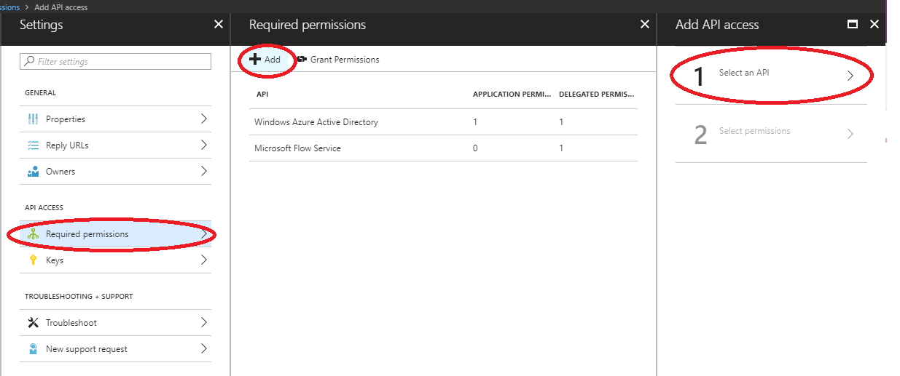
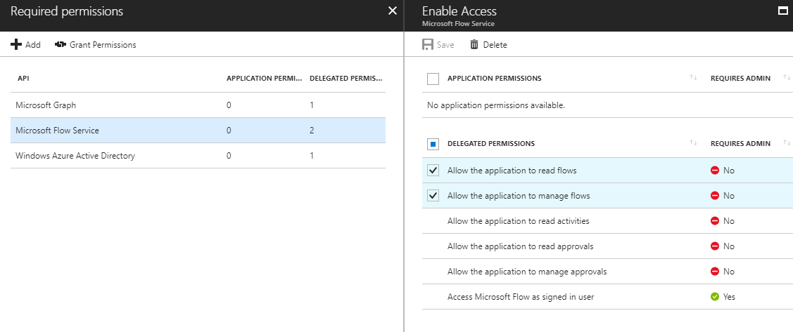
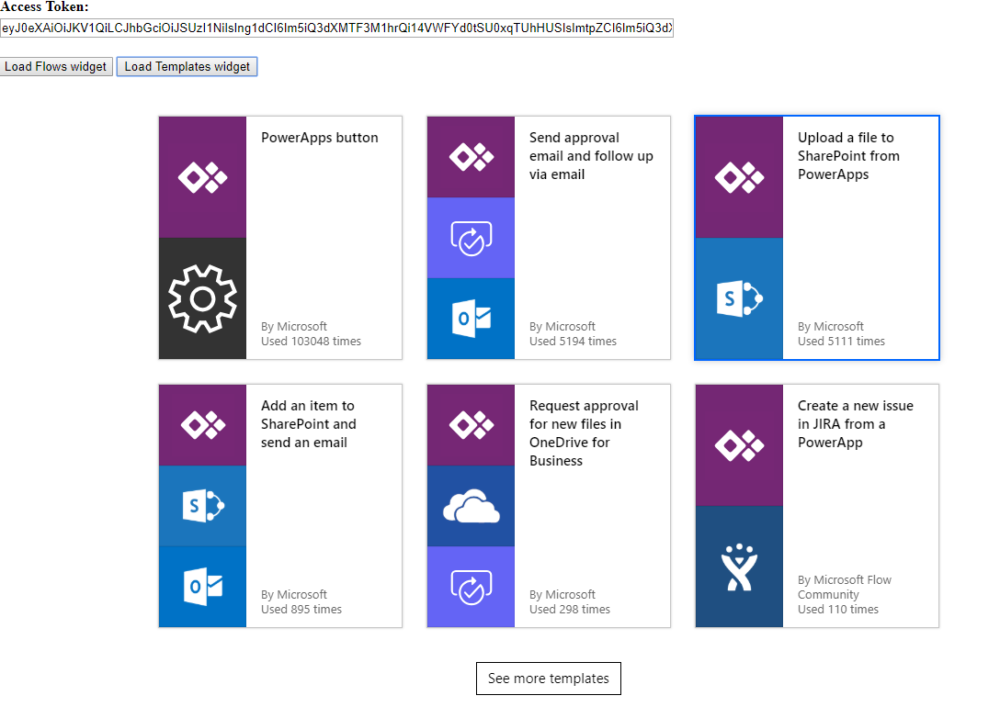

# Integrate Microsoft Flow with websites and apps
Embed Microsoft Flow right into your app or website using the *flow widgets* to give users a simple way to automate their personal or professional tasks.

To create flows, users will need either a **Microsoft Account** or a work or school account in **Azure Active Directory**. Microsoft Flow doesn't support, for example, a whitelabel solution that supports whatever identity your system  uses (unless it already uses Microsoft Accounts or AAD).

The flow widgets are iframes in a host document that points to a page in the Microsoft Flow portal and integrates a specific flow functionality in the third-party application.

Widgets can be simple, for example - a widget that renders a list of templates with no communication between the host and iframe. Or they can be more complex - like a widget that can provision a flow from a template and trigger the flow via two-way communication between the host and widget.

## Use the unauthenticated widget
Templates widget can be embedded in the host application in iframe directly without using any JS SDK or user access token.

### Show templates for your scenarios
To start, add this code to show the flow templates directly in your website:

```html
<iframe src="https://flow.microsoft.com/{locale}/widgets/templates/?q={search term}
&pagesize={number of templates}&destination={destination}"></iframe>
```

| Parameter | Description |
| --- | --- |
| locale |The four-letter language and region code for the template view. For example, `en-us` represents American English, and `de-de` represents German. |
| search term |The search term for the templates that you want to show in the view. For example, search `wunderlist` to show templates for Wunderlist. |
| number of templates |The number of templates that you want to show in the view. |
| destination |The page that opens when users click the template. Specify `details` to show the details about the template, or specify `new` to open the Microsoft Flow designer. |
| parameters.{name} |Additional context to pass into the flow. |
| templateCategory | Templates displayed are filtered to the specified template category                     | 

If the destination parameter is `new`, Microsoft Flow opens when users click a template, and they can create a flow in the designer. See the next section if you want to have the full experience work from inside of the widget.

### Passing additional parameters to the flow template
If the user is in a certain context in your website or app, you might want to pass that context to the flow. For example, a user might open a template for *Notify me when an item is added to a list* while looking at a certain list in Wunderlist. By following these steps, you can pass in the list ID as a *parameter* to the flow:

1. Define the parameter in the flow template before you publish it. A parameter looks like `@{parameters('parameter_name')}`.
2. Pass the parameter in the iframe src. For example, add `&parameters.listName={the name of the list}` if you have a parameter called **listName**.

### Full sample
To show the top four templates about Wunderlist in German and to start the user with **myCoolList**:

```html
<iframe src="https://flow.microsoft.com/de-de/widgets/templates/?q=wunderlist
&pagesize=4&destination=details&parameters.listName=myCoolList"></iframe>
```

## Use the authenticated flow widgets
Following table shows list of flow widgets that support full experience within the widget using user authentication access token. You will need to use Flow's Javascript Software Developer Kit (JS SDK) to embed the widgets and provide the required user access token.

| Widget type    | Supported feature                                                                                                                  | 
|----------------|------------------------------------------------------------------------------------------------------------------------------------| 
| Flows          | Shows a list of flows in a tab for personal and shared flows. Edit an existing flow or create a new flow from a template or blank. | 
| FlowCreation   | Creates a flow from a template Id specified by the host application                                                                | 
| Runtime        | Triggers a manual or hybrid-trigger flow specified by the host application                                                         | 
| ApprovalCenter | Embeds approval requests and sent approvals                                                                                        | 
| Templates      | Shows a list of templates. Choose one to create a new flow.                                                                        | 

Use the authenticated Flow SDK to allow users to create and manage flows directly from your website or app (instead of navigating to the Microsoft Flow portal). You'll need to sign the user in to Microsoft Account or Azure Active Directory to use the authenticated SDK.

> [!NOTE]
> All users who use Microsoft Flow in your application will be Microsoft Flow users. There is no way to hide the Microsoft Flow branding.

## Widget architecture

Flow widgets work by embedding an iframe in the host application then loading the Flow feature in the iframe. The host provides the access token that's required by the Flow widget. Flow's JS SDK enables the host application to initialize and manage the widget life cycle.


### JS SDK details

The Flow team provides JS SDK to facilitate integrating Flow widgets in third-party applications. Flow JS SDK is available as a public link in the Flow service and lets the host application handle events from the widget and interact with the Flow application by sending actions to the widget. Widget events and actions are specific to the widget type.

### Widget initialization

The Flow JS SDK reference needs to be added to the host application before initializing the widget.

```html
<script src="https://flow.microsoft.com/Content/msflowsdk-1.1.js\"></script>
```

Create a JS SDK instance by passing optional hostName and locale values in a JSON object.

```javascript
var sdk = new MsFlowSdk({
    hostName:'https://flow.microsoft.com',
    locale:'en-US',
}); 
```

| Name     | Required/Optional | Description                                                    | 
|----------|-------------------|----------------------------------------------------------------| 
| `hostName` | Optional          | Flow host name, for example, https://flow.microsoft.com        | 
| `locale`   | Optional          | Client locale for the widget (defaults to en-Us if not passed) | 


Once the JS SDK instance is created you can initialize and embed a Flow widget in a parent element in the host application. Add an HTML div:

```html
<div id="flowDiv" class="flowContainer"></div>
```

Initialize the Flow widget with JS SDK renderWidget() method by specifying the widget type and corresponding settings.

```javascript
var widget = sdk.renderWidget('<widgettype>', {
        container: 'flow-div',
        flowsSettings: {},
        templatesSettings: {},
        approvalSettings: {},
        widgetStyleSettings: {},
});
```

Here's a sample style for the container that can be modified to match with the host application's dimensions.

```html
<head>
    <style>
        .flowContainer iframe {
            width: 400px;
            height: 1000px;
            border: none;
            overflow: hidden;
    }
    </style>
</head>
```

These are the parameters for `renderWidget()`: 

| Parameter        | Required/Optional | Description                                                                                 | 
|------------------|-------------------|---------------------------------------------------------------------------------------------| 
| `container`        | Required          | Id of a DIV element on the host page where the widget will be embedded                      | 
| `environmentId`    | Optional          | Widgets need an environment Id. If the Id doesn’t pass, a default environment will be used. | 
| `flowsSettings`    | Optional          | Flow settings object                                                                        | 
| `templateSettings` | Optional          | Template settings object                                                                    | 
| `approvalSettings` | Optional          | Approval settings object                                                                    | 

### Access tokens

Right after the JS SDK `renderWidget()` call, JS SDK will initialize an iframe pointing to the Flow widget URL, with all the settings passed as query string parameters. The host application needs to get a Flow access token for the user (Azure Active Directory JWT token with audience https://service.flow.microsoft.com) before initializing the widget. The widget raises a `GET_ACCESS_TOKEN` event to request an access token from the host. The host needs to handle the event and pass the token to the widget:

```javascript
widget.listen("GET_ACCESS_TOKEN", function(requestParam, widgetDoneCallback) {
    widgetDoneCallback(null, {
        token:  '<accesstokenFromHost>'
    });
});
```

The host application is responsible for maintaining the token and passing it with valid expiry to the widget when requested. If the widget is open for longer periods, the host should check if the token is expired and refresh the token if it's needed before passing it to the widget.

### Detecting if the widget is ready

After successful initialization, the widget raises an event to notify that the widget is ready. The host can listen to the `WIDGET_READY` event and execute any additional host code.

```javascript
widget.listen("WIDGET_READY", function() {
    console.log("The flow widget is now ready.");
    // other host code on widget ready
});
 ```

## Widget settings

### FlowsSettings 

FlowsSettings can be used to customize the functionality of the Flow
widget.

```javascript
flowsSettings?: {
    createFromBlankTemplateId?: string;
    flowsFilter?: string;sc
    tab?: string;
};
 ```

| Parameter | Required/Optional | Description | 
|-----------|-------------------|-------------| 
| `createFromBlankTemplateId` | Required | Use template GUID when the user selects the Create from blank button on the Flow widget | 
| `flowsFilter` | Optional | The Flow widget will apply the specified filter when listing flows, for example: Show flows that reference a specific SharePoint site. <br /> ```flowFilter: "operations/any(operation: operation/sharepoint.site eq 'https://microsoft.sharepoint.com/teams/ProcessSimple' )"   ``` |                 
| `tab` | Optional | Default active tab to show in the Flow widget. <br /> Examples: <br /> ```tab:'sharedFlows' ``` // Show Team flows as the active tab <br /> ``` tab:'myFlows' ```  // Show My flows as the active tab |   

### TemplatesSettings 

This applies to all widgets that enable creating from a template---Flows, FlowCreation, and Templates widgets.

```javascript
templatesSettings?: {
    defaultParams?: any;
    destination?: string;
    pageSize?: number;
    searchTerm?: string;
    templateCategory?: string;
    useServerSideProvisioning?: boolean;
    enableDietDesigner?: boolean;
};
 ```

| Parameter |Required/Optional | Description                                                                        
|-----------|-------------------|-----------------| 
|`defaultParams` | Optional          | Design time parameters to use when creating a flow from a template, for example: <br /> ``` defaultParams: {'parameters.sharepoint.site': 'https://microsoft.sharepoint.com/teams/ProcessSimple', 'parameters.sharepoint.list': 'b3a5baa8-fe94-44ca-a6f0-270d9f821668'   } ```| 
| `destination` | Optional          | Valid values 'new' or 'details'. When set to 'details', a detail page is shown when creating a flow from a template.     |
| `pageSize` | Optional          | Number of templates to display. Default size = 6 | 
| `searchTerm` | Optional          | Templates displayed are filtered to the specified search term| 
| `templateCategory` | Optional          | Templates displayed are filtered to the specified template category| 
 
### ApprovalCenterSettings

Applies to ApprovalCenter widgets.

 ```javascript
 approvalCenterSettings?: {
    approvalsFilter?: string;
    tab?: string;but
    autoNavigateToDetails?: boolean;
    showSimpleEmptyPage? boolean;
    hideLink?: boolean
};
 ```
| Parameter | Required/Optional | Description | 
|------------|-------------------|--------------| 
| `hideLink`| Optional | When set to `true`, the widget will hide received and sent approval links | 
| `autoNavigateToDetails`| Optional | When set to `true`, the widget will automatically open the approval details when only one approval exists | 
| `approvalsFilter`| Optional | The approval widget will apply the specified approval filter when listing the approvals, for example:    The approval widget will apply the specified approval filter when listing the approvals, for example: <br/> ``` approvalsFilter: 'properties/itemlink eq \'https://microsoft.sharepoint.com/teams/ProcessSimple/_layouts/15/listform.aspx?PageType=4&ListId=737e30a6-5bc4-4e9c-bcdc-d34c5c57d938&ID=3&ContentTypeID=0x010010B708969A9C16408696FD23801531C6\'' ```  <br/> <br/>``` approvalsFilter: 'properties/itemlinkencoded eq \'{Your base64 encoded item link url} \'' ```|
| `tab`| Optional | Default active tab to show in the Flow widget. <br/> Valid values : 'receivedApprovals', 'sentApprovals' | 
| `showSimpleEmptyPage`| Optional | Shows an empty page when there are no approvals | 
| `hideInfoPaneCloseButton` | Optional | Hides the info-pane Close button (or the host already has a Close button) | 

## Widget events

The Flow widget supports events that let the host listen to various widget life-cycle events. The Flow widget supports two types of events: one-way notification events (for example, Widget\_Ready) and events raised from the widget to fetch data from the host (Get\_Access\_Token). The host needs to use widget.listen() method to listen to specific events raised from the widget.

### Usage

```javascript
widget.listen("<WIDGET_EVENT>", function() {
    console.log("The flow widget raised event");
});
```

### Supported events by widget type

| Widget event      | Details                                                         | 
|-------------------|-----------------------------------------------------------------| 
| `WIDGET_READY`      | Widget loaded successfully                                      | 
| `WIDGET_RENDERED`   | Widget loaded and UI rendering is complete                      | 
| `GET_ACCESS_TOKEN`  | Widget request for embed user-access token                      | 
| `GET_STRINGS`       | Allows host to override a set of UI strings shown in the widget | 

### Runtime widget

| Widget event                    | Details                                     | Data                                              | 
|---------------------------------|---------------------------------------------|-----------| 
| `RUN_FLOW_STARTED`                | Triggered and the flow run was started      |           | 
| `RUN_FLOW_COMPLETED`              | Flow run triggered successfully             |           | 
| `RUN_FLOW_DONE_BUTTON_CLICKED`    | User selected Done button on flow run       |           | 
| `RUN_FLOW_CANCEL_BUTTON_CLICKED`  | User selected Cancel button on flow run     |           | 
| `FLOW_CREATION_SUCCEEDED`         | The flow was created successfully           |`{ flowUrl: string, flowId: string, fromTemplate: string } `|
| `WIDGET_CLOSE`                    | Fired when the host should close the widget |       | 

### Flow Creation widget

| Widget event             | Details                                  | Data  | 
|--------------------------|------------------------------------------|-------| 
| `FLOW_CREATION_FAILED`     | Flow creation failed                     |       | 
| `WIDGET_CLOSE`             | Fired when host should close the widget  |       | 
| `TEMPLATE_LOAD_FAILED`     | The template failed to load              |       | 
| `FLOW_CREATION_SUCCEEDED`  | The flow was created successfully        |` { flowUrl: string, flowId: string,fromTemplate?: string } `| 

### Approval widget

| Widget event                      | Details                             | 
|-----------------------------------|-------------------------------------| 
| `RECEIVED_APPROVAL_STATUS_CHANGED`  | ‘Received’ approval status changed  | 
| `SENT_APPROVAL_STATUS_CHANGED`      | ‘Sent’ approval status changed      | 

**GET\_STRINGS** event lets you customize text for some of the UI elements shown in the widget. The following strings can be customized:

| String key                     | Use in the widget                                                                                                                  | 
|--------------------------------|------------------------------------------------------------------------------------------------------------------------------------| 
| `FLOW_CREATION_CREATE_BUTTON`    | Text displayed on the ‘create flow’ button in both flow creation and runtime widget                                                | 
| `FLOW_CREATION_CUSTOM_FLOW_NAME` | The initial value to use for the flow name in the flow creation widget. Only used when the allowCustomFlowName setting is enabled. | 
| `FLOW_CREATION_HEADER`           | Header to use when creating a flow in both the flow creation and runtime widget                                                    | 
| `INVOKE_FLOW_HEADER`             | Header to use when invoking a flow in the runtime widget                                                                           | 
| `INVOKE_FLOW_RUN_FLOW_BUTTON`    | Text displayed on the button used to invoke/run a flow in the runtime widget                                                       | 

### Example

Call `widgetDoneCallback` passing a JSON object with key-value pairs of string key and text to override the default value.

```javascript
widget.listen("GET_STRINGS", function(requestParam, widgetDoneCallback) {
    widgetDoneCallback(null, {
         "FLOW_CREATION_HEADER": "<string override would go here>",
        "INVOKE_FLOW_RUN_FLOW_BUTTON":  "<string override would go here>"
    });
});
```

## Widget actions

The host uses widget actions to send a specific action or message to the widget. Widget JS SDK provides `notify()` method to send a message or a JSON payload to the widget. Each widget action supports a specific payload signature.

### Usage

```javascript
widget.notify('<WIDGET_ACTION>', parameterMatchingParameterInterface)
    .then(result => console.log(result))
    .catch(error => console.log(error))
 ```

### Example 

Invoke a flow by sending the following command to a runtime widget 

```javascript
widget.notify('triggerFlow', { flowName: flowName, implicitData:implicitData });  
 ```

### Runtime widget

| Widget action                               | Details                                                      | Parameter interface  | 
|---------------------------------------------|--------------------------------------------------------------|----------------------| 
| `triggerFlow`                                 | Triggers a flow run                                          | `{ flowName: string, implicitData?: string } `| 
| `triggerFlowByTemplate`                       | Triggers a flow run by template                              | `{ templateId: string, implicitData?: string, designTimeParameters?: Record<string, any> }` |
| `getTriggerSchema`                            | Gets trigger schema for a flow                               | `{   flowName: string, }` | 
| `closeWidget`                                 | Cancels any pending activity and raises a WIDGET_CLOSE event |                      | 

### Flow Creation widget

| Widget action                               | Details                                                      | Parameter interface  | 
|---------------------------------------------|--------------------------------------------------------------|----------------------| 
| `createFlowFromTemplate`                      | Creates a flow for the selected template                     | `{ templateName: string, designTimeParameters?: Record<string, any> }`| 
| `createFlowFromTemplateDefinition`            | Creates a flow for the selected template definition          | `{ templateDefinition: string }` | 
| `closeWidget`                                 | Cancels any pending activity and raises a WIDGET_CLOSE event |                      | 

### Approval widget

| Widget action  | Details                                           | Parameter interface  | 
|----------------|---------------------------------------------------|----------------------| 
| `closeInfoPane`  | Closes the info-pane displaying approval details  | N/A                  | 

## Configuring your client application

You will need to configure your client application with Flow Service Scopes (Delegated Permissions). If the Azure Active Directory (AAD) app used for the widget integration uses a 'code grant' authorization flow, the AAD app needs to be preconfigured with delegated permissions that are supported by the Flow service. This provides delegated permissions that let the application:

-   Manage approvals
-   Read approvals
-   Read activities
-   Manage flows
-   Read flows

Follow these steps to select one or more delegated permissions:

1.  Go to https://flow.microsoft.com 
2.  Select **Azure Active Directory**.
3.  Select **App registrations** under **Manage**.
4.  Enter the third-party application to be configured for Flow service scopes.
5.  Select **Settings**.
      
6. Select **Required permissions** under **API access**/
7. Select **Add**.
8. Choose **Select an API**.
      
9. Search for **Microsoft Flow service** and select it. Note: Before you can see Microsoft Flow service, your tenant needs to  have at least one AAD user signed into the Flow portal (<https://flow.microsoft.com>)
10. Choose the required Flow scopes for your application then select **Save**.
      

After configuring, your application will get a Flow Service token that contains delegated permissions in the \'scp' claim in the JWT token.

## Sample application embedding flow widgets 

A sample JavaScript Single Page Application (SPA) is provided in the resources section so you can experiment with embedding flow widgets in a host page. Using the sample application requires registering an AAD application with implicit grant flow enabled.

### Registering an AAD app

1.  Sign in to the [Azure portal](https://portal.azure.com/).
2.  In the left navigation pane, select **Azure Active Directory**, then select **App registrations** (Preview) \> New registration.
3.  When the **Register an application** page appears, enter a name for your application.
4.  Under **Supported account types**, select **Accounts** in any organizational directory.
5.  Under the **Redirect URL** section, select the web platform and set the value to the application\'s URL based on your web server. Configure this value to http://localhost:30662/ to run the sample app.
6.  When finished, select **Register**.
7.  On the app **Overview** page, note the application (client) ID value.
8.  The sample requires [implicit grant flow](https://docs.microsoft.com/en-us/azure/active-directory/develop/v2-oauth2-implicit-grant-flow) to be enabled. In the left navigation pane of the registered application, select **Authentication**.
9.  In **Advanced settings**, under **Implicit grant**, enable both **ID tokens** and **Access tokens** checkboxes. ID tokens and access
    tokens are required since this app needs to sign in users and call Flow API.
10. Select **Save**.

### Running the sample

1.  Download the sample and copy it to a local folder on your machine.
2.  Open the file index.html under FlowSDKSample folder and modify the `applicaionConfig` to update the `clientID` to the application ID register above.
    
3.  The sample app is configured to use Flow scopes **Flows.Read.All** and **Flow.Manage.All.** Additional scopes can be added by updating the **flowScopes** property in **applicationConfig** object.
4.  Run these commands to install the dependency and run the sample app:
    > \> npm install 
    > \> node server.js
5. Open the browser and type http://localhost:30662
6. Select the **Sign in** button to authenticate to AAD and acquire a flow access token.
7. The **Access Token** text box will be populated with the access token.
    
8. Select **Load Flows widget** or **Load Templates widget** to embed the corresponding widgets.
    

Sample application [download link](../media/embed-flow-dev/FlowWidgetSampleApp.zip).

## Resources

### Widget test pages

Find out more about widget integration and settings:

- Templates widget: <[https://flow.microsoft.com/en-us/test/templateswidget/](https://flow.microsoft.com/en-us/test/templateswidget/)>
- FlowCreation widget: <[https://flow.microsoft.com/en-us/test/flowcreationwidget/](https://flow.microsoft.com/en-us/test/flowcreationwidget/)>
- Runtime widget: <[https://flow.microsoft.com/en-us/test/runtimewidget/](https://flow.microsoft.com/en-us/test/runtimewidget/)>
- Approvals center widget: <[https://flow.microsoft.com/en-us/test/approvalcenterwidget/](https://flow.microsoft.com/en-us/test/approvalcenterwidget/)>
- Flows widget: <[https://flow.microsoft.com/en-us/test/managewidget/](https://flow.microsoft.com/en-us/test/managewidget/)>

### Supported widget locales

If the initialized locale isn't listed, Flow will default to the closest supported locale.

| Locale     | Language                   | 
|------------|----------------------------| 
| bg-bg      | Bulgarian (Bulgaria)       | 
| ca-es      | Catalan (Spain)            | 
| cs-cz      | Czech (Czech Republic)     | 
| da-dk      | Danish (Denmark)           | 
| de-de      | German (Germany)           | 
| el-gr      | Greek (Greece)             | 
| en-Us      | English (United States)    | 
| es-es      | Spanish (Castilian)        | 
| et-ee      | Estonian (Estonia)         | 
| eu-es      | Basque (Spain)             | 
| fi-fi      | Finnish (Finland)          | 
| fr-fr      | French (France)            | 
| gl-es      | Galician (Spain)           | 
| hi-HU      | Hungarian (Hungary)        | 
| hi-in      | Hindi (India)              | 
| hr-hr      | Croatian (Croatia)         | 
| id-Id      | Indonesian (Indonesia)     | 
| it-It      | Italian (Italy)            | 
| jp-Jp      | Japanese (Japan)           | 
| kk-kz      | Kazakh (Kazakhstan)        | 
| ko-kr      | Korean (Korea)             | 
| lt-LT      | Lithuanian (Lithuania)     | 
| lv-lv      | Latvian (Latvia)           | 
| ms-my      | Malay (Malaysia)           | 
| nb-no      | Norwegian (Bokmål)         | 
| nl-nl      | Dutch (Netherlands)        | 
| pl-pl      | Polish (Poland)            | 
| pt-br      | Portuguese (Brazil)        | 
| pt-pt      | Portuguese (Portugal)      | 
| ro-ro      | Romanian (Romania)         | 
| ru-ru      | Russian (Russia)           | 
| sk-sk      | Slovak (Slovakia)          | 
| sl-si      | Slovenian (Slovenia)       | 
| sr-cyrl-rs | Serbian (Cyrillic, Serbia) | 
| sr-latn-rs | Serbian (Latin, Serbia)    | 
| sv-se      | Swedish (Sweden)           | 
| th-th      | Thai (Thailand)            | 
| tr-tr      | Turkish (Turkey)           | 
| uk-ua      | Ukrainian (Ukraine)        | 
| vi-vn      | Vietnamese (Viet Nam)      |
