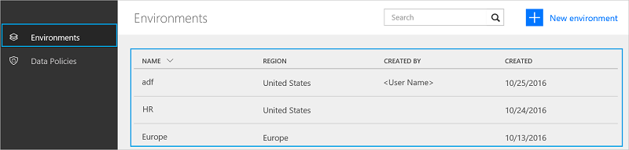
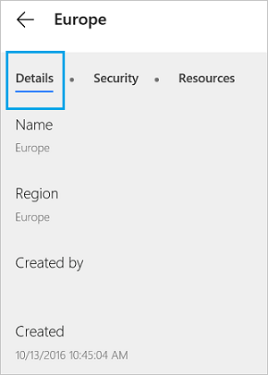
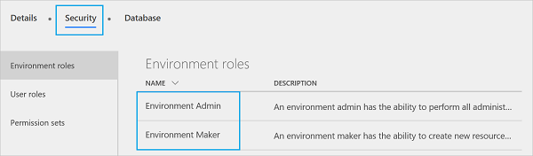

# Using environments within Microsoft Flow

## Benefits

Environments provide the following benefits:

* **Data locality**: Environments can be created in different regions and they're bound to that geographic location. When you create a flow in an environment, that flow is routed to all datacenters in that geographic location. This also provides a performance benefit.

    If your users are in Europe, create and use the environment in the Europe region. If your users are in the United States, create and use the environment in the U.S. 

    > [!IMPORTANT]
    > If you delete the environment, then all flows within that environment are also deleted. This applies to any items you create in that environment, including connections, gateways, PowerApps, and more.
* **Data loss prevention**: As an Administrator, you don't want flows that get data from an internal location (such as *OneDrive for Business* or a SharePoint list that contains salary information), and then post that data publicly (such as to *Twitter*). Use data loss prevention to control which services can share data within your Microsoft Flow deployment.

    For example, you can add the *SharePoint* and *OneDrive for Business* services to a business data only policy. Any flows created in this environment can use *SharePoint* and *OneDrive for Business* services. However, they won't be able to share data with other services that aren't included in the business data only policy.

  > [!NOTE]
  > Data loss prevention is available with some license skus, including the P2 license.

* **Isolation boundary for all resources**: Any flows, gateways, connections, custom connectors, and so on reside in a specific environment. They don't exist in any other environments.
* **Common Data Service**: Here are your options if you want to create a flow that inserts data into a service:

  * Insert data into an Excel file, and store the Excel file in a cloud storage account, such as OneDrive.
  * Create a SQL Database, and then store your data in it.
  * Use the Common Data Service to store your data.

    Every environment can have a maximum of one database for your flows in the Common Data Service. Access to the Common Data Service depends on the license you've purchased; the Common Data Service isn't included with the Free license.

## Limitations

Although environments provide many benefits, they also introduce new limitations. The fact that environments are an isolation boundary means that you can never have resources that reference resources *across* environments. For example, you may not create a custom connector in one environment and then create a flow that uses that custom connector in a different environment.

## Use the default environment

The **Default** environment is shared by all users and any user can create flows in the **Default** environment.

> [!TIP]
> If you're a Preview user, all existing flows reside in the default environment. A *Preview user* is someone who was using Microsoft Flow before its release to General Availability (GA).

## The admin center

Administrators use the admin center to create and manage environments. Here are the two ways to open the admin center:

### Option 1: Select Settings

1. Sign in to [flow.microsoft.com](https://flow.microsoft.com).
1. Select the Settings gear, and choose **Admin Center** from the list:

   
1. The administrator center opens.

### Option 2: Open admin.flow.microsoft.com

Go to [admin.flow.microsoft.com](https://admin.flow.microsoft.com), and sign-in with your work account.

## Create an environment

1. In the [Microsoft Flow admin center](https://admin.flow.microsoft.com), select **Environments**. You'll see all existing environments:
   
1. Select **New environment** and then provide the required information:

   | Property | Description |
   | --- | --- |
   | Environment Name |Enter the name of your environment, such as `Human Resources`, or `Europe flows`. |
   | Region |Choose the location to host your environment. For the best performance, use a region closest to your users.|
1. Select **Create environment**.

You can now add users to the environment.

## Manage your existing environments

1. In the [Microsoft Flow admin center](https://admin.flow.microsoft.com), select **Environments**:

   
1. Select an environment to open its properties.
1. Use the **Details** tab to view additional information about an environment, including who created the environment, its geographic location, and more:

   
1. Select **Security**.

    In **Environment roles**, there're two options: **Environment Admin** and **Environment Maker**:

    

    A **Maker** can create new resources such as flows, data connections, and gateways in an environment.

   > [!NOTE]
   > A user doesn't need to be a **Maker** to *edit* resources in an environment. Each Maker determines who can edit her or his resources by granting permissions to users who aren't environment Makers.
   > 
   > 

    An **Admin** can create data loss prevention policies and perform other administrative tasks, such as create environments, add users to environments, and assign admin/maker privileges.

   1. Select the **Environment Maker** role, and then select **Users**:
      
   1. Enter a name, email address, or user group that you'd like to give the **Maker** role.
   1. Select **Save**.

1. Within **Security**, select **User Roles**:

    

    Any existing roles are listed, including the options to edit or delete the role.

    Select **New role** to create a new role.
1. Within **Security**, select **Permission Sets**:

    

    You'll see all existing permission sets and options to edit or delete roles.

    Select **New permission set** to create a new permission set.
1. In **Database**, create a database to store your data. This database is part of the Common Data Service.

## Frequently asked questions

### Can I move a flow between environments?

No, flows cannot be moved between environments. Recreate the flow in the different environment.

### Which license includes the Common Data Service?

Only Microsoft PowerApps Plan 2 includes rights to create databases with the Common Data Service. However, all paid plans (Microsoft Flow plans 1 and 2, and Microsoft PowerApps plans 1 and 2) have the rights to use the Common Data Service.

Choose a plan that's right for you by visiting the [Microsoft Flow pricing](https://flow.microsoft.com/pricing/) page.

See the [Billing questions](billing-questions.md) document for answers to frequently asked questions about billing.

### Can the Common Data Service be used outside of an environment?

No. The Common Data Service requires an environment. [Read more](common-data-model-intro.md) about it.

### What regions include Microsoft Flow?

Microsoft Flow supports most regions that Office 365 supports, see [the regions overview](regions-overview.md) for more details.

### What's needed to create my own custom environment?

All users with the Microsoft Flow Plan 2 license can create their own environments. All Microsoft Flow users can use environments created by Plan 2 administrators, but they cannot create their own environments.
