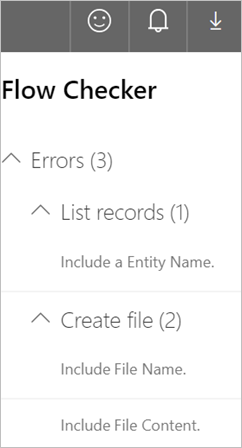

# The Microsoft Flow checker

The Microsoft Flow checker promotes higher quality flows by ensuring you follow best practices when you design flows. When you run the checker, you get insights into questions like "which areas of my flow's implementation pose a performance or reliability risk?"

For each issue the checker identifies, the checker points to specific occurrences within the flow where you should consider making improvements. And, you learn how to implement these improvements by following detailed guidance.

The checker is always active, appearing in the command bar in the designer. The checker shows a red dot when it finds one or more errors or potential errors in your flow.

## View errors in the checker

While designing your flow, you can select this button to open the checker to view errors and warnings. 

The checker also opens automatically when you save the flow if there are errors or warnings.  Once the checker opens, it shows all errors and warnings in your flow. In each section, the checker calls out the actions where the error or warning occurs. 

## Learn to fix errors and warnings

Expand each section to learn more about how to fix an error.

## Learn more

[Getting started with Microsoft Flow](getting-started.md)

