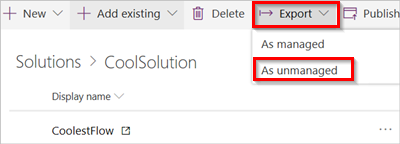

# Export a solution

Follow these steps to move your solution and its dependencies to a new environment:

1. Select **Solutions** from the navigation bar.
1. Select the solution you want to export.
1. Select **|->Export** from the menu at the top.
1. Select **As unmanaged**.

    

1. Save the solution with a name of your choice.

    ![NOTE] **As managed** is not supported currently.

## Learn more

* [Create a solution](./overview-solution-flows.md)
* [Create a flow in a solution](./create-flow-solution.md)
* [Import a solution](./import-flow-solution.md)
* [Edit a solution-aware flow](./edit-solution-aware-flow.md)