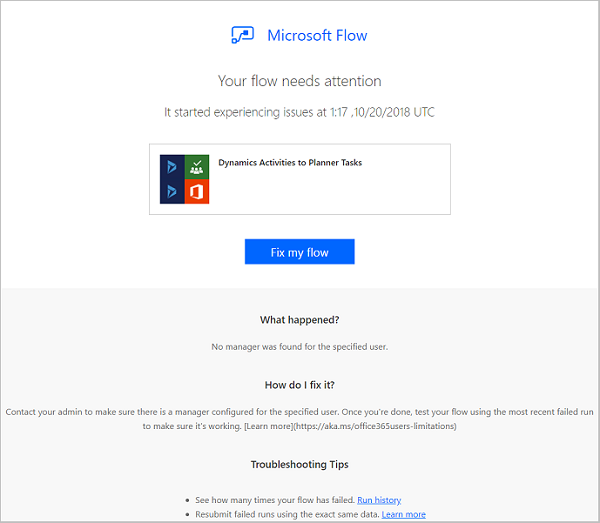

# Troubleshooting a flow

## Repair tips in email

Repair tips are sent to flow owners via email whenever a flow fails. These repair tips emails contain specific, actionable feedback about certain errors. For example, one common error is setting up a flow that attempts to get a person’s manager in Office 365—but there is no manager configured in Azure AD. If this, or several other conditions cause your flow to fail, you get a repair tips email like this one:

The repair tips email contains the following sections:

Name|Description
---|---
Time|Displays the time the flow first failed.
What happened|Provides a description of the problem that caused the failure in the flow.
How do I fix|Provides tips for resolving the issue that cause the failure in the flow.
Troubleshooting Tips|Provides details including the number of times the flow failed, and a link to retry the flow with the same input data.

To fix the reported errors, select **Fix my flow** and follow the steps in the repair tips email.

Repair tips emails are optional. If you don't want to receive them, just turn off from the properties menu for the specific flow.

If your flow fails, you can also troubleshoot it directly in Microsoft Flow.  Here are a few common failure scenarios and tips on how to fix them.

## Identify the error
Before you can fix a flow, you must identify why it failed. Click or tap the notifications icon at the top of the web portal (or open the **Activity** tab in the mobile app), and then click or tap your flow in the list that appears.

Details about the flow appear, and at least one step shows a red exclamation icon. Open that step and review the error message.

## Authentication failures
In many cases, flows fail because of an authentication error. If you have this type of error, the error message contains **Unauthorized** or an error code of **401** or **403** appears. You can usually fix an authentication error by updating the connection:

1. At the top of the web portal, click or tap the gear icon to open the **Settings** menu, and then click or tap **Connections**.
2. Scroll to the connection for which you saw the **Unauthorized** error message.
3. Next to the connection, click or tap the **Verify password** link in the message about the connection not being authenticated.
4. Verify your credentials by following the instructions that appear, return to your flow-run failure, and then click or tap **Resubmit**.
   
    The flow should now run as expected.

## Action configuration
Flows also fail if a setting in an action of the flow doesn't function as expected. In this case, the error message contains **Bad request** or **Not found**, or an error code of **400** or **404** appears.

The error message should specify how to correct the failure. You'll need to click or tap the **Edit** button and then correct the problem inside the flow definition. Save the updated flow, and then click or tap **Resubmit** to try the run again with the updated configuration.

## Other failures
If the error code **500** or **502** appears, the failure is temporary or transient. Click or tap **Resubmit** to try the flow again.

If you encounter some other problem, [please ask our community](https://go.microsoft.com/fwlink/?LinkID=787467) because others may have encountered a similar problem.

