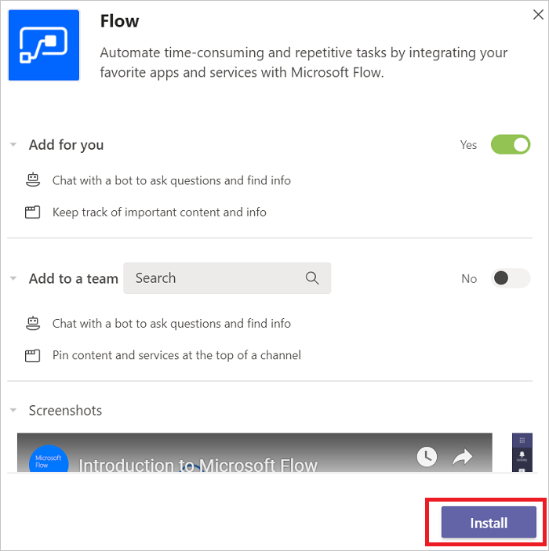
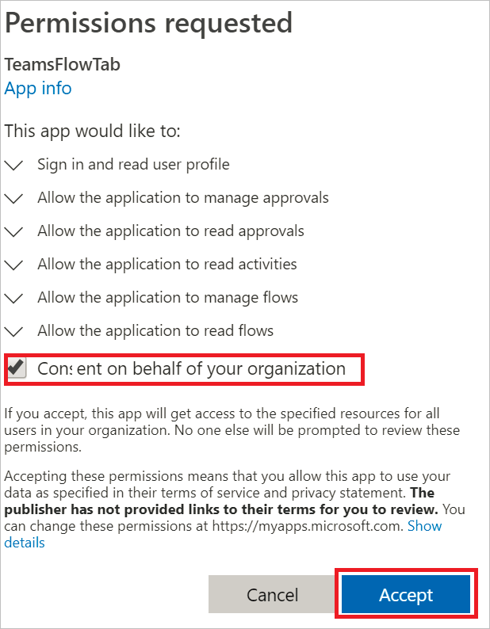
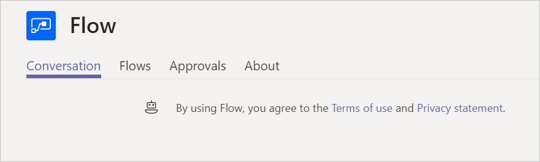
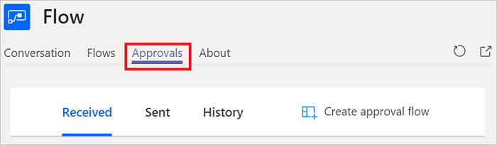
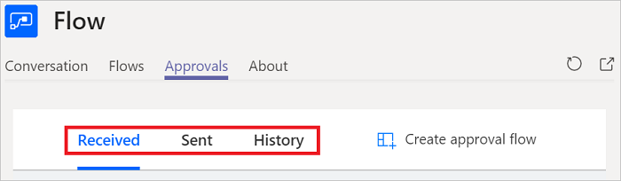
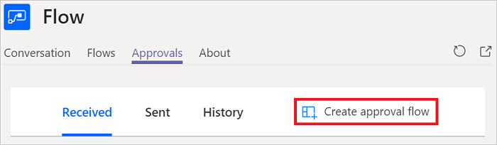
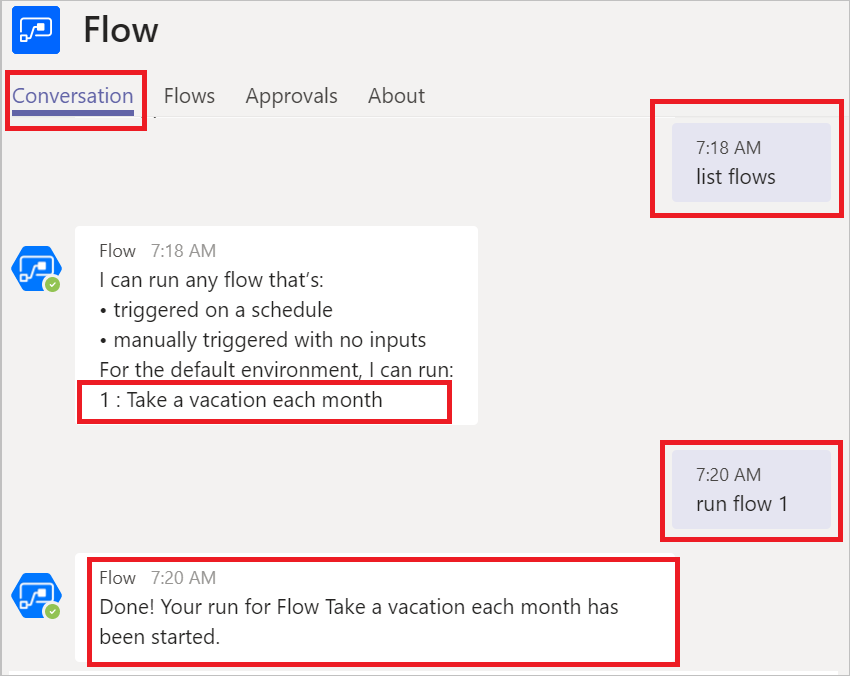
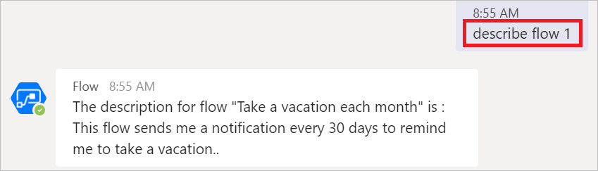
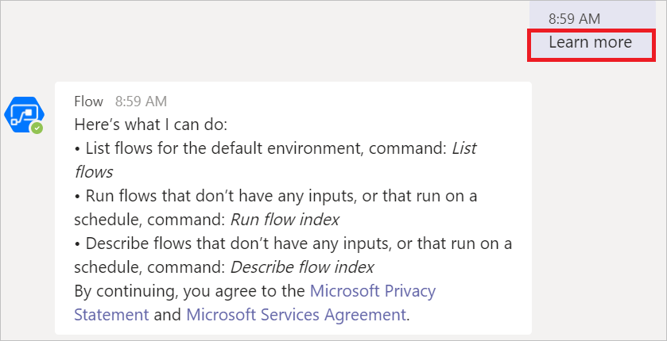

# Microsoft Flow in Teams

### Prerequisites

1. Access to Microsoft Teams.
1. Access to Microsoft Flow.

## Install the Microsoft Flow app in Teams

Follow these steps to install the Microsoft Flow app in Microsoft Teams.

1. Sign into Microsoft Teams.

1. Tap the **Apps** icon at the bottom left of the Teams navigation bar.

    

1. Select the **Flow** app. You might need to search for **Flow** if you don't see it.

    

1. Select the **Install** button.

    

1. Microsoft Flow is now installed.

    


## Create a flow in teams

1. Sign into Microsoft Teams.

1. Select the **More added apps** link (three dots) on the navigation bar.

    

1. Select the **Flow** app.

1. If you haven't done so before, you might need sign in and  grant permissions:.

    


    Notice the following tabs

    

    Name|Purpose
    ----|-----|
    Conversation|Interact with the Flow bot.
    Flows|Create and manage flows.
    Approvals|Lists received and sent approval requests.
    About|Displays version and other information about Microsoft Flow.


    You now see all flows you've created from the Microsoft Flow designer (if any). 

    You can also create flows from a [custom template]() or from [blank template](), just like you do from the Microsoft Flow designer. 

## Manage approvals

You can manage [approvals](modern-approvals.md) in Microsoft Teams, just like you would do in Microsoft Flow. Follow these steps to manage your approvals:

1. Sign into Microsoft Teams.
1. Select the **Approvals** tab.

    

    You'll notice the following sub-tabs:

    Tab|Purpose
    ----|-----|
    Received|Lists approval requests you've received and are pending action from you.
    Sent|Lists approval requests you've sent and are pending action from others.
    History|Lists received and sent approval requests.
    Create approval flow|Create approval flows.

1. Select the **Received**, **Sent**, or **History** tabs to learn more.

    

1. Select the **Create approval flow** to create an approval flow.

    

## Use the bot with flows

### List and launch flows with the bot

> [!TIP]
> The bot lists and runs flows that are triggered by a schedule, or manually triggered without user input.
1. Sign into Microsoft Teams.
1. Select the **More added apps** link (three dots) on the navigation bar.

    
1. Select the **Flow** app

1. Select the **Conversation** tab.

    

On the **Conversation** tab, you can send commands to the bot, which responds by performing the actions you command it to run. For example, to list my flows and run the flow with index 1, run the following commands:
- ```List flows``` - The bot displays a list of your flows, prefixed by an index number.
- ```Run flow 1``` - Runs flow number 1. Here, *1* is the index number of the flow you want to run.

   

### Get the description for flows

To get the description for the flow with index 1 from your list of flows, run ```describe flow 1```. The bot responds similar to this image:

   

### Get the list of commands for the bot

To get the list of commands the bot handles, just ask it with this command:

```learn more```. The bot responds like this image:

    