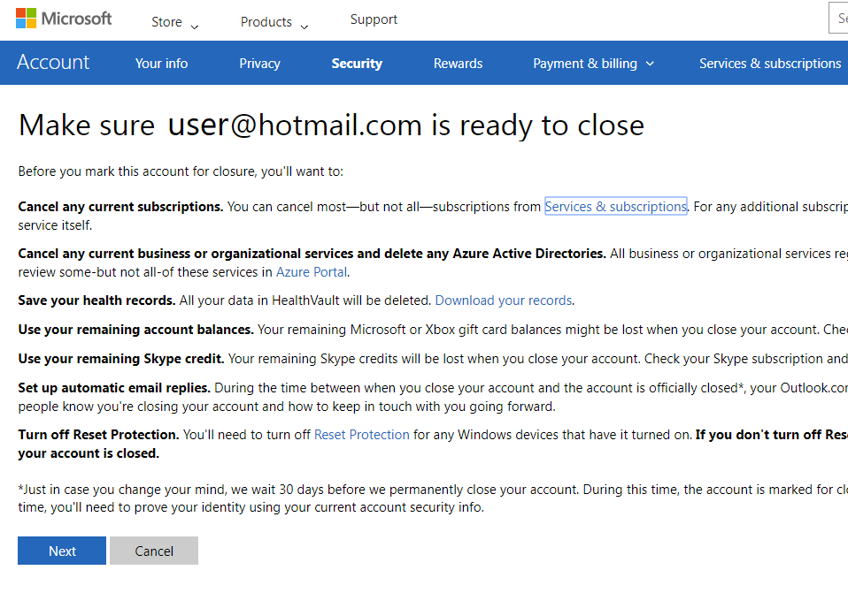
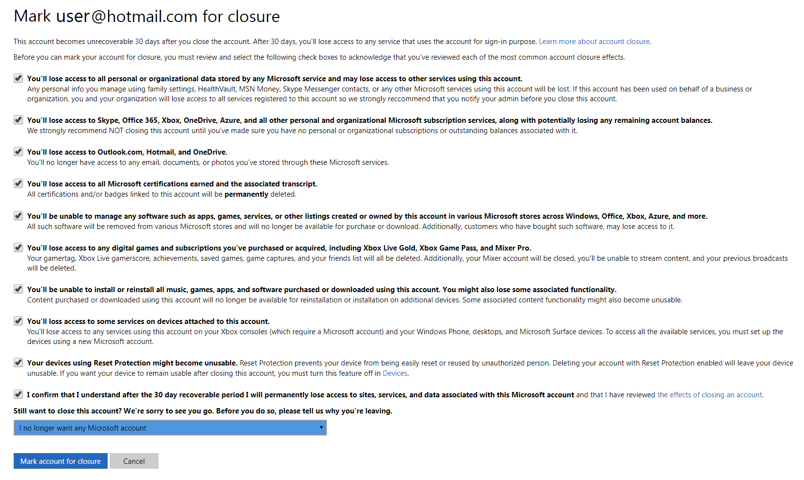
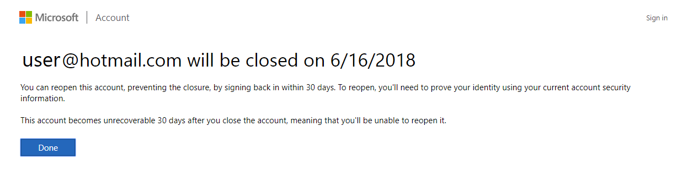

# Responding to GDPR Data Subject Account Close Requests for Microsoft Flow - Microsoft Accounts (MSA)

The “right to erasure” by the removal of personal data is a key protection in the GDPR. Removing personal data includes removing all personal data except audit log information. When a user decides to close their Microsoft Account, the user's underlying data will also be deleted.

The following table shows resources containing personal data that will be automatically deleted when a Microsoft Account is closed.

|Resources containing personal data|
|------|------|
|Product and service activity|
|Run history|
|Flows|
|Activity Feed|
|User details|
|Connections|

**Website access:** The following website provides support to close your Microsoft Account.
* [Microsoft Account Close Portal](http://go.microsoft.com/fwlink/?LinkId=523898)

## Account Close requests

The steps below describe how functions exist to serve Account Close requests for GDPR.

 1. Sign into the [Microsoft Account Close Portal](http://go.microsoft.com/fwlink/?LinkId=523898) using your Microsoft Account.
1. You will be reminded to cancel any existing subscriptions or export data from existing services that you may subscribe to. Click **Next** to proceed.

    
1. Users are asked to acknowledge they understand the implications of closing their Microsoft Account including losing access to services and content. Upon acknowledging these impacts, click on the **Mark account for closure** button.

1. A notification will appear indicating that your account will be closed in 30 days. Until that time, you have the ability to reopen this account.

1. At the end of this 30 day window, the process  to delete all Microsoft Flow resources for this Microsoft Account will begin.