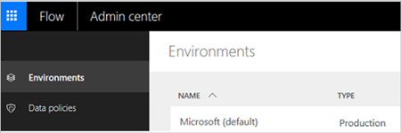
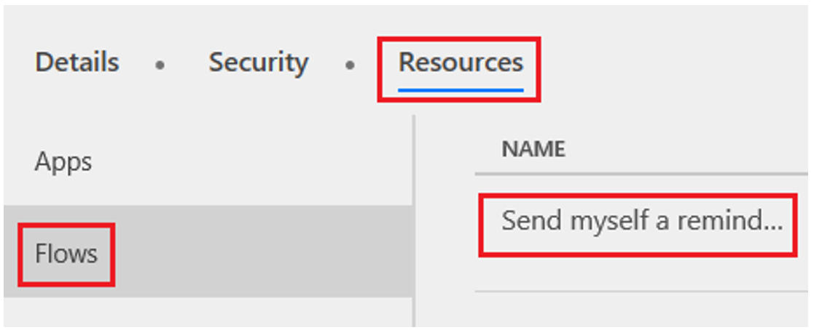
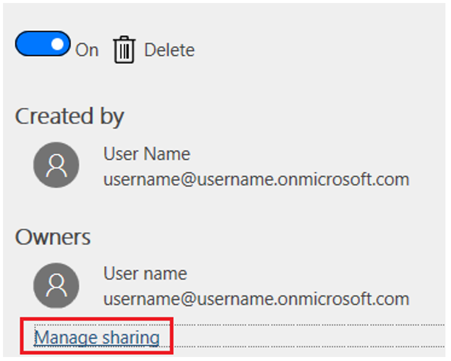
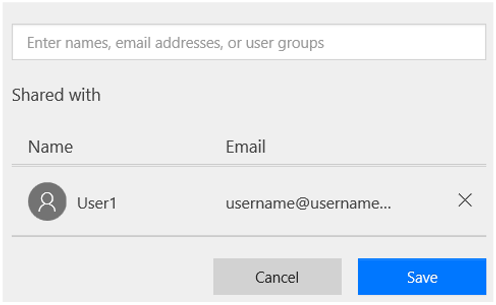
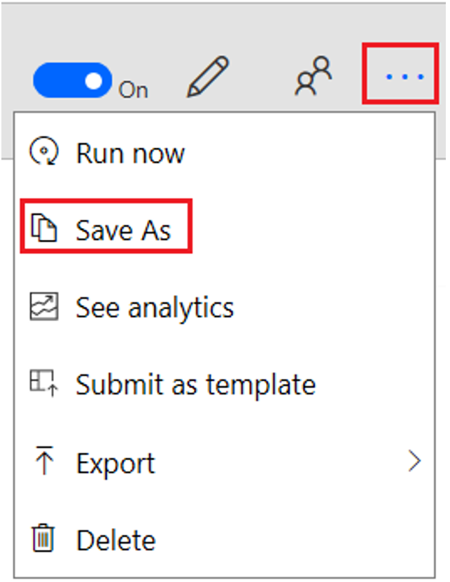
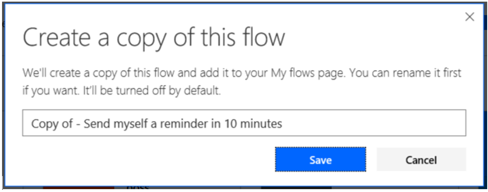
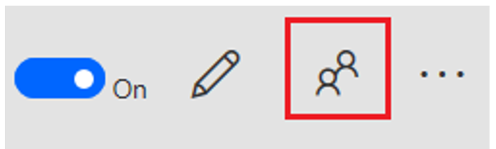
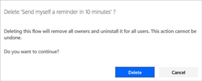

# Responding to GDPR Data Subject Delete Requests for Microsoft Flow

The “right to erasure” by the removal of personal data from an organization’s Customer Data is a key protection in the GDPR. Removing personal data includes removing all personal data and system-generated logs, except audit log information.

Microsoft Flow allows users to build automation workflows that are a critical part of your organization’s day-to-day operations. When a user leaves your organization, an administrator needs to manually review and determine whether or not to delete certain data and resources that the user created. There is other personal data that's automatically deleted whenever the user’s account is deleted from Azure Active Directory.

The following table shows which personal data is automatically deleted and which data requires an administrator to manually review and delete:

|Requires manual review and deletion|Automatically deleted when the user is deleted from Azure Active Directory|
|------|------|
|Environment*|System-generated logs|
|Environment permissions**|Run history|
|Flows|Activity Feed|
|Flow permissions|Gateway |
|User details|Gateway permissions|
|Connections*||
|Connection permissions||
|Custom connector*||
|Custom connector permissions||

*Each of these resources contains “Created By” and “Modified By” records that include personal data. For security reasons, these records are retained until the resource is deleted.

**For environments that include a Common Data Service For Apps database, environment permissions (e.g. which users are assigned to the Environment Maker and Admin roles) are stored as records in the Common Data Service database. Please see [Executing DSRs against Common Data Service Customer Data](https://go.microsoft.com/fwlink/?linkid=872251), for guidance on how to respond to DSRs for users who use the Common Data Service.

For the data and resources that require manual review, Microsoft Flow offers the following experiences to find or change personal data for a specific user:

* **Website access:** sign in to the [PowerApps Admin Center](https://admin.powerapps.com/), or the [Microsoft Flow Admin Center](https://admin.flow.microsoft.com/)

* **PowerShell access:**  [PowerApps Admin PowerShell cdmlets](https://go.microsoft.com/fwlink/?linkid=871804) 

Here is the breakdown of experiences that are available for an administrator to delete each types of personal data within each type of resource:

|Resources containing personal data|Website access|PowerShell access|Automated Deletion|
|-----|----|----|----|
|System-generated logs|[Office 365 Service Trust Portal](https://servicetrust.microsoft.com/)|||
|Environment|Microsoft Flow Admin Center|PowerApps cmdlets||
|Environment permissions*|Microsoft Flow Admin Center|PowerApps cmdlets||
|Run history||| Deleted through 28 day retention policy|
|Activity feed |||Deleted through 28 day retention policy|
|Flows|Microsoft Flow Maker Portal**|||
|Flow permissions|Microsoft Flow Maker Portal|||
|User details||PowerApps cmdlets||
|Connections|Microsoft Flow Maker Portal| ||
|Connection permissions|Microsoft Flow Maker Portal| ||
|Custom connector|Microsoft Flow Maker Portal| ||
|Custom connector permissions|Microsoft Flow Maker Portal| ||
|Approval History|Microsoft PowerApps Maker Portal*|||

*With the introduction of the Common Data Service for Apps, if a database is created within the environment, environment permissions and model-driven app permissions are stored as records within the Common Data Service for Apps database instance. Please see [Executing DSRs against Common Data Service Customer Data](https://go.microsoft.com/fwlink/?linkid=872251), for guidance on how to respond to DSRs for users who use the Common Data Service.

** An admin will only be able to access these resources from the Microsoft Flow Maker Portal if the administrator has been assigned access from the Microsoft Flow Admin Center.

## Manage Delete requests

The steps below describe how administrative functions exist to serve delete requests for GDPR. These steps should be performed in the order outlined below.

> [!IMPORTANT]
> To avoid data corruption, follow these steps in order.
>
>

## List and re-assign flows

These steps copy existing flows for a departing user. If you assign new ownership to the copies, these flows can continue to support existing business processes. Copying these flows is important to delete personal identifier linkages to the departing user and new connections must be established for the flow to connect with other APIs and SaaS applications.

1. Sign into the [Microsoft Flow admin center](https://admin.flow.microsoft.com/), and then select the environment that contains flows that the deleted user owns.

    

1. Select **Resources**, > **Flows**, and then select the title for the flow that you want to reassign.

    

1. Select **Manage sharing**.

    

1. In the **Share** panel that appears near the right edge, add yourself as an owner, and then select **Save**.

    

1. Sign into [Microsoft Flow](https://flow.microsoft.com/), select **My flows**, and then select **Team flows**.

1. Select the ellipsis **(… )** for the flow you want to copy, and then select **Save As**.

    

1. Configure connections as required, and then select **Continue**.

1. Provide a new name, and then select **Save**.

    

1. This new version of the flow appears in **My flows**, where you can share it with additional users if you want.

    

1. Delete the original flow by selecting the ellipsis **(…)** for it, selecting **Delete**, and then select **Delete** again when prompted. This step will also remove underlying personal identifiers that are included in system dependencies between the user and Microsoft Flow.

    

1. Enable the copy of the flow, by opening **My flows** and then turning the toggle control to **On**.

    

1. The copy now performs the same workflow logic as the original version.

## Delete approval history from Microsoft Flow

 Approval data for Microsoft Flow is stored within the current or previous version of Common Data Service for Apps. Within an approval, personal information exists in the form of approval assignments and comments included in an approval response. Administrators can access that data by following these steps:

1. Sign into [PowerApps](https://web.powerapps.com/).

1. Select **Data**, and then select **Entities**.

1. Select the ellipsis **(…)** for the **Flow Approval** entity, and then open the data in Microsoft Excel.

1. In Microsoft Excel, search, filter, and then delete approval data as required.

Please see [Executing DSRs against Common Data Service Customer Data](https://go.microsoft.com/fwlink/?linkid=872251), for additional guidance on how to respond to DSRs for users who use the Common Data Service.


## Delete connections created by a user

Connections are used in conjunction with connectors to establish connectivity with other APIs and SaaS systems.  Connections include references to the user who created them and as a result, can be deleted to remove any references to the user.

PowerApps Maker PowerShell cmdlets

A user can delete all of their connections by using the Remove-Connection function from the [PowerApps Maker PowerShell cmdlets](https://go.microsoft.com/fwlink/?linkid=871448):

```PowerShell
Add-PowerAppsAccount

#Retrieves all connections for the calling user and deletes them
Get-Connection | Remove-Connection
```

PowerApps Admin PowerShell cmdlets

```PowerShell
Add-PowerAppsAccount

$deleteDsrUserId = "7822bb68-7c24-49ce-90ce-1ec8deab99a7"
#Retrieves all connections for the DSR user and deletes them 
Get-AdminConnection -CreatedBy $deleteDsrUserId | Remove-AdminConnection 

```
## Delete the user’s permissions to shared connections

PowerApps Maker PowerShell cmdlets

A user can delete all of their connection role assignments for shared connections Remove-ConnectionRoleAssignment function in the [PowerApps Maker PowerShell cmdlets](https://go.microsoft.com/fwlink/?linkid=871448):

```PowerShell
Add-PowerAppsAccount

#Retrieves all connection role assignments for the calling users and deletes them
Get-ConnectionRoleAssignment | Remove-ConnectionRoleAssignment
```

PowerApps Admin PowerShell cmdlets

```PowerShell
Add-PowerAppsAccount

$deleteDsrUserId = "7822bb68-7c24-49ce-90ce-1ec8deab99a7"
#Retrieves all shared connections for the DSR user and deletes their permissions 
Get-AdminConnectionRoleAssignment -PrincipalObjectId $deleteDsrUserId | Remove-AdminConnectionRoleAssignment  

```
> [!NOTE]
> Owner role assignments cannot be deleted without deleting the connection resource.
>
>

## Delete custom connectors created by the user

Custom Connectors supplement the existing out of box connectors and allow for connectivity to other APIs, SaaS and custom-developed systems. Custom Connectors do include references to the user who created them and as a result, can be deleted to remove any references to the user.

PowerApps Maker PowerShell cmdlets

A user can delete all of their custom connectors the Remove-Connector function in the [PowerApps Maker PowerShell cmdlets](https://go.microsoft.com/fwlink/?linkid=871448):

```PowerShell
Add-PowerAppsAccount

#Retrieves all custom connectors for the calling user and deletes them
Get-Connector -FilterNonCustomConnectors | Remove-Connector
```

PowerApps Admin PowerShell cmdlets
```PowerShell
Add-PowerAppsAccount

$deleteDsrUserId = "7822bb68-7c24-49ce-90ce-1ec8deab99a7"
#Retrieves all custom connectors created by the DSR user and deletes them 
Get-AdminConnector -CreatedBy $deleteDsrUserId | Remove-AdminConnector  

```

## Delete the user’s permissions to shared custom connectors

PowerApps Maker PowerShell cmdlets

A user can delete all of their connector role assignments for shared custom conector with the Remove-ConnectorRoleAssignment function in the [PowerApps Maker PowerShell cmdlets](https://go.microsoft.com/fwlink/?linkid=871448):

```PowerShell
Add-PowerAppsAccount

#Retrieves all connector role assignments for the calling users and deletes them
Get-ConnectorRoleAssignment | Remove-ConnectorRoleAssignment
```

PowerApps Admin PowerShell cmdlets
```PowerShell
Add-PowerAppsAccount

$deleteDsrUserId = "7822bb68-7c24-49ce-90ce-1ec8deab99a7"
#Retrieves all custom connector role assignments for the DSR user and deletes them 
Get-AdminConnectorRoleAssignment -PrincipalObjectId $deleteDsrUserId | Remove-AdminConnectorRoleAssignment  

```

> [!NOTE]
> Owner role assignments cannot be deleted without deleting the connection resource.
>
>


## Delete or reassign all environments created by the user

As an admin you have two decisions to make when processing a DSR delete request for a user for each of the environments that has been created by the user:

1. If you determine that the environment is not being used by anyone else in your organization then you can choose to delete the environment
1. If you determine that the environment is still required, then you can choose to not delete the environment and add yourself (or another user in your organization) as an Environment Admin.
    > [!IMPORTANT]
    > Deleting an environment will permanently delete all resources within the environment, including all apps, flows, connections, etc., so please review the contents of an environment before deletion.
    >
    >

## Give access to a user’s environments from the Microsoft Flow Admin Center

An admin can grant Admin access to an environment created by a specific user from the [Microsoft Flow Admin Center](https://admin.flow.microsoft.com/). For more information on administrating environments please navigate to [Using environments within Microsoft Flow](https://docs.microsoft.com/flow/environments-overview-admin).

## Delete the user’s permissions to all other environments

Users can be assigned permissions (such as Environment Admin, Environment Maker, etc.) in an environment, which is stored in the Microsoft Flow service as a “role assignment.”

With the introduction of the Common Data Service for Apps, if a database is created within the environment, these “role assignments” are stored as records within the Common Data Service for Apps database instance.

For more information on removing a user's permission in an  environment, navigate to [Using environments within Microsoft Flow](https://docs.microsoft.com/flow/environments-overview-admin).

## Delete Gateway Settings
Responding to Data Subject Delete Requests for On-Premise Data Gateways can be found [here](https://docs.microsoft.com/en-us/power-bi/service-gateway-onprem#tenant-level-administration).

## Delete User Details
User details provide a linkage between a user and a specific tenant. Before running this command, ensure that all flows for this user have been re-assigned and/or deleted. Once that has been completed, an administrator can delete user details by calling the **Remove-AdminFlowUserDetails** cmdlet and passing in the Object ID for the user.


PowerApps Admin PowerShell cmdlets
```PowerShell
Add-PowerAppsAccount
Remove-AdminFlowUserDetails -UserId 1b6759b9-bbea-43b6-9f3e-1af6206e0e80
```

> [!IMPORTANT]
> If a user still owns individual or team flows, this command will return an error. To resolve, delete all remaining flows or team flows for this user and run command again.
>
>
## Delete the user from Azure Active Directory
Once the above steps have been completed, the final step is to delete the user’s account for Azure Active Directory by following the steps outlined in the Azure Data Subject Request GDPR documentation that can be found on the [Office 365 Service Trust Portal](https://servicetrust.microsoft.com/ViewPage/GDPRDSR).

## Delete the user from Unmanaged Tenant
In the event you are a member of an unmanaged tenant, you need perform an **Account close** action from the [Work and School Privacy portal](https://go.microsoft.com/fwlink/?linkid=873123).

To determine whether or not you are a user of a managed or unmanaged tenant, perform the following actions:
1. Open the following URL in a browser, making sure to replace your email address in the URL:[ https://login.windows.net/common/userrealm/foobar@contoso.com?api-version=2.1](https://login.windows.net/common/userrealm/foobar@contoso.com?api-version=2.1).
1. If you are a member of an **unmanaged tenant** then you will see an `"IsViral": true` in the response.

    {

     "Login": "foobar@unmanagedcontoso.com",

    "DomainName": "unmanagedcontoso.com",

    "IsViral": **true**,
    
    }

1. Otherwise, you belong to a managed tenant.

