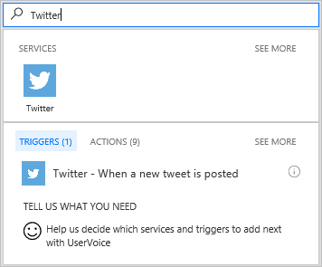
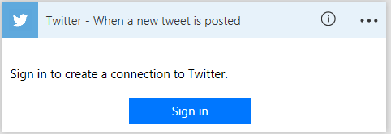
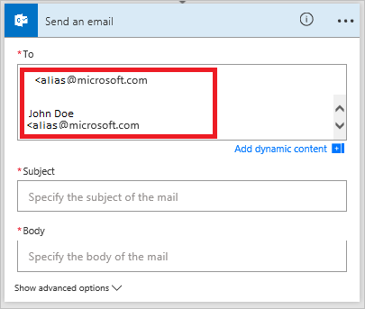
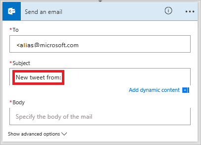
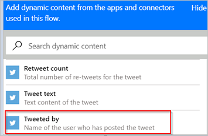
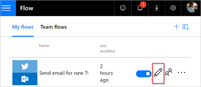
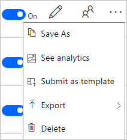

# Create a flow in Microsoft Flow
<iframe width="560" height="315" src="https://www.youtube.com/embed/Gt3CMhLAQqE?list=PL8nfc9haGeb55I9wL9QnWyHp3ctU2_ThF" frameborder="0" allowfullscreen></iframe>

Create a flow to perform one or more tasks automatically when you want an event to kick off an action. For example, create a flow that notifies you by mail as soon as someone sends a tweet that contains a keyword you specify. In this example, sending a tweet is the event, and sending mail is the action.

**Prerequisites**

* An account on [flow.microsoft.com](https://flow.microsoft.com)
* An Twitter account
* Office 365 credentials

## Specify an event
First, you will need to select what starting action, or *trigger*, will start your flow.

1. In [flow.microsoft.com](https://flow.microsoft.com), select **My flows** in the top navigation bar, and then select **Create from blank**.
   
    
2. In the box that says **Search all services and triggers**, type or paste **Twitter**, and then select **Twitter - When a new tweet is posted**.
   
    
3. If you haven't already connected your Twitter account to Microsoft Flow, select **Sign in to Twitter**, and then provide your credentials.
   
    
4. In the **Query text** box, type the keyword that you want to find.
   
    

## Specify an action
1. Under the event that you created in the previous procedure, select **New step**, and then select **Add an action**.
   
    
2. In the box that shows **Search all services and actions**, type or paste **send email**, and then select **Office 365 Outlook - Send an email**.
   
    
3. If prompted, select the sign-in button, and then provide your credentials.
4. In the form that appears, type or paste your email address in the **To** box then select your name from the list of contacts that appears.
   
    
5. In the **Subject** box, type or paste **New tweet from:**, then type a space.
   
    
6. In the list of parameters, select the **Tweeted by** parameter to add a placeholder for it.
   
    
7. Click or tap in the **Body** box then click or tap the **Tweet text** parameter to add a placeholder for it.
8. (optional) Add more parameters, other content, or both to the body of the email.
9. Near the top of the screen, name your flow, and then select **Create flow**.
   
   
10. Select **Done** to update the list of your flows.
    
     
11. Send a tweet with the keyword that you indicated.
    
     Within a minute, an email message notifies you of the new tweet.

## Manage a flow
1. In [flow.microsoft.com](https://flow.microsoft.com), select **My flows** in the top navigation bar.
2. In the list of flows, do any of the following:
   
   * To pause a flow, set its toggle to **Off**.
     
       
   * To resume a flow, set its toggle to **On**.  
     
       
   * To edit a flow, select it from the list of flows.  
     
       
   * To delete a flow, select the **...** icon, select its trash-can icon, and then select **OK**.  
     
       
   * To view flow history, select the **List runs** icon.  
     
       
     
     Select a flow run from the list of runs to see the inputs and outputs of each step.

**Note**: You can have up to 50 flows in your account. If you already have 50, delete one before you can create another.

## Next steps
* [Add steps](multi-step-logic-flow.md), such as different ways to be notified, to your flow.
* [Run tasks on a schedule](run-tasks-on-a-schedule.md), when you want an action to occur daily, on a certain date, or after a certain number of minutes.
* [Add a flow to an app](https://powerapps.microsoft.com/tutorials/using-logic-flows/) to allow your app to kick off logic in the cloud.
* [Get started with team flows](create-team-flows.md) and invite others to collaborate with you to design flows.

