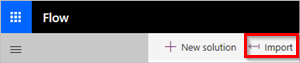
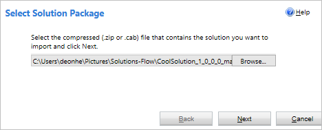

# Import a solution

After you've exported your solution, you can import it into any environment that meets the prerequisites. Follow these steps to import a solution:

1. Sign in to Microsoft Flow, and then select **Solutions** from the navigation bar.

   

<!--from editor: I don't think you need the symbols on the left of Import, below. They don't look like the arrow icon, and I think Import is clear enough. -->

1. Select **<- Import**.

   

1. Select **Browse** from the **Import Solution** page that opens.
1. Find and then select the solution that you want to import.
1. Select **Open**.

<!--from editor: The following screenshot says Select Solution Package, which differs from the sentence below. That might be confusing for readers. Also, "deonhe" is visible in the screenshot. We need to keep PII out of images. Can you blur that?--> 

   You should now see the **Import Solution Package** page similar to this image:

   

1. Select **Next**.

   If there are no errors, the importation completes within a few moments.

> [!NOTE]
> You cannot import a solution into an environment in which the solution already exists.

## Learn more

- [Create a solution](./overview-solution-flows.md)
- [Create a flow in a solution](./create-flow-solution.md)
- [Export a solution](./export-flow-solution.md)
- [Edit a solution-aware flow](./edit-solution-aware-flow.md)
