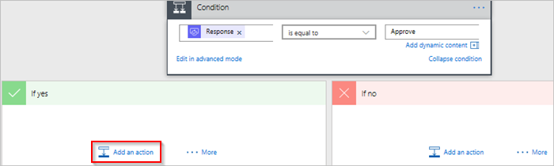

1. Select **Add an action** on the **IF YES, DO NOTHING** branch of the condition.
   
     
2. Enter **send email** into the search box on the **Choose an action** card.
   
     
3. Select the **Office 365 Outlook - Send an email** action.
   
     
4. Configure the email card to suit your needs.
   
     Note: **To**, **Subject**, and **Body** are required.
   
     This card is a template for the email that is sent when the status of the vacation request changes.
   
     Note: In the **Body** box on the **Send an email** card, use the **Comments** token from the **Approvals - Start an approval** action.

