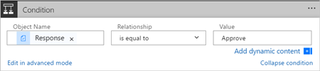

1. Select **New step**, and then select **Add a condition**.
   
    
2. Select the **Object Name** box, and then enter **response** into the search box on the **Add dynamic content from the apps and services used in this flow** card.
3. Select the **Response** token.
   
    
4. Select the **Value** box, and then enter **Approve** into the box.
   
   > [!NOTE]
   > The valid responses to the **Approvals - Start an approval** action are "Approve" and "Reject". These responses are case-sensitive.
   > 
   > 
5. Your **Condition** card should now resemble this image:
   
    

