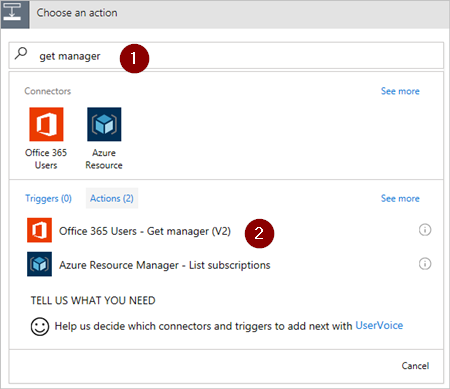

1. Select **New step**, and then select **Add an action**.
   
    
2. Enter **get manager** into the **Choose an action** search box.
3. Find, and then select the **Office 365 Users - Get manager (V2)** action.

    
4. Insert the **Created By Email** token into the **User** box on the **Get manager** card.

    This action gets the manager for the person who created the vacation request in SharePoint.

    

