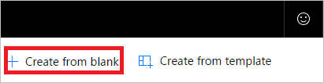
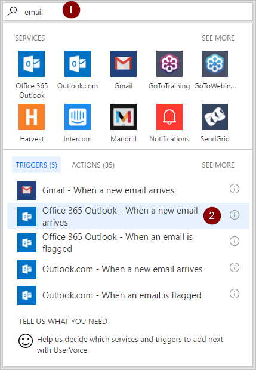

1. Sign in to [Microsoft Flow](https://flow.microsoft.com), and then select the **My flows** tab.
2. Select **Create from blank**.
   
    
3. Search for "email", and then select **Office 365 Outlook - When a new email arrives** from the list of triggers. This trigger runs each time an email arrives.
   
    
4. Select the folder that you'd like the flow to monitor for incoming emails, and then select **Show advanced options**.
   
     Note: To display all your email folders, select the **Show Picker** icon, which is located on the right side of the **Folder** box on the **When a new email arrives** card.
   
    

