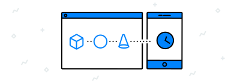

    

        <ul class="cardsY panelContent featuredContent">
            <li>
                <a href="getting-started.md">
                    

                        

                            

                                

                                    

                                        
                                    

                                

                                

                                    View all docs
                                

                            

                        

                    

                </a>
            </li>
        </ul>
    

    <h1>Microsoft Flow Documentation</h1>
    <ul class="pivots">
        <li>
            <a href="#start">I'm a beginner</a>
            <ul id="start">
                <li>
                    
                    <ul id="start-all" class="cardsC">
                        <li>
                            <a href="./guided-learning/index.yml">
                            

                                

                                    

                                        

                                            

                                                                                             

                                        

                                        

                                            <h3>Take a guided learning tour</h3>
                                            
Start your learning journey with this sequenced collection of courses to understand the extensive and powerful capabilities of Microsoft Flow.

                                        

                                    

                                

                            

                            </a>
                        </li>
                        <li>
                            <a href="getting-started.md">
                            

                                

                                    

                                        

                                            

                                                
                                            

                                        

                                        

                                            <h3>Get started with the basics</h3>
                                            
Quick ways to start automating your work and life with Microsoft Flow.

                                        

                                    

                                

                            

                            </a>
                        </li>
                        <li>
                            <a href="mobile-create-flow.md">
                            

                                

                                    

                                        

                                            

                                                
                                            

                                        

                                        

                                            <h3>Get to know the mobile app</h3>
                                            
Manage, track, and explore your automated workflows anytime and from anywhere.

                                        

                                    

                                

                            

                            </a>
                        </li>
                        <li>
                            <a href="introduction-to-button-flows.md">
                            

                                

                                    

                                        

                                            

                                                
                                            

                                        

                                        

                                            <h3>Create a button flow in 2 minutes</h3>
                                            
Learn how to automate and run repetitive tasks with button flows.

                                        

                                    

                                

                            

                            </a>
                        </li>
                        <li>
                            <a href="https://aka.ms/flowoftheweek">
                            

                                

                                    

                                        

                                            

                                                
                                            

                                        

                                        

                                            <h3>Catch up on the Flow of the Week</h3>
                                            
Learn new tricks directly from the Microsoft Flow team.

                                        

                                    

                                

                            

                            </a>
                        </li>
                        <li>
                            <a href="https://flow.microsoft.com/support/">
                            

                                

                                    

                                        

                                            

                                                
                                            

                                        

                                        

                                            <h3>Get help</h3>
                                            
We&#39;re always here to help. What&#39;s on your mind?

                                        

                                    

                                

                            

                            </a>
                        </li>
                    </ul>
                </li>
            </ul>
        </li>
        <li>
            <a href="#intermediate">I'm an intermediate</a>
            <ul id="intermediate">
                <li>
                    
                    <ul id="intermediate-all" class="cardsC">
                        <li>
                            <a href="get-started-logic-template.md">
                            

                                

                                    

                                        

                                            

                                                
                                            

                                        

                                        

                                            <h3>Create a flow from a template</h3>
                                            
Create a flow from any of several predefined templates.

                                        

                                    

                                

                            

                            </a>
                        </li>
                        <li>
                            <a href="get-started-logic-flow.md">
                            

                                

                                    

                                        

                                            

                                                
                                            

                                        

                                        

                                            <h3>Create a flow from scratch</h3>
                                            
Let your imagination lead you to amazing flows.

                                        

                                    

                                

                            

                            </a>
                        </li>
                        <li>
                            <a href="modern-approvals.md">
                            

                                

                                    

                                        

                                            

                                                
                                            

                                        

                                        

                                            <h3>Create approval flows</h3>
                                            
Learn to create flows that manage the approval of documents or processes across several services.

                                        

                                    

                                

                            

                            </a>
                        </li>
                        <li>
                            <a href="create-team-flows.md">
                            

                                

                                    

                                        

                                            

                                                
                                            

                                        

                                        

                                            <h3>Collaborate on a team flow</h3>
                                            
Microsoft Flow makes it easy automate repetitive tasks. You can add users or groups as owners, and then collaborate with them to design and manage flows.

                                        

                                    

                                

                            

                            </a>
                        </li>
                        <li>
                            <a href="share-buttons.md">
                            

                                

                                    

                                        

                                            

                                                
                                            

                                        

                                        

                                            <h3>Let others use your button flows</h3>
                                            
Share your buttons with others so they can use them to save time.

                                        

                                    

                                

                            

                            </a>
                        </li>
                        <li>
                            <a href="fix-flow-failures.md">
                            

                                

                                    

                                        

                                            

                                                
                                            

                                        

                                        

                                            <h3>Troubleshoot your flows</h3>
                                            
Here are a few tips for when things go wrong and you need to take a closer look.

                                        

                                    

                                

                            

                            </a>
                        </li>
                    </ul>
                </li>
            </ul>
        </li>
        <li>
            <a href="#expert">I'm an expert</a>
            <ul id="expert">
                <li>
                    
                    <ul id="expert-all" class="cardsC">
                        <li>
                            <a href="use-expressions-in-conditions.md">
                            

                                

                                    

                                        

                                            

                                                
                                            

                                        

                                        

                                            <h3>Fine-tune your flows with expressions</h3>
                                            
Learn to use expressions and conditions to compare multiple values.

                                        

                                    

                                

                            

                            </a>
                        </li>
                        <li>
                            <a href="environments-overview-admin.md">
                            

                                

                                    

                                        

                                            

                                                
                                            

                                        

                                        

                                            <h3>Manage Microsoft Flow for your organization</h3>
                                            
Learn how to create, use, and manage environments in Microsoft Flow.

                                        

                                    

                                

                            

                            </a>
                        </li>
                        <li>
                            <a href="https://flow.microsoft.com/blog/call-flow-restapi/">
                            

                                

                                    

                                        

                                            

                                                
                                            

                                        

                                        

                                            <h3>Learn to use REST APIs with your flows</h3>
                                            
Call Microsoft Flow from your own applications.

                                        

                                    

                                

                            

                            </a>
                        </li>
                        <li>
                            <a href="https://docs.microsoft.com/connectors/custom-connectors/create-web-api-connector">
                            

                                

                                    

                                        

                                            

                                                
                                            

                                        

                                        

                                            <h3>Create a custom connector</h3>
                                            
Build a custom connector that you can use in Azure Logic Apps, Microsoft Flow, or Microsoft PowerApps.

                                        

                                    

                                

                            

                            </a>
                        </li>
                        <li>
                            <a href="https://flow.microsoft.com/blog/grow-up-to-logic-apps">
                            

                                

                                    

                                        

                                            

                                                
                                            

                                        

                                        

                                            <h3>Expand your flows with Logic Apps</h3>
                                            
Azure Logic Apps provides a richer set of capabilities than what’s included in Microsoft Flow. Simply save any flow as a Logic Apps template, and then manage it like any other Logic Apps resource.

                                        

                                    

                                

                            

                            </a>
                        </li>
                        <li>
                            <a href="https://docs.microsoft.com/flow/business-process-flows-overview">
                            

                                

                                    

                                        

                                            

                                                
                                            

                                        

                                        

                                            <h3>Drive data collection and workflow consistency</h3>
                                            
Drive data collection and workflow consistency by using business process flows.

                                        

                                    

                                

                            

                            </a>
                        </li>
                        <li>
                            <a href="https://docs.microsoft.com/flow/workflow-processes">
                            

                                

                                    

                                        

                                            

                                                
                                            

                                        

                                        

                                            <h3>Use Common Data Service (CDS) for apps</h3>
                                            
Use Common Data Service (CDS) for apps with workflow processes.

                                        

                                    

                                

                            

                            </a>
                        </li>
                    </ul>
                </li>
            </ul>
        </li>
        <li>
            <a href="#admin">I'm an admin</a>
            <ul id="admin">
                <li>
                    
                    <ul id="admin-all" class="cardsC">
                        <li>
                            <a href="environments-overview-admin.md">
                            

                                

                                    

                                        

                                            

                                                
                                            

                                        

                                        

                                            <h3>Manage environments</h3>
                                            
Manage your organization's environments.

                                        

                                    

                                

                            

                            </a>
                        </li>
                        <li>
                            <a href="prevent-data-loss.md">
                            

                                

                                    

                                        

                                            

                                                
                                            

                                        

                                        

                                            <h3>Prevent data loss</h3>
                                            
Define policies to protect your organization's data.

                                        

                                    

                                

                            

                            </a>
                        </li>
                        <li>
                            <a href="https://flow.microsoft.com/blog/accessing-office-365-security-compliance-center-logs-from-microsoft-flow/">
                            

                                

                                    

                                        

                                            

                                                
                                            

                                        

                                        

                                            <h3>Manage flow runs</h3>
                                            
Investigate and manage each run of your flows.

                                        

                                    

                                

                            

                            </a>
                        </li>
                        <li>
                            <a href="https://flow.microsoft.com/blog/announcing-microsoft-flow-analytics/">
                            

                                

                                    

                                        

                                            

                                                
                                            

                                        

                                        

                                            <h3>Get insights into your flows</h3>
                                            
Gain insights into the health of your flows from the analytics dashboard.

                                        

                                    

                                

                            

                            </a>
                        </li>
                    </ul>
                </li>
            </ul>
        </li>
    </ul>

