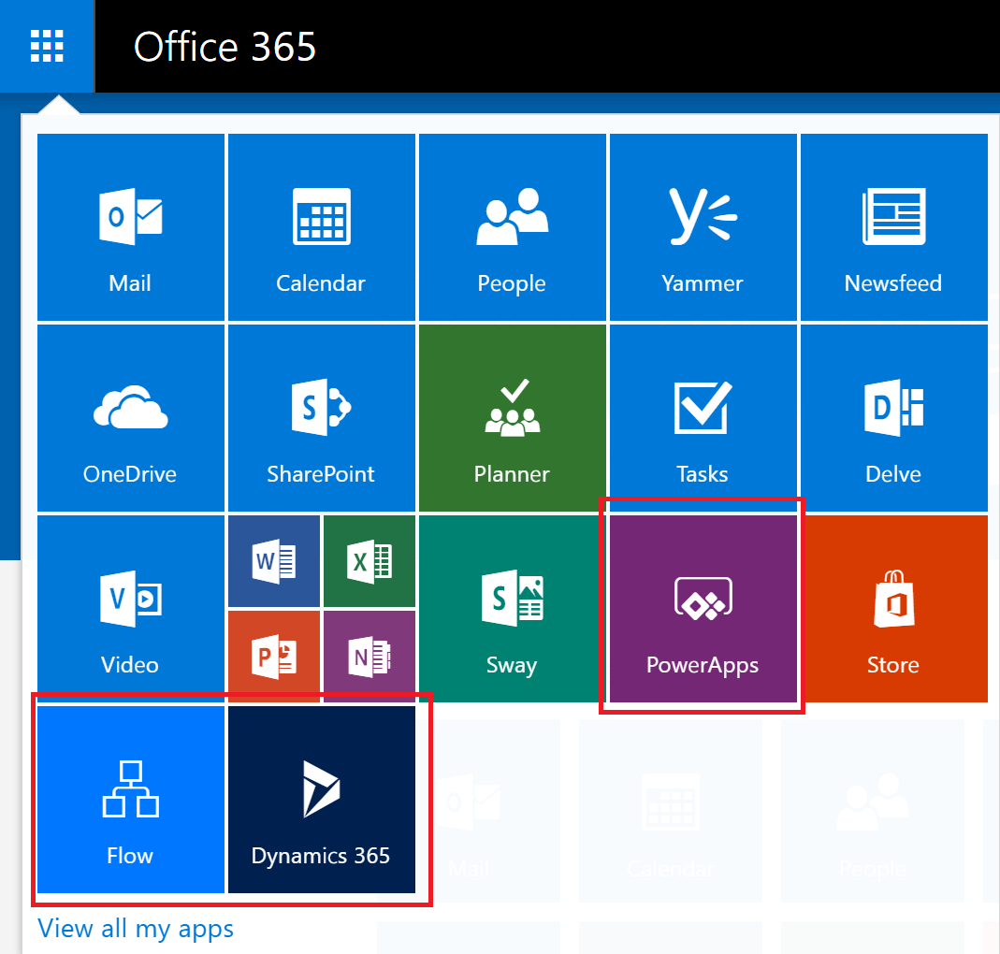

# Flow in your organization Q&A
This topic describes how users in your organization can use Flow, and how you can control the Flow service.

## Signing up for Flow
### What is Microsoft Flow?
Microsoft Flow is a public cloud service to help individuals and teams to set up automated workflows between their favorite apps and services to synchronize, get notifications, collect data, and more. 

### How do people sign up for Flow?
There are two possible ways for individuals to sign up for Flow through the web portal:

#### Option 1
Anyone can sign up by going to [flow.microsoft.com](https://flow.microsoft.com), selecting **Sign up free**, and then completing the sign-up process for Flow through [portal.office.com](https://portal.office.com/Start?sku=flow_free) or [signup.live.com](https://signup.live.com).

#### Option 2
Anyone can sign up by going to [flow.microsoft.com](https://flow.microsoft.com), selecting **Sign in**, signing in with their work, school or personal email, and accepting the Flow terms of use.    

When a user in your organization signs up for Flow with Option 2, that user will be assigned a Microsoft Flow Free license automatically.

[Sign up for Flow](sign-up-sign-in.md) includes more details.

### Can I block another person from signing up for Flow?
Microsoft Flow is a fully public cloud service, and everyone in the world can sign up and use it to automate their day-to-day tasks. To use Microsoft Flow there is no requirements that users have or use an Office 365 account. Because of this, there’s no mechanism at this time for you to block another person from using Flow (as everyone in the world can, irrespective of their email address).

However, if a person signs up for Microsoft Flow, and you choose to not support them inside of your organization, they can in no way incur costs to your company. When an individual signs up for Microsoft Flow, the relationship is between that individual and Microsoft, which is like many other cloud services from Microsoft such as Bing, Wunderlist, OneDrive, or Outlook.com. An individual's use of Microsoft Flow does not in any way imply that the service is provided by your organization.

Finally, if your company wishes to restrict the use of organizational-only data inside of Microsoft Flow, that is possible through Data loss prevention (DLP) policies.

### How can people gain access to the paid features of Microsoft Flow?
Individuals can gain access to the paid features of Microsoft Flow in three different ways:

1. They can individually sign up for a Flow Plan 1 or Flow Plan 2 trial 90 days for free
2. You can assign a Flow license to them within the Office 365 admin portal.
3. The user has been assigned an Office 365 and Dynamics 365 plans that includes access to the Flow service. See the [Flow pricing page](https://flow.microsoft.com/pricing/) for the list of Office 365 and Dynamics 365 plans that include Flow capabilities.

### Can I block another person from using the paid features of Flow?
Any individual can try out the paid features of Microsoft Flow for 90 days, and incur no costs. However, you can fully manage the assignment of the perpetual paid licenses inside of your organization through the Office 365 admin portal.

As with the free offerings, if an individual chooses to sign up for the trial that is a direct relationship between the individual and Microsoft, not necessarily endorsed by your company.

## Administration of Flow
### Why has the Flow icon appeared in the Office 365 app launcher?
As announced in August, Microsoft Flow is now a fundamental part of the Office 365 suite. Three months after this announcement Microsoft Flow was enabled as a service as a part of all existing Office 365 SKU's. As users everywhere in the world can now use Microsoft Flow, it has appeared in the app launcher for them.

See the following section if you'd like to remove the Flow tile from the app launcher by default.

### How do I remove Microsoft Flow from the app launcher for my organization?
If a user was assigned a Flow Plan 1 or Flow Plan 2 license then you can take the following steps to remove the Flow license for that user, which will remove the Flow icon from the app launcher:

1. Go to the [Office 365 Admin Portal](https://portal.microsoftonline.com/).
2. In the left navigation bar, select **Users**, and then select **Active Users**.
3. Find the user you want to remove the license for, and then select their name.
4. On the user details pane, in the **Product licenses** section select **Edit**.
5. Find the license called **Microsoft Flow Plan 1** or **Microsoft Flow Plan 2**, set the toggle to **Off** and then select **Save**.
   
   

If a user has access to Flow through their Office 365 and Dynamics 365 plan license, then you can disable their access to the additional features included in this plan by taking the following steps:

1. Go to the [Office 365 Admin Portal](https://portal.microsoftonline.com/).
2. In the left navigation bar, select **Users**, and then select **Active Users**.
3. Find the user you want to remove access for, and then select their name.
4. On the user details pane, in the **Product licenses** section select **Edit**.
5. Expand the user's Office 365 or Dynamics 365 license, disable access to the service called **Flow for Office 365** or **Flow for Dynamics 365** and then select **Save**.
   
   

Bulk removal of licenses is also possible through PowerShell. See [Remove licenses from user accounts with Office 365 PowerShell](https://technet.microsoft.com/library/dn771774.aspx) for a detailed example.   Finally, further guidance about bulk removal of services within a license can be found at [Disable access to services with Office 365 PowerShell](https://technet.microsoft.com/library/dn771769.aspx).

Removing of the Flow license or service for a user in your organization will result in the removal of the Flow icon from the following locations for that user:

1. [Office.com](https://office.com)
   
   
2. Office 365 App Launcher
   
   

Note that this will only remove the Flow tile by default. A user may still choose to use Microsoft Flow as an individual.

### Why did 10,000 licenses for Microsoft Flow show up in my Office 365 tenant?
Any person can try out Microsoft Flow Plan 1 or 2 for 90 days, and these trial licenses represent the available capacity for new Flow users in your tenant. There is no charge for these licenses. Specifically, there are two possible reasons why you may see a capacity 10,000 (trial) licenses for Flow showing up in the Office 365 admin portal:

1. If at least one user in your tenant participated in the Flow public preview that spanned from April 2016 to October 2016 then you will see 10,000 licenses labeled as "Microsoft PowerApps and Logic flows"
   
    
2. If at least one user in your tenant has signed-up for a Flow Plan 2 trial by going through trial signup **Option 1** outlined in the [How do users sign up for PowerApps](#how-do-people-sign-up-for-flow) section then you will see 10,000 licenses labeled "Microsoft Power Apps & Flow"
   
    

You can choose to assign additional licenses to users yourself through the Office 365 admin portal, but please note that these are trial licenses for Microsoft Flow Plan 2 and they will expire after 90 days of being assigned to a user.

### Is this free? Will I be charged for these licenses?
No user can incur any cost to your organization without your express consent, so neither free nor trial licenses can cause any charges to your organization. Moreover, they also do not use any quotas, such as run quotas.

### I removed the Microsoft Flow Free license and users can still access Flow?
The Microsoft Flow Free license is included only for tracking purposes. As covered in the first section, it is not possible to prevent another person from using Microsoft Flow for individual purposes. Thus, the presence of a Microsoft Flow Free license does not actually grant or remove any capabilities.

### Why can't I see all Flow licenses in the Office 365 Admin portal?
Users can use Microsoft Flow either as individuals or as a part of their organization. Licenses at the organization level will always be visible in the Office 365 portal. However, if a user signs up for a trial as an individual then that is not managed by their Office 365 admin and will not show up in the portal.

### How does an individual find out what plan they are on?
Anyone can see the plan they have by visiting the Flow pricing page at [https://flow.microsoft.com/pricing](https://flow.microsoft.com/pricing). The plan or trial they are currently on will be shown there.

### Will Microsoft Flow sign up impact the identities in my organization?
If your organization already has an existing Office 365 environment and all users in your organization have Office 365 accounts, then identity management is not impacted.

If your organization already has an existing Office 365 environment but not all users in your organization have Office 365 accounts, then we create a user in the tenant and assign licenses based on the user’s work or school email address. This means that the number of users you are managing at any particular time will grow as users in your organization sign up for the service.

If your organization does not have an Office 365 environment connected to your email domain, there is no change in how you manage identity. Users will be added to a new, cloud-only user directory, and you will have the option to take over as the tenant admin and manage them.

### A new tenant was created by Microsoft Flow, how do I manage this?
If a new tenant was created by Microsoft Flow, then you can claim and manage that tenant using the following steps:

1. Join the tenant by signing up for Flow using an email address domain that matches the tenant domain you want to manage. For example, if Microsoft created the contoso.com tenant, then join the tenant with an email address ending with @contoso.com.
2. Claim admin control by verifying domain ownership: once you are in the tenant, you can promote yourself to the admin role by verifying domain ownership. To do so, follow these steps:    
   
   1. Go to [https://portal.office.com](https://portal.office.com/Start?sku=flow_free).
   2. Select the app launcher icon in the upper-left and choose Admin.
   3. Read the instructions on the **Become the admin** page, and then choose **Yes, I want to be the admin**.  
      
       **NOTE**: If this option doesn’t appear, an Office 365 administrator is already in place.

### If I have multiple domains, can I control the Office 365 tenant that users are added to?
If you do nothing, a tenant is created for each user email domain and subdomain.

If you want all users to be in the same tenant regardless of their email address extensions:  

* Create a target tenant ahead of time or use an existing tenant. Add all the existing domains and subdomains that you want consolidated within that tenant. Then all the users with email addresses ending in those domains and subdomains automatically join the target tenant when they sign up.

**IMPORTANT**: There is no supported automated mechanism to move users across tenants once they have been created. To learn about adding domains to a single Office 365 tenant, see [Add your users and domain to Office 365](https://support.office.com/article/Add-your-users-and-domain-to-Office-365-ffdb2216-330d-4d73-832b-3e31bcb5b2a7).

### How can I restrict my users' ability to access my organization's business data?
Microsoft Flow allows you to create data zones for business and non-business data, as shown below. Once these data loss prevention policies are implemented, users are prevented from designing or running Flow that combine business and non-business data. For more details, See [Data loss prevention (DLP) policies](prevent-data-loss.md).

  

