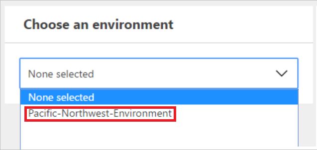
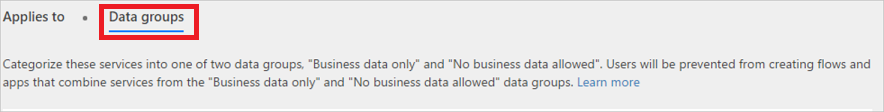
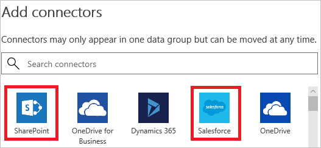
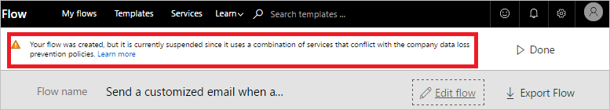
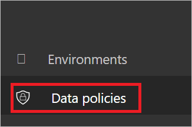
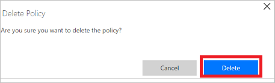

# Data loss prevention (DLP) policies

This document introduces you to data loss prevention policies, which help protect your organizational data from being shared with a list of connectors that you define.

## What's a data loss prevention policy?

An organization's data is critical to its success. Its data needs to be readily available for decision-making, but it needs to be protected so that it isn't shared with audiences that shouldn't have access to it. To protect this data, Microsoft Flow provides you with the ability to create, and enforce policies that define which consumer connectors can access and share business data. These policies that define how data can be shared are referred to as data loss prevention (DLP) policies.

## Why create a DLP policy?

You create DLP policy to clearly define which consumer connectors may access and share your business data. For example, an organization that uses Microsoft Flow may not want its business data in SharePoint to be automatically published to its Twitter feed. To prevent this, you create a DLP policy that blocks SharePoint data from being used as the source for tweets.

## Benefits of a DLP policy

* Ensures that data is managed in a uniform manner across the organization.
* Prevents important business data from being accidentally published to connectors such as social media sites.

## Managing DLP policies

### Prerequisites for managing DLP policies

* Either environment admin or tenant admin permissions.

    You can learn more about permissions in the [environments article](environments-overview-admin.md).
* A [Microsoft Flow P2 license](billing-questions.md).

## Create a DLP policy

### Prerequisites for creating DLP policies

To create a DLP policy, you must have permissions to at least one environment.

Follow these steps to create a DLP policy that prevents data in your company’s SharePoint site from being published to Twitter:

1. Sign into the [Microsoft Flow Admin center](https://admin.flow.microsoft.com) (Admin center).

1. Select the Data Policies tab, and then select the **New policy** link:

    
1. Select the **Data groups** tab.

1. Enter the name of the DLP policy as *Secure Data Access for Contoso* in the **Data Policy Name** label at the top of the page:

    

1. Select the [environment](environments-overview-admin.md) on the **Environments** tab.

    > [!NOTE]
    > As an environment admin, you can create policies that apply to only a single environment. As a tenant admin, you can create policies that apply to any combination of environments:
    >
    >

    

1. Select the **Data groups** tab:

    

1. Select the **Add** link located inside the **Business data only** group box:

    

1. Select the **SharePoint** and **Salesforce** connectors from the **Add connectors** page:

   

1. Select the **Add connectors** button to add the connectors that can share business data:

1. Select **Save Policy** in the top right corner of the screen.

1. After a few moments, your new DLP policy will be displayed in the data loss prevention policies list:

    

1. **Optional** Send an email or other communication to your team, alerting them that a new DLP policy is now available.

Congratulations, you've now created a DLP policy that allows app to share data between SharePoint and Salesforce and blocks the sharing of data with any other services.

> [!NOTE]
> Adding a service to one data group automatically removes it from the other data group. For example, if Twitter is currently located in the **business data only** data group, and you don't want to allow business data to be shared with Twitter, simply add the Twitter service to the **no business data allowed** data group. This will remove Twitter from the business data only data group.
>
>

## Data sharing violations

Assuming you've created the DLP policy outlined above, if a user creates a flow that shares data between Salesforce (which is in the **business data only** data group) and Twitter (which is in the **no business data allowed** data group), the user will be informed that the flow is **suspended** due to a conflict with the data loss prevention policy you created.

If your users contact you about suspended flows, here a few things to consider:

1. In this example, if there's a valid business reason to share business data between SharePoint and Twitter, you can edit the DLP policy.

1. Ask the user to edit the flow to comply with the DLP policy.

1. Ask the user to leave the flow in the suspended state until a decision is made regarding the sharing of data between these two entities.

## Find a DLP policy

### Admins

Admins can use the search feature from the Admin center to find specific DLP policies.

> [!NOTE]
> Admins should publish all DLP policies so that users in the organization are aware of the policies prior to creating flows.
>
>

### Makers

If you don't have admin permissions and you wish to learn more about the DLP policies in your organization, contact your administrator. You can also learn more from the [maker environments article](environments-overview-maker.md)

> [!NOTE]
> Only admins can edit or delete DLP policies.
>
>

## Edit a DLP policy

1. Launch the [Admin center](https://admin.flow.microsoft.com).

1. In the Admin center that launches, select the **Data polices** link on the left side.

    

1. Search the list of existing DLP policies and select the edit button next to the policy you intend to edit.

1. Make the necessary changes to the policy. You can modify the environment or the services in the data groups, for example.

1. Select **Save Policy** to save your changes.

> [!NOTE]
> DLP policies created by tenant admins can be viewed by environment admins but cannot be edited by environment admins.
>
>

## Delete a DLP policy

1. Launch the [Admin center](https://admin.flow.microsoft.com)

1. Select the **Data polices** tab on the left side.

    

1. Search the list of existing DLP policies, and then select the delete button next to the policy you intend to delete:

    

1. Confirm that you really want to delete the policy by selecting the **Delete** button:

    

## DLP policy permissions

Only tenant and environment admins can create and modify DLP policies. Learn more about permissions in the [environments](environments-overview-admin.md) article.

## Next steps

* [Learn more about environments](environments-overview-admin.md)
* [Learn more about Microsoft Flow](getting-started.md)
* [Learn more about the admin center](admin-center-introduction.md)
* [Learn more about data integration](https://docs.microsoft.com/common-data-service/entity-reference/dynamics-365-integration)
