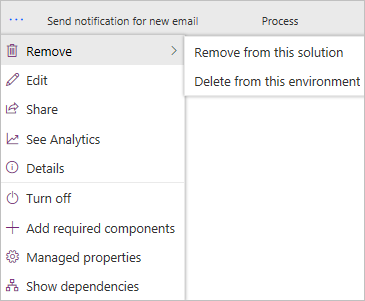

# Delete a solution-aware flow

You can either remove a flow from a solution, or delete the flow from an environment entirely.

Action|Result
------|-----------
Remove from this solution|The flow is removed from the selected solution, but it remains in the environment. You can use the flow in other solutions in the environment at a later date.
Delete from this environment|The flow is deleted; it is not available in the environment.

1. Sign in to Microsoft Flow, and then select **Solutions** from the navigation bar.
1. Select the solution that contains the flow you want to delete.

   
   
1. Select **...** (More Commands) for your flow, select **Remove**, and then select either **Remove from this solution** or **Delete from this environment**.

   

## Learn more

- [Create a solution](./overview-solution-flows.md)
- [Create a flow in a solution](./create-flow-solution.md)
- [Export a solution](./export-flow-solution.md)
- [Import a solution](./import-flow-solution.md)
- [Edit a solution-aware flow](./edit-solution-aware-flow.md)
