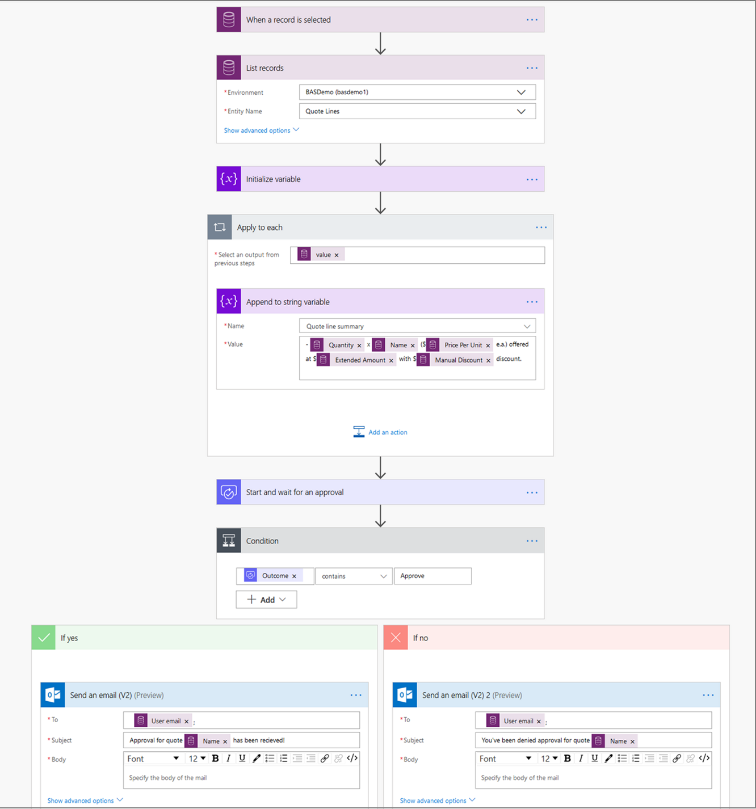

# Replace classic Common Data Service workflows with flows

Microsoft Flow has significant advantages over the classic workflow model; you should consider using Microsoft Flow capabilities and recommended patterns while automating your processes using flow instead of classic workflow. This topic provides information about the Microsoft Flow capabilities in comparison to the classic workflow. 

It is recommended that you use flows instead of classic Common Data Service workflows to build any new automation processes. You should also review your existing classic workflow processes and consider replacing them with flows.

## Feature capability comparison

This table summarizes a comparison between Microsoft Flow and classic workflows capabilities. 

*We are continuously adding new capabilities to Microsoft Flow so that it's at par and even better than classic workflow capabilities. We will update information in this table as Microsoft Flow gains capabilities; check back often!*

<table>
<tr>
<th colspan="2">Capability</th>
<th>Microsoft Flow</th>
<th>Classic Workflow</th>
</tr>
<tr>
<td rowspan="5">Modeling</td>
<td>Conditional branching</td>
<td>Yes</td>
<td>
                    
   Yes
                    
                </td>
            </tr>
            <tr>
                <td>
                    
   Looping
                    
                </td>
                <td>
                    
   Yes
                    
                </td>
                <td>
                    
   No
                    
                </td>
            </tr>
            <tr>
                <td>
                    
   Wait conditions on fields
                    
                </td>
                <td>
                    
   No
                    
                </td>
                <td>
                    
   Yes
                    
                </td>
            </tr>
            <tr>
                <td>
                    
   Parallel branch
                    
                </td>
                <td>
                    
   Yes
                    
                </td>
                <td>
                    
   No
                    
                </td>
            </tr>
            <tr>
                <td>
                    
   Out-of-box connectors to external systems (trigger and
   perform actions in external services)
                    
                </td>
                <td>
                    
   Yes
                    
                </td>
                <td>
                    
   No
                    
                </td>
            </tr>
            <tr>
                <td rowspan="7">
                    
   Composition
                    
                </td>
                <td>
                    
   Dynamic content
                    
                </td>
                <td>
                    
   Yes
                    
                </td>
                <td>
                    
   Yes
                    
                </td>
            </tr>
            <tr>
                <td>
                    
   Access to pre-image of event data
                    
                </td>
                <td>
                    
   No
                    
                </td>
                <td>
                    
   Yes
                    
                </td>
            </tr>
            <tr>
                <td>
                    
   Run child workflows
                    
                </td>
                <td>
                    
   No
                    
                </td>
                <td>
                    
   Yes
                    
                </td>
            </tr>
            <tr>
                <td>
                    
   Run Common Data Service actions (incl. custom)
                    
                </td>
                <td>
                    
   No
                    
                </td>
                <td>
                    
   Yes
                    
                </td>
            </tr>
            <tr>
                <td>
                    
   Run custom workflow activities
                    
                </td>
                <td>
                    
   No
                    
                </td>
                <td>
                    
   Yes
                    
                </td>
            </tr>
            <tr>
                <td>
                    
   Group steps to run in a transaction
                    
                </td>
                <td>
                    
   Yes (changesets)
                    
                </td>
                <td>
                    
   No
                    
                </td>
            </tr>
            <tr>
                <td>
                    
   Approval workflows
                    
                </td>
                <td>
                    
   Yes
                    
                </td>
                <td>
                    
   No
                    
                </td>
            </tr>
            <tr>
                <td rowspan="7">
                    
   Execution
                    
                </td>
                <td>
                    
   Trigger on field changes
                    
                </td>
                <td>
                    
   Yes
                    
                </td>
                <td>
                    
   Yes
                    
                </td>
            </tr>
            <tr>
                <td>
                    
   Trigger conditionally on field values (e.g., on a
   certain date in a date field)
                    
                </td>
                <td>
                    
   No
                    
                </td>
                <td>
                    
   No
                    
                </td>
            </tr>
            <tr>
                <td>
                    
   Trigger on multiple Common Data Service entity events
                    
                </td>
                <td>
                    
   No
                    
                </td>
                <td>
                    
   Yes
                    
                </td>
            </tr>
            <tr>
                <td>
                    
   Run on-demand
                    
                </td>
                <td>
                    
   Yes
                    
                </td>
                <td>
                    
   Yes
                    
                </td>
            </tr>
            <tr>
                <td>
                    
   Run-as scopes
    
   (for example, organization, business unit, user)
                    
                </td>
                <td>
                    
   Yes
                    
                </td>
                <td>
                    
   Yes
                    
                </td>
            </tr>
            <tr>
                <td>
                    
   Run on a schedule
                    
                </td>
                <td>
                    
   Yes
                    
                </td>
                <td>
                    
   No
                    
                </td>
            </tr>
            <tr>
                <td>
                    
   Run synchronously (real-time)
                    
                </td>
                <td>
                    
   No
                    
                </td>
                <td>
                    
   Yes
                    
                </td>
            </tr>
            <tr>
                <td rowspan="2">
                    
   History
                    
                </td>
                <td>
                    
   Auditing
                    
                </td>
                <td>
                    
   Yes
                    
                </td>
                <td>
                    
   Yes
                    
                </td>
            </tr>
            <tr>
                <td>
                    
   Run analytics
                    
                </td>
                <td>
                    
   Yes
                    
                </td>
                <td>
                    
   No
                    
                </td>
            </tr>
            <tr>
                <td rowspan="3">
                    
   Authoring and portability
                    
                </td>
                <td>
                    
   Solution support
                    
                </td>
                <td>
                    
   Yes
                    
                </td>
                <td>
                    
   Yes
                    
                </td>
            </tr>
            <tr>
                <td>
                    
   Modern designer
                    
                </td>
                <td>
                    
   Yes
                    
                </td>
                <td>
                    
   No
                    
                </td>
            </tr>
            <tr>
<td>AI-assisted authoring</td>
<td>Yes</td>
<td>No</td>
</tr>
</table>

## Example scenario: Replace workflow with a flow

Imagine a sales scenario where you have put together a quotation for a customer
and now need to request approval from your management team prior to send. With
classic workflows, this wouldn’t have been particularly easy to do and most
solutions to this would require a developer to write custom workflow activities
to retrieve quote line items.

With flows, this is much easier to build as demonstrated in the walkthrough later that will cover 
some of the Flow capabilities to support the scenario. This
includes:

-   Creating a flow that runs on demand

-   Getting a list of records related to a Common Data Service entity

-   Looping over a list of records

-   Sending approval requests

To allow the sales person to trigger the approval request on demand:

1. Sign in to [Microsoft Flow](https://flow.microsoft.com/) and create a new
flow in a solution. More information: [Create a flow in a solution](create-flow-solution.md). 

1. From the list of flow triggers, select **Common Data Service (Current Environment) – When a
record is selected** and select **Quotes** as the entity. This trigger allows a
flow to be run on-demand on a record or list of records from the Flow menu.

1. With the trigger configured, add actions to run in our flow. This will
provide the approver with the summary detail they need to identify the quote
items and values. Begin by adding the **Common Data Service (Current
Environment) – List records** action. Because we want to get individual line
items from a Quote, set the entity to **Quote lines**. To make sure we only list
those quote line items that belong to the Quote that the flow has been triggered
for, we’ll specify an OData style filter criterion. In the **Filter Query** field,
type *\_quoteid_value eq* and then select *Quote* from the list of dynamic
values that appear.

    

1. As we want to summarize quote line items for the approval, add the
**Initialize variable** action. Set the Name field to *Quote line summary* and
the Type to String (from the dropdown), and leave the Value field empty.

1. Add the **Append to string variable** action and select the *Quote line
summary* variable we had previously created. In the **Value** field, select *Quantity,
Name, Price per unit, Extended amount and Manual amount* from the list of
dynamic values. The Microsoft Flow designer intelligently identifies that these values are
from a list of quote line items, and adds this action in an **Apply to each**
loop to ensure information from each line item is added to this summary.

    

1. To request approval on the quote summary we’ve created, add the **Approval –
Start and wait for an approval** action. Select an Approval type (for example,
Approve/Reject – First to respond), give the Approval request a Title (for example, the
Name of the Quote for which approval is being requested, picked from the list of
dynamic values), enter the email address of the person who needs to review and
approve the quote in the Assigned to field. In the details field, add the *Quote
line summary* variable, along with any other information that might be relevant
using the dynamic value picker (for example, Total Amount).

1. To determine what happens once an approval has been accepted/rejected, add the
**Condition** action. Select *Outcome* from the list of dynamic values from the
first field in the condition, *Contains* from the dropdown in the second field,
and type *Accept* in the third field of the condition. Finally, add actions
based on the outcome of the approval (e.g., send a notification email)

    

We now have the approval structure created so the approver has all of the
information they need to make a decision on next steps. The entire example
on-demand flow to request approval is shown below:

To execute, run this flow on-demand against your quote. The flow summarizes
quote line items for that quote and sends an approval request that the approver
can respond to from the flow portal, or the actionable email they receive. An
example of the display is below:

## Recommended patterns

-   **Workflows with complex else-if conditional logic**  
    
    Instead of using conditions, we recommend using the [switch
    action](https://docs.microsoft.com/en-us/azure/logic-apps/logic-apps-control-flow-switch-statement#add-switch-statement)
    instead.

-   **Workflows that run from plug-in/code**  
    
    It is recommend redesigning the flow to run off triggers.

    -   Use the Common Data Service triggers to run flows based on events in it.

    -   To run flows based on events in an external service, leverage more than 260
        out-of-box connectors.

    -   For scenarios where a connector you need isn’t available out-of-the-box,
        easily create your own custom connector ([learn to create custom
        connectors](https://docs.microsoft.com/en-us/connectors/custom-connectors/define-blank))

    -   Finally, if there are scenarios where you cannot trigger your flow using
        the Common Data Service connector, one of our out-of-box connectors, or
        create your own custom connector, leverage the [When a HTTP request is
        received
        trigger](https://docs.microsoft.com/en-us/azure/connectors/connectors-native-reqres#use-the-http-request-trigger)
        to invoke the flow

-   **Workflows that run recursively**  
    
    Use the
    [do-until](https://docs.microsoft.com/azure/logic-apps/logic-apps-control-flow-loops#until-loop)
    or [apply to
    each](https://docs.microsoft.com/azure/logic-apps/logic-apps-control-flow-loops#foreach-loop)
    loop in Flows instead

-   **Workflows that need a list of records**  
    
    Use the **list records** action instead. When using this action, it is
    recommended to define record filtering criteria using OData syntax to
    optimize the action by minimizing the number of records that need to
    retrieved.

-   **Workflows that sleep to run on a schedule**  
    
    Use the **recurrence** trigger to run business logic at periodic time
    intervals. For workflows that need to be triggered at a specific time, or
    when a condition is met, define these triggering criteria in the trigger,
    available in Oct ‘19

-   **Workflows for which runs were managed to ensure activities were executed in
    a single transaction**  
    
    [Use the [changeset action](https://docs.microsoft.com/business-applications-release-notes/april19/microsoft-flow/automated-flows-support-change-sets-common-data-service) to  ensures that all actions within it are performed as a single, atomic unit that either all succeed, or fail as a group. If any one of the actions in a change set fails, changes made by completed operations
    are rolled back.

-   **Monitor workflow runs for failures**  
    
    In flow, use the **run-after setting** on an action to configure it to run
    when the previous action fails. E.g. send a flow mobile notification when
    the update a record action fails, or times out.

## FAQs

-   **I have a Dynamics 365 license. Can I use Microsoft Flow?**

    Every user of Dynamics 365 is already entitled to use Microsoft Flow. Review our licensing information available at: <https://flow.microsoft.com/pricing/>

-   **How often can my Flows be triggered?**

    -   Dynamics 365 (or Common Data Service) flows run near real-time of
        trigger due to the fact they use webhooks (no polling required)

    -   As with direct API access, there are throttles/limits in the system,
        fully documented here:
        <https://docs.microsoft.com/flow/limits-and-config>

    -   Specifically, there is a limit of 100k actions per 5 minutes, per flow –
        and a single loop in a flow cannot process more than 100k items at a
        time

    -   Maximum of 6GB of throughput per 5 minutes

-   **How long can a single flow run for?**  
    
    A single flow run times out after 30 days.

-   **How do I move my Flows between environments?**  
    
    Just like classic workflows, Flows can be created in solutions to support
    the full application lifecycle for processes.

-   **Are Flow dependencies tracked in the Common Data Service?**  
    
    Just as with any other component in a solution, all dependencies for Flows
    in solutions are tracked

-   **Do I have to rebuild all workflows from scratch as I move to Flows?**
  
    Moving to Flows will not require building most workflows from scratch.
    Starting Oct’19, it will be possible to generate Flow templates from
    existing workflows

-   **What about synchronous workflows?** 
 
    It is recommended to re-evaluate the need for synchronous workflows to
    identify whether the objective, or parts of the workflow can be built using
    a Flow. In particular, we see from our telemetry that synchronous workflows
    are a significant contributor to overall end user poor performance
    experience. For many uses though it would be preferable to split these
    actions out as asynchronous so that the user can continue with their
    activity while Flow continues to ensure completion of the action.

-   **Using flow, will my data stay within region (that is, the same region as my
    Dynamics 365/Common Data Service environment)?**  
    
    Yes, Microsoft Flow will always use the exact same region as the Common Data Service
    environment.

-   **Do I need to make proxy/firewall changes?**  
    
    Refer to the [IP address configuration reference](limits-and-config#ip-address-configuration.md)
    to determine whether you need to make any proxy/firewall changes.
