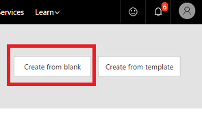

# Run flows on a schedule
Create a flow that performs the same task or tasks, such as sending a report in email, every day, hour, or minute. As an alternative, create a flow that waits a certain number of minutes or until a certain date before performing a task or tasks.

## Prerequisites
* An account on [flow.microsoft.com](https://flow.microsoft.com)

## Create a recurring flow
1. In [flow.microsoft.com](https://flow.microsoft.com), select **My flows** in the top navigation bar.
   
    
2. Select **Create from blank**.
   
    
3. Select **Recurrence** in the box that says **How would you like to start?**
   
    
4. In the **Recurrence** dialog box, specify how often you want the flow to run.
   
    For example, specify **Day** under **Frequency** and **2** under **Interval** if you want the flow to run every two days.
   
    
5. Add the action or actions that you want the flow to take, as [Create a flow from scratch](get-started-logic-flow.md) describes.

## Delay a flow
1. In [flow.microsoft.com](https://flow.microsoft.com), select **My flows** in the top navigation bar.
   
    
2. Select **Create from blank**.
   
    
3. Specify an event as [Create a flow from scratch](get-started-logic-flow.md) describes.
4. Select the plus icon, and then select **Add an action**.
   
    
5. In the list of actions, do either of the following:
   
   * Select **Delay**, and then specify a number of minutes,
   * Select **Delay until**, and then specify a date.
     
     

