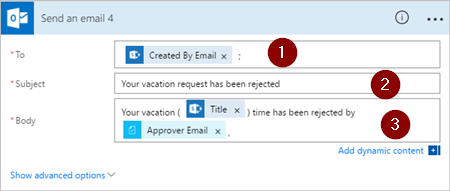

# Manage sequential approvals with Microsoft Flow
Some workflows require pre-approval before the final approver is required to sign off. For example, a company may have a sequential approval policy that requires pre-approval for invoices over $1000.00 before they're approved by the Finance department.

In this walkthrough, we create a sequential approval flow that manages employee vacation requests.

## Detailed steps in the flow
The flow:

1. Starts when an employee creates vacation request in a [SharePoint Online list](https://support.office.com/article/Introduction-to-lists-0a1c3ace-def0-44af-b225-cfa8d92c52d7).
2. Adds the vacation request to the approval center and then emails the request to the pre-approver.
3. Emails the pre-approval decision to the employee.
4. Updates the SharePoint Online list with the pre-approver's decision and comments.
   
   Note: If the request is pre-approved, the flow continues with these steps:
5. Sends the request to the final approver.
6. Emails the final decision to the employee.
7. Updates the SharePoint list with the final decision.

This image summarizes the preceding steps:

   

## Prerequisites
[!INCLUDE [prerequisites-for-modern-approvals](includes/prerequisites-for-modern-approvals.md)]

The SharePoint Online list that you create must include the following columns:

   

Make note of the name and URL of the SharePoint Online list. We use these items later when you configure the **SharePoint - When a new item is created** trigger.

## Create your flow from the blank template
[!INCLUDE [sign-in-and-create-flow-from-blank-template](includes/sign-in-and-create-flow-from-blank-template.md)]

## Add a trigger
[!INCLUDE [add-trigger-when-sharepoint-item-created](includes/add-trigger-when-sharepoint-item-created.md)]

   

## Get the manager for the person who created the vacation request
[!INCLUDE [add-get-manager-action](includes/add-get-manager-action.md)]

1. Provide a name for your flow, and then select **Create flow** to save the work we've done so far.
   
    
   
   > [!NOTE]
   > Select **Update flow** from the top of the screen periodically to save the changes to your flow.
   > 
   > 
   
    

After each save operation, select **Edit flow** from the top of the screen, and then continue making changes.

## Add an approval action for pre-approvals
[!INCLUDE [add-an-approval-action](includes/add-an-approval-action.md)]

Note: This action sends the pre-approval request to the email address in the **Assigned To** box.

## Add a condition
[!INCLUDE [add-approval-condition-response](includes/add-approval-condition-response.md)]

> [!NOTE]
> This condition checks the response from the **Start an approval** action.
> 
> 

## Add an email action for pre-approvals
[!INCLUDE [add-action-to-send-email-when-vacation-approved](includes/add-action-to-send-email-when-vacation-approved.md)]

   

## Add an update action for pre-approved requests
[!INCLUDE [add-action-to-update-sharepoint-with-approval](includes/add-action-to-update-sharepoint-with-approval.md)]

   

## Get the pre-approver's manager
1. Use the [Get the manager for the person who created the vacation request](sequential-modern-approvals.md#get-the-manager-for-the-person-who-created-the-vacation-request) steps we did earlier to add, and then configure another **Get manager** action. This time we get the pre-approver's manager.
2. The **Get manager 2** card should resemble this image when you're finished. Be sure to use the **Email** token from the **Get manager** category on the **Add dynamic content from the apps and services used in this flow** card.
   
   

## Add the final approval action
1. Use the [add an approval action for pre-approvals](sequential-modern-approvals.md#add-an-approval-action-for-pre-approvals) steps we did earlier to add, and then configure another **Start an approval** action. This action sends an email request for final approval.
2. When you're done, the card should resemble this image:
   
    

## Add the final approval condition
1. Repeat the steps from [add a condition](sequential-modern-approvals.md#add-a-condition) to add, and then configure a **Condition** that checks the final approver's decision.

## Send email with final approval
1. Use the steps from [Add an email action for pre-approvals](sequential-modern-approvals.md#add-an-email-action-for-pre-approvals) to add, and then configure an action that sends an email when vacation requests are approved.
2. When you're finished, your card should resemble this image:
   
   

## Update SharePoint with approval
1. Use the steps from [Add an update action for pre-approved requests](sequential-modern-approvals.md#add-an-update-action-for-pre-approved-requests) to add, and then configure an action that updates SharePoint when the vacation request is approved.
2. When you're finished, the card should resemble this image:
   
    

## Send email with pre-approval rejection
[!INCLUDE [add-action-to-send-email-when-vacation-rejected](includes/add-action-to-send-email-when-vacation-rejected.md)]

   

Note: This action must be added to the **IF NO, DO NOTHING** branch below the **Condition** card.

## Update SharePoint with pre-approval rejection
[!INCLUDE [add-action-to-update-sharepoint-with-rejection](includes/add-action-to-update-sharepoint-with-rejection.md)]

   

## Send email with final rejection
1. Use the steps from [Send email with pre-approval rejection](sequential-modern-approvals.md#send-email-with-pre-approval-rejection) to add, and then configure an action that sends an email when the vacation request is rejected by the final approver.
   
    Note: This action must be added to the **IF NO, DO NOTHING** branch below the **Condition 2** card.
2. When you're finished, the card should resemble this image:
   
   

## Update SharePoint with final rejection
1. Use the steps from [Update SharePoint with pre-approval rejection](sequential-modern-approvals.md#update-sharepoint-with-pre-approval-rejection) to add, and then configure an action that updates SharePoint if the final approver rejects the vacation request.
2. When you're finished, the card should resemble this image:
   
   
3. Select **Update flow** to save the work we've done.
   
   

If you've followed along, your flow should resemble this image:

Now that we've created the flow, let's see it in action.

## Request an approval
[!INCLUDE [request-vacation-approval](includes/request-vacation-approval.md)]

Your request should resemble this image:

## View pending approval requests
[!INCLUDE [view-pending-approvals](includes/view-pending-approvals.md)]

## Pre-approve a request
[!INCLUDE [approve-request-from-different-locations](includes/approve-request-from-different-locations.md)]

## Approve the request
The steps to approve a request are identical to the steps to [pre-approve a request](sequential-modern-approvals.md#pre-approve-a-request)

Note: The final approver gets the vacation request only after the request has been pre-approved.

## Reject a request
[!INCLUDE [reject-a-request](includes/reject-a-request.md)]

## More information
[Single approver modern approvals walkthrough](modern-approvals.md)

