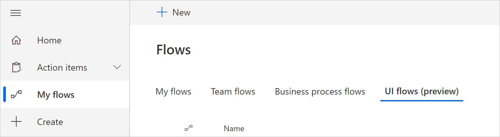
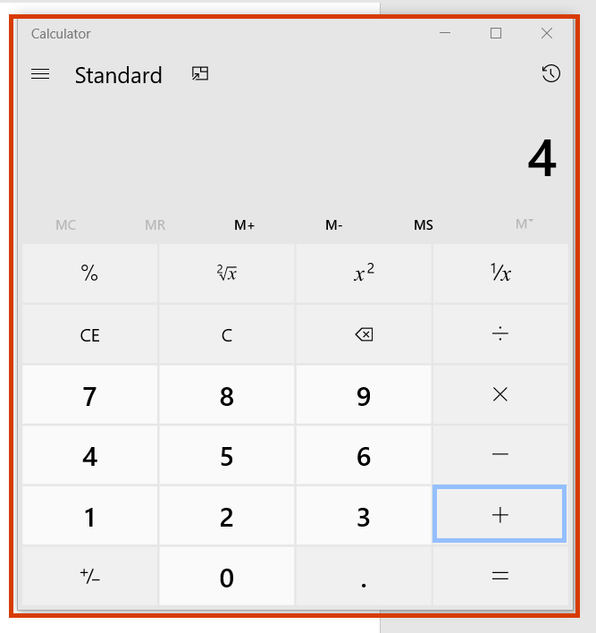

# Create and test desktop UI flows

[This topic is pre-release documentation and is subject to change.]

[!INCLUDE [view-pending-approvals](../includes/cc-rebrand.md)]

Create desktop UI flows to automate Windows desktop applications. 

Please refer to the [Known issues](create-desktop.md#known-issues-and-solutions) later in this topic to learn more about issues you might run into, workarounds for those issues, and scenarios that are not supported in this preview release.

> [!TIP]
> You can automate other Windows desktop apps by following a similar pattern.

## Create a desktop UI flow

In the following steps, we'll demonstrate how to automate the calculator app to sum two numbers and then store the result for later use. 

1. Ensure your [device is ready](setup.md) to create UI flows. <!--Todo: link to the prereqs section-->

1. Use the [Chromium version of Microsoft Edge](https://www.microsoftedgeinsider.com) or Google Chrome to open [Power Automate](https://flow.microsoft.com), and then sign in with a work or school email account.

1. Select **My flows** > **UI flows (preview)** > **New**.

   

1. Choose **Desktop app** and then select **Next**.

    

1. Enter a name for your UI flow into the **Flow name** field, and then select **Next**.

    

1. Select **Next** at the bottom to skip the optional **Set up inputs** screen since we aren't using inputs in this walkthrough.

1. Select the **Record app** card to expand it.

   

1. Select **Launch recorder**.

   

   The recorder control displays at the top of your screen.

   

1. Start the calculator app.

     >[!TIP]
     >As your mouse hovers over controls in the app, you'll notice that a blue outline highlights each control. Always wait for the blue highlight before you select a control.
     >
     >If the blue highlight doesn't display around the element, it might not be recorded properly.

1. Select **Record** from the recorder control.
1. Select the first number, select **+**, select the second number, and then select **=**.

    

1. Select **Done** on the recorder control after you complete the actions you want to record.

1. Close the app that you recorded.

1. Select the card that starts with "Run <app name> script" to view screenshots of the recorded steps.

     >[!TIP]
     >Select **...** > **Delete** to remove any extra steps that you may want to remove.

    

1. Select **Next**. 

1. Select **Next** to skip the optional **Set up outputs** step since we aren't using outputs in this walkthrough.

## Test your UI flow

It's always a great idea to test your UI flow. To do this, select the **Test now** button, and then watch your UI flow run.
    
 >[!IMPORTANT]
 >For best results, do not interact with your device for the duration of playback.

1. Select **Save and exit** to save your flow and exit the UI flows feature.

## Known issues and solutions

- Open and maximize the apps you want to record before *before* you start recording.

- You may want to add a [**Close** action](edit-desktop.md#add-a-manual-action) at the end of your UI flow because UI flows launches a new instance of the applications with each test or run.

- Select **...** > **Delete** on the recorded actions card to remove any unnecessary/duplicate actions. Duplicate actions may be created depending on the type and the speed of you are recording. 

- Right clicks may not play back correctly. In such case, while recording, click left to focus UI flows on the target user interface element, and then right click.

- If UI flows no longer records or plays back Windows applications after installing a new version, uninstall the previous version and then install a new version.

### Unsupported application types

-   Interactions on Windows (File explorer, startup menu, task bar, etc.).

-   Web browsers (Chrome, IE, Edge, Edge Chromium, Firefox, Mozilla, etc.).
    Please instead refer to [Create a Web UI flow](edit-web.md) to
    automate websites.

-   Java applications.

-   Click once applications.

-   Applications with a Web view such as Electron applications.

-   Microsoft Office 2016 and earlier. 

-   Microsoft Office online.

### Unsupported configurations

-   Multi-screen.

-   Recording through a virtual machine client (Remote Desktop, Citrix, etc.),
    either with the UI flows app running on the host device or on the virtual
    machine. None are supported.

-   Multiple instances of an application where the main window titles are
    identical.

-   Application windows with identical titles, for example, Microsoft Outlook with multiple **Untitled – Message (HTML)** new mail windows active at the same time.

-   Concurrent recording sessions on a given device.

-   Concurrent playback sessions on a given device. In case of simultaneous UI
    flow runs, the first one takes precedence and the subsequent ones 
    fail until the first one completes.

-   Playback on a device with a different keyboard layout than the device on which it was recorded.

-   Recording on a device or Windows session while the browser with Microsoft
    Flow is on a different device or Windows session.

### Unsupported action types and behaviors

The following actions will not be recorded:

-   Double click.

-   Mouse move.

-   Mouse hover.

-   Click and drag.

-   Touch or pen input.

-   Open app before recording.

-   Closed app before playback starts.

## Unreliable behaviors and workarounds for Microsoft Office (desktop)
- Pin the ribbon before you begin playback to avoid issues that may occur if the ribbon is set to auto-hide during playback.
- Do not select items by clicking and dragging. For example, don't use shift-click to select cells in Microsoft Excel and don't select text in Microsoft Word or Microsoft PowerPoint by dragging the mouse.
- Some elements may not work correctly in UI flows (preview) for Microsoft Word and Microsoft PowerPoint Desktop applications. For instance, options on the File menu such as starting from blank, or right clicking controls like adding a paragraph in Microsoft Word or changing the layout of slides in Microsoft PowerPoint may not work.

## Next steps

- Learn how to [trigger the UI flow](run-ui-flow.md) you just created.

- If you want to do more with UI flows, you can also try out UI flows with [input and output](inputs-outputs-web.md) parameters.

