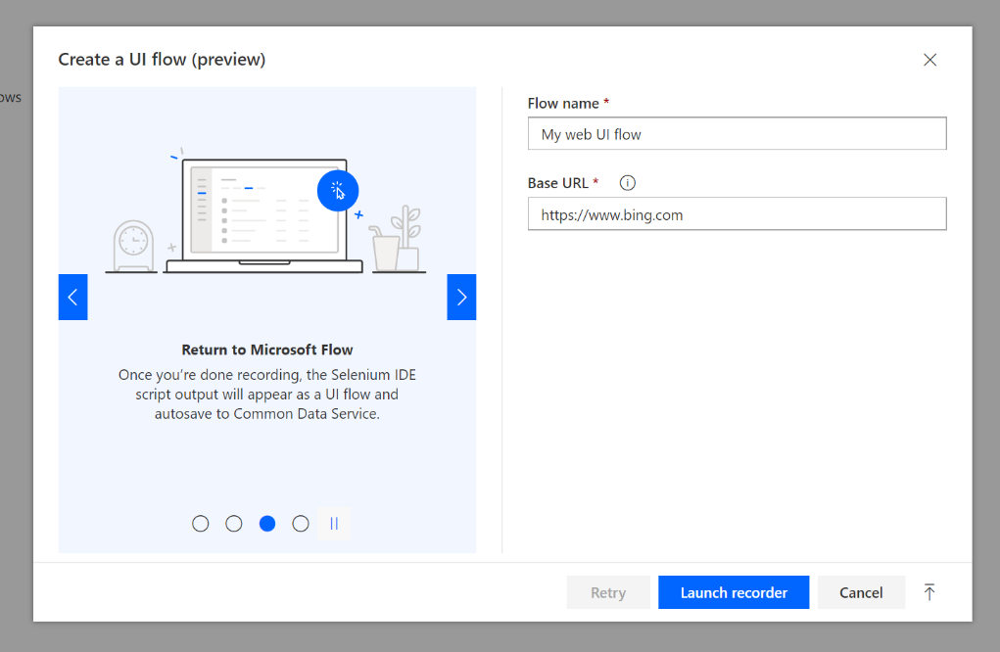
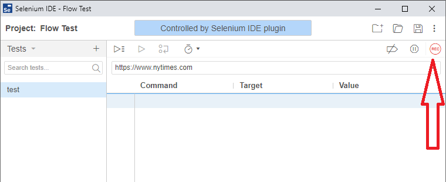
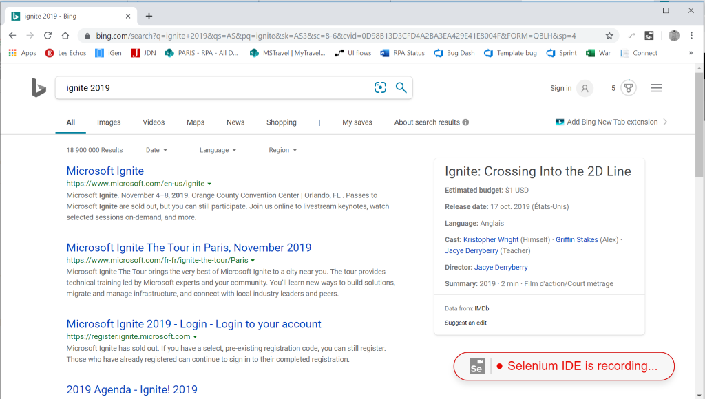
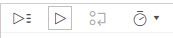

# Create your first Web UI flow

Follow these steps to create a simple Web UI flow: 

1.  Open the [next version of Microsoft
    Edge](https://www.microsoftedgeinsider.com/) or Google Chrome then navigate
    to [Microsoft Flow](https://flow.microsoft.com/).

1.  Sign in with your work or school account if needed.

1.  Navigate to **My flows** then **UI flows (preview)** and click **+ New**  
    

    

1.  Select **Web app**  > **Next**
    
    

1. Enter a name for your UI flow into the **Flow name** field.
1. Enter the URL for the Website you want to automate into the **Base URL** field, and then select **Launch recorder**.

   The Selenium IDE launches.

   >[!TIP] 
   >Tip: You can record actions across multiple http or https websites within
    the same tab.  

   

   

1. In Selenium IDE, select the red **REC** button in the top right side of the screen to launch the recorder.

   The the URL you chose in the previous step opens.

   

1.  Perform the actions on the website so that they can be recordedL. 
    
    >[!TIP]
    >At the bottom right, you can see the recording status.

    

1.  When you are finished recording, click on the red **Stop** button in the top right corner of the Selenium IDE.

    

1. Select the **Run current test** button from the top left side of the screen to see the UI flow you just created run.

   >[!TIP]
   >You can set the wait time between steps to slow the local playback for testing. This setting is for testing purposes and has no impact when your UI flow is deployed.  
  
    

1. Select the **Save project** button in the top right of the Selenium IDE. This closes and uploads the project.

## Next steps

<!--Todo: fix links-->
- To trigger the UI Flow you just created you can learn how to [run UI
flows](#run-ui-flows).

- If you want to do more with UI flows, you can also try out UI flows with
[input](#define-inputs-for-a-web-ui-flow) and
[output](#define-outputs-for-a-web-ui-flow) parameters.

