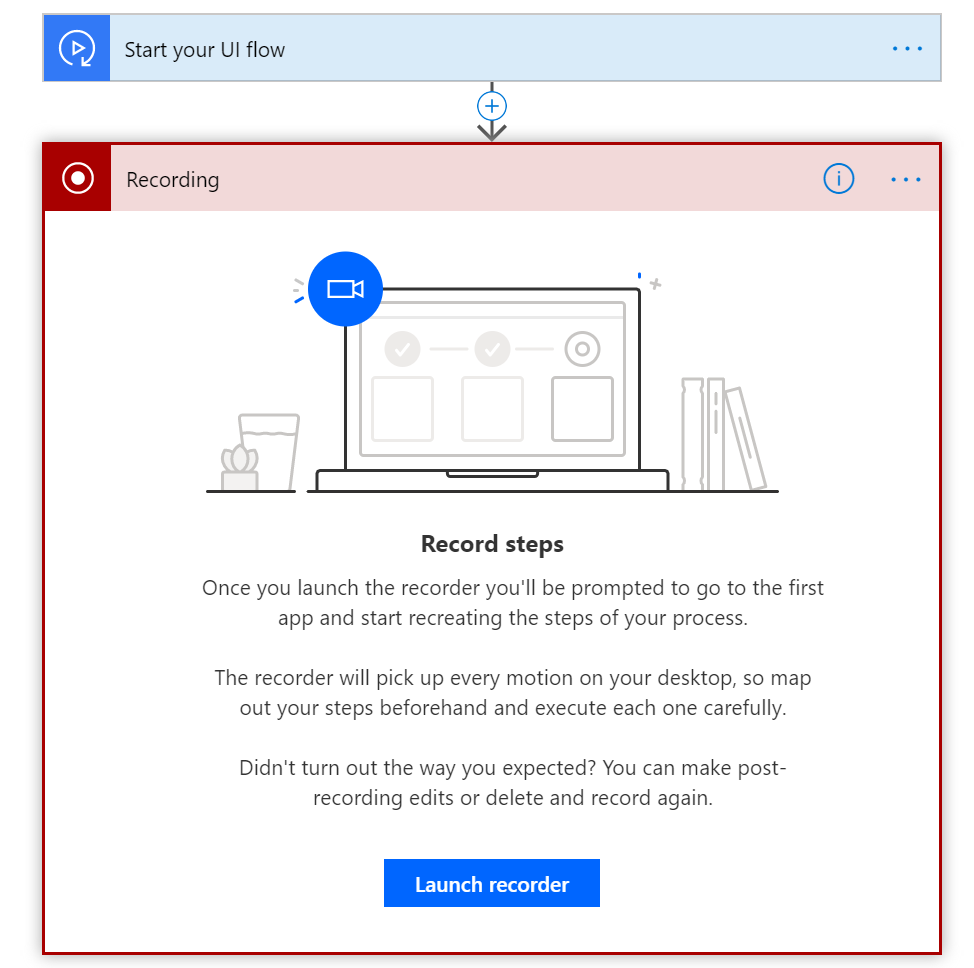

Create your first desktop UI flow
------------------------------------------

In the following steps, we'll demonstrate how to automate the calculator app to add two numbers and then store the result for later use. You can automate other apps by following a similar pattern.

1. Ensure your [device is ready]() to create UI flows. <!--Todo: link to the prereqs section-->
1.  Use the [Chromium version of Microsoft Edge](https://www.microsoftedgeinsider.com) or Google Chrome to open [Microsoft Flow](https://flow.microsoft.com), and then sign in.

1. Select  **My flows**, and then select **UI flows (preview)**.
1. Select **+ New** from the top of the screen.    

   

1.  Choose **Desktop app** and then select **Next**.

     

1.  Enter a name for your UI flow into the **Flow name** field, and then select **Next**.

1.  Select **Next** at the bottom to skip the optional **Set up inputs** screen.

    

1.  Select the **Record app** card to expand it.

     

1.  Select **Launch recorder**.

    

    The recorder control displays at the top of your screen.

1.  Start the calculator app.

     >[!TIP]
     >As your mouse hovers over controls in the app, you'll notice that a blue outline highlights each control. Always wait for the blue highlight before you select a control.
     >
     >If the blue highlight doesn't display around the element, it might not be
    recorded properly.

1.  Select **Record** from the recorder control.
1.  Select the first number, select **+**, select the second number, and then select **=**.

     >[!NOTE] <!--todo Is this really necessary?-->
     >unsupported apps will be blocked so that you don’t unintentionally
    record them.

    

1.  Select **Done** after you complete the actions you want to record, and then close the app that you recorded.

    

1.  Select the card that starts with "Run <app name> script" to view the screenshot list of recorded steps.

     >[!TIP]
     >Select **...** > **Delete** to remove any extra steps that you may want to remove. 
1.  Select **Next**. 

    

1.  Select **Next** to skip the optional **Set up outputs** step.

    

    >[!TIP]
    >It's always a great idea to test your UI flow. To do this, select the **Test now** button, and then watch your UI flow run.
    
    >[!IMPORTANT]For best results, do not interact with your device for the duration of playback.

1.  Select **Save and exit** to save your flow and exit the UI flows feature.

## Next steps

