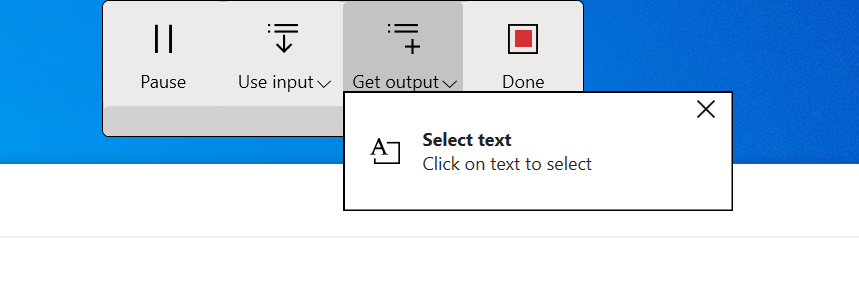
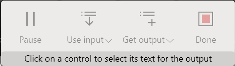
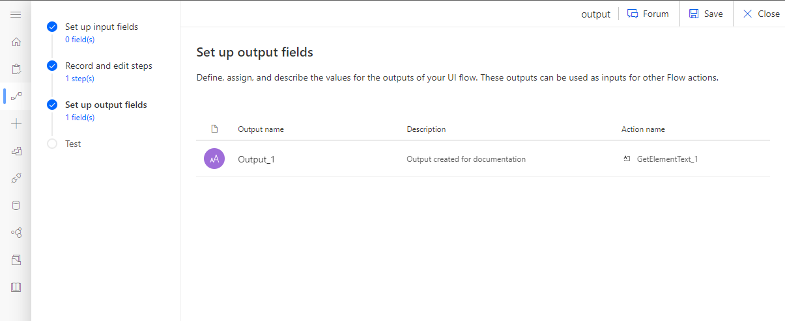
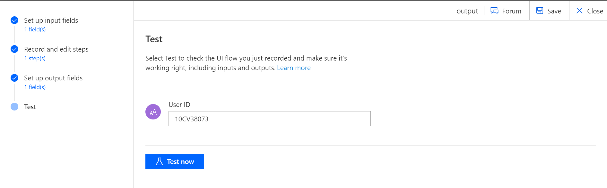

# Use inputs and outputs in desktop UI flows
[!INCLUDE [view-pending-approvals](../includes/cc-rebrand.md)]

[This topic is pre-release documentation and is subject to change.]

## Define inputs

Inputs let you pass information from an external source such as a database or any supported connector to the legacy software that UI flows automates.

For example, you can use customer information from a SharePoint list as a source for input into your legacy accounting software.

### Define inputs in the UI flows wizard

1. Select “New input”

   

1. Add a name, a sample data and a description to your input.

    - Sample data is used during the recording or test.

    - The description will be helpful to differentiate the inputs that you have created.

   

1.  Once your inputs are created, you can click on next to use them in a recording.

### Use inputs to pass information to the application

1. While recording, you can use an input in an app by selecting **Use input**.

1. In the list, you can choose between three options:

    - Select one of the inputs that you defined in UI flows’ **Set up input fields** step.

    - Use a previously defined output (see Outputs section). This is useful to pass information between different applications within the same UI flow.

    - Create a new input as you are recording. You will find it back in UI flows’ **Set up input fields** step.

   

1. Select the location where you want to use the input. The sample value you defined is  automatically used. In the below example “Hello world” is the sample value for the input name “My input” and is added to the page within Microsoft Word.  
    
    

1. In Microsoft Flows’ **Record and edit steps**, expand actions that use inputs to view which one as selected.

   

1. When triggering your UI flow, you can change the input value at will. See Use inputs & outputs for more information.

## Use outputs to extract information from the app

Outputs let you pass information from the legacy software that UI flows
automates to an external destination such as a database or any [supported
connector](https://flow.microsoft.com/connectors/).

For example, you can extract customer information your legacy accounting software and add it to a SharePoint list.

Outputs can only be created as you record your UI flow.

1. During a recording, select in the recorder “Get output” button

   

1. Select “Select text” button (this is the only type of output available for now)

   

1. Click on a User Interface element to select its text for the output. The value will be automatically captured.

   

   

1. Define the name and the description of the output.

   

1. Select **Save.** 

Your output is now available in the dedicated area of the wizard

   

Each output has:

-  An output name as defined during the recording
-  A description: This field can be very useful when you define many outputs during a recording and want to easily identify them.
-  An action name: the action where the output has been defined in your UI flow

## Delete an output from a UI flow

If you do not need an output anymore, you can delete it by going back to the associated action and removing the Output name in the dynamic value.

## Test your UI flow

Testing UI flows lets you validate your changes and the appropriate playback behavior.

1. (Optional) Enter new value in the input field. 
    
    

1. Click **Test now** to see the legacy software being automated. You will see UI flow automation playing back the steps you recorded. **Please do not interact with your device for the duration of playback.**

1. Once playback is complete, you will see the execution status of your UI flow:

    - For each action, a status indicating that the test worked well and the associated inputs.

    - The value of the outputs obtained for this test.

    - In case an error has been generated, you will be able to see which step was problematic with a screenshot of the moment the error occurred.

   

## Next steps

- Learn how to [trigger the UI flow](run-ui-flow.md) you just created.

