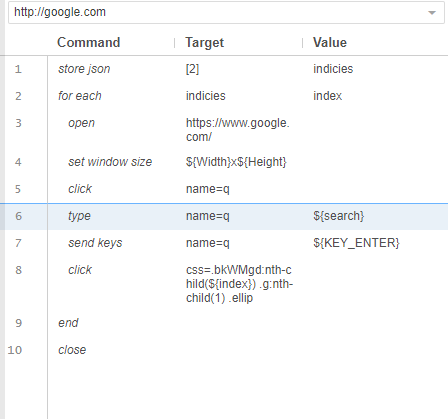
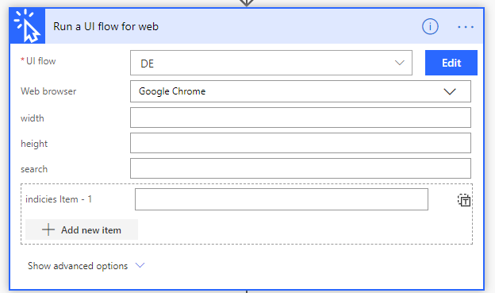

# Use inputs and outputs in Web UI flows

[This topic is pre-release documentation and is subject to change.]

[!INCLUDE [view-pending-approvals](../includes/cc-rebrand.md)]

## Define inputs for a Web UI flow

Inputs of a UI flow let you pass information from an external source such as a database or another UI flow to the target legacy software that you will automate.

Any variable that is used (read) before initialization (usually done via **store** commands) will be automatically treated as input variable and it will be displayed on the "Run a UI Flow for web" action card.

You can use variable via string interpolation, e.g. change click command's target field to "id=\${elementId}". Or change type command's value field to "\${inputText}".

For example, the command “set window size” and command “type” in the screenshot below uses uninitialized variables \${Width}, \${Height} and \${search}. These variables will become input values.

You can use variable directly in some commands, e.g. forEach command's target/value fields are both variables, you don't need \${} around it.

Please consult [Selenium Commands](https://www.seleniumhq.org/selenium-ide/docs/en/api/commands/) reference to determine which commands takes variable name directly.

## Define outputs for a Web UI flow

Any variable defined in the selenium script automatically becomes an output value. Use the following commands to declare variables:

[Store](https://www.seleniumhq.org/selenium-ide/docs/en/api/commands/#store)

[Store attribute](https://www.seleniumhq.org/selenium-ide/docs/en/api/commands/#store-attribute)

[Store json](https://www.seleniumhq.org/selenium-ide/docs/en/api/commands/#store-json)

[Store title](https://www.seleniumhq.org/selenium-ide/docs/en/api/commands/#store-title)

[store value](https://www.seleniumhq.org/selenium-ide/docs/en/api/commands/#store-value)

[Store window handle](https://www.seleniumhq.org/selenium-ide/docs/en/api/commands/#store-window-handle)

[Store xpath count](https://www.seleniumhq.org/selenium-ide/docs/en/api/commands/#store-xpath-count)

[Execute script](https://www.seleniumhq.org/selenium-ide/docs/en/api/commands/#execute-script)
(add 'return' syntax to return the object you want to store at the end of the
script)

## Next steps

- Learn how to [trigger UI flows](run-ui-flow.md).

