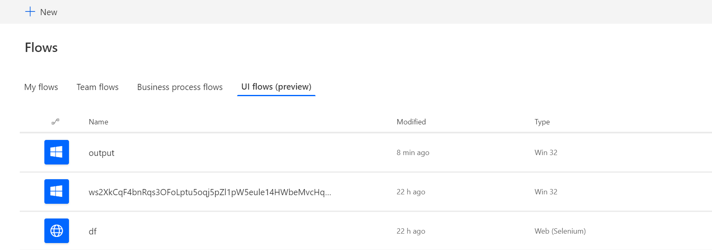
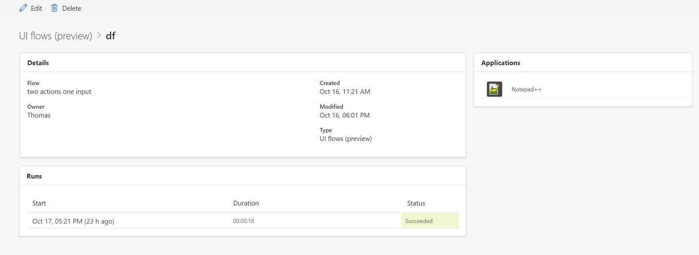

# Manage UI flows
[!INCLUDE [view-pending-approvals](../includes/cc-rebrand.md)]

[This topic is pre-release documentation and is subject to change.]

## List of UI flows

You can manage your UI flows on the **UI flows (preview)** tab of **My flows**.

From this section, you can create a new UI flow and edit or delete all your
existing UI flows (web and desktop)

## Details page

For each of your UI flows, you can see its details by clicking on its name from
the list of UI flows.

-   the details of your UI flow

-   The run history with details

-   the applications or websites used in the UI flow.

## Next steps

