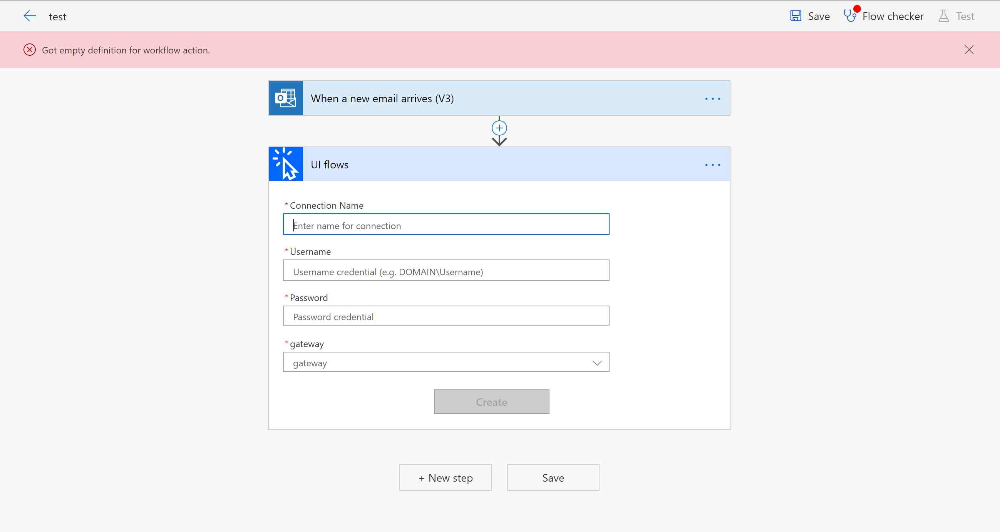
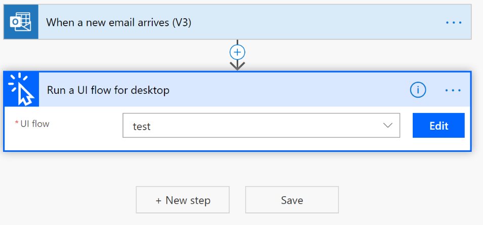
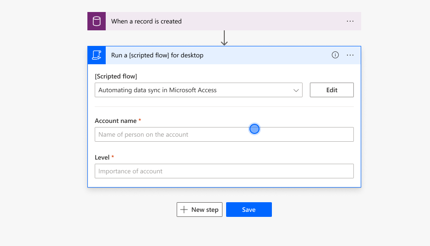
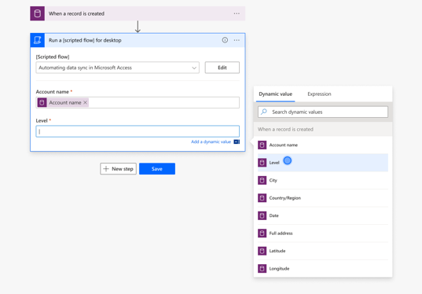
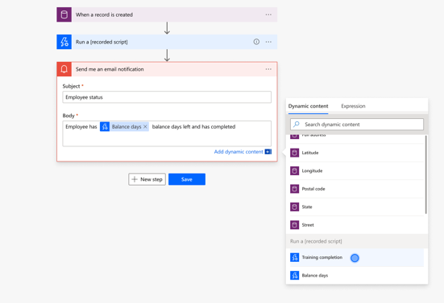

# Run UI flows
[!INCLUDE [view-pending-approvals](../includes/cc-rebrand.md)]

[This topic is pre-release documentation and is subject to change.]

After you've created and tested a UI flow, you can run it from an event, schedule, or button. To make this possible, add your UI flow to an [Automated
flow](https://docs.microsoft.com/flow/get-started-logic-flow), a [Button flow](https://docs.microsoft.com/flow/introduction-to-button-flows), a
[Scheduled flow](https://docs.microsoft.com/flow/run-scheduled-tasks), or a[Business process flows](https://docs.microsoft.com/flow/business-process-flows-overview).

## Prerequisites

You need the the [on-premises data gateway](https://go.microsoft.com/fwlink/?LinkID=820580&clcid=0x409) for your
device to have the UI flow triggered by Microsoft Flow.

The gateway is an enterprise-grade secure connection between Microsoft Flow and your device (where your UI flow runs). Microsoft Flow uses the gateway access your on-premises device to trigger your UI flows from an event, schedule or button.

<!--To do, no need for this here... it duplicates gateway content-->

<!-- 

You need to use the same work or school account in the gateway as on your
Windows device and Microsoft Flow.

1. Accept the terms of use and privacy statement  
    
    

1.  You will be prompted multiple times by Windows to accept changes made to
    your computer

1. Enter the email address for your work or school account that is used with
    Microsoft Flow and your Windows device and select **sign in**.

   

1. Sign in with your account. You may see a different screen at this stage
    depending on your account configuration.  
    
    

1. Register a new gateway if this is the first time that you do so  
    

    

1. Choose a name for the gateway, set a recovery key of your choice and select
    **Configure.**  
  
    

1. You are done and can close the summary screen

   

For more information you can look at the [on-premises data gateway installer
documentation](https://docs.microsoft.com/data-integration/gateway/service-gateway-app)
and the [gateway
management](https://docs.microsoft.com/flow/gateway-manage) documentation.

-->

## Run your UI flow from an event, button, schedule or business process

In this example we will use an automated flow to trigger a UI flow when a
new email arrives.

1. Navigate to [Microsoft Flow,](https://flow.microsoft.com/) select **My flows** in the left navigation bar, select **New**, and then select **Automated-from blank**.

   >[!TIP]
   >You can choose any other type of flow to suit your needs.

1. Give it a name then choose a service for which you have an account for such
    as Outlook.com, Microsoft Teams or Gmail. In this example we will use “When
    a new email arrives” from Office 365 Outlook.  
    
    

1. Click **Create** then add a new step

1. Search for **UI flows** and select it  
  
    

1. Select **Run a UI flow for Desktop (preview)** or **Run a UI flow for web
    (preview)**

     

1.  Provide the gateway information and device credentials. You will only have
    to do this once per device:

    -  **Connection name**: choose a name for the device to Flow connection. It
        can be different than the Gateway name.

    -  **Username**: provide your device’s Work or School account on your
        device.

    -  **Password**: your Work or School account’s password.

    -  **Gateway**: select the gateway that you created during the
        installation.

     

1.  Next, select the UI flow that you previously created

    

1.  Save it and test it out by sending yourself an email! You will see UI flow
    automation playing back the steps you recorded. **Please do not interact
    with your device for the duration of playback.**

## Use inputs & outputs

Once you defined inputs and outputs within a UI flow, you can pass information
from and to them.

1. When you add a UI flow in a flow, you can see the list of inputs that have
    defined during the creation phase

   

1. You can bind each input with previous steps of the Flow by selecting an
    input from the token picker

   

1. You can also bind outputs of you UI flow with inputs of next steps.

## Limitations and known issues

-   Gateway clusters are unsupported

-   Playback of an input step where the key sequence was recorded from a non US
    (QWERTY) keyboard will result in key strokes in US (QWERTY).

## Next steps

