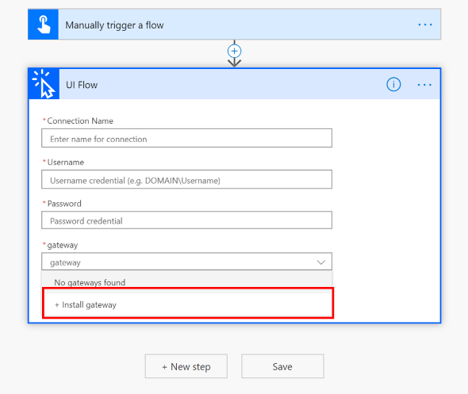
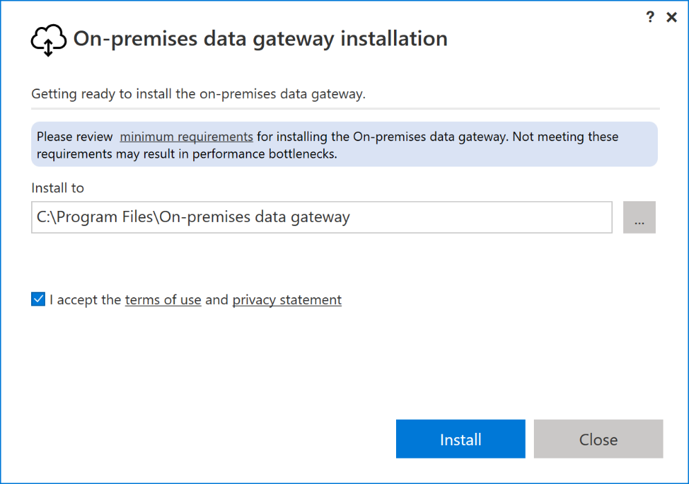
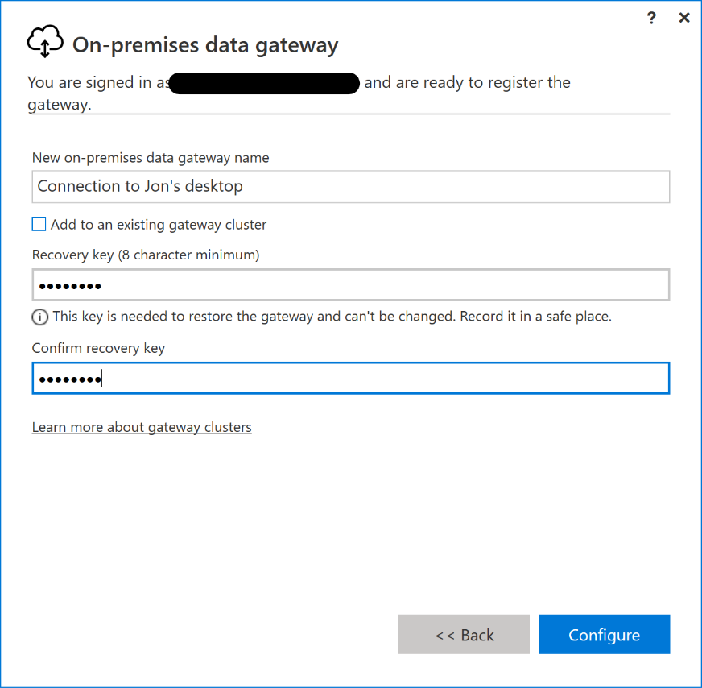
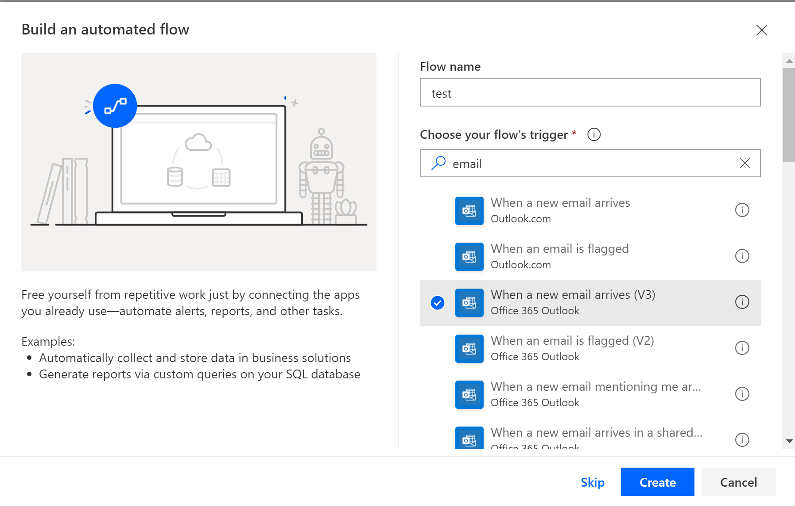
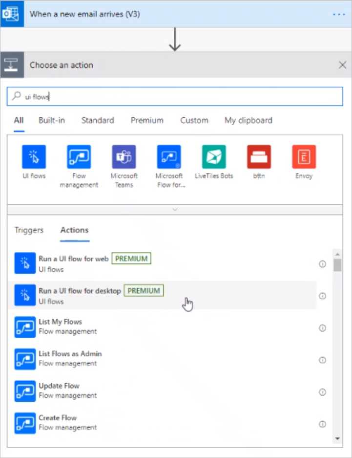
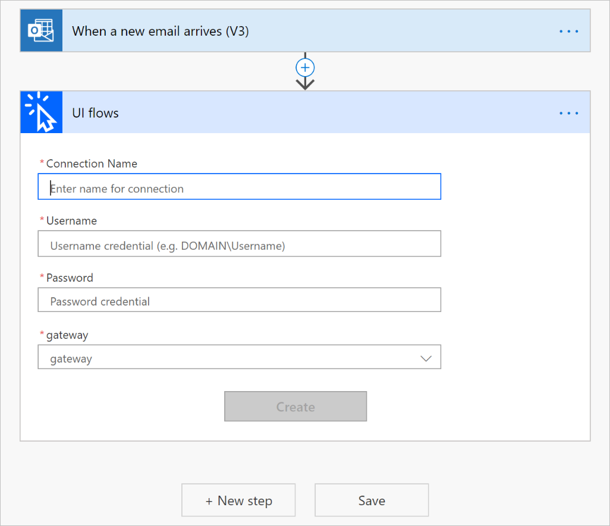
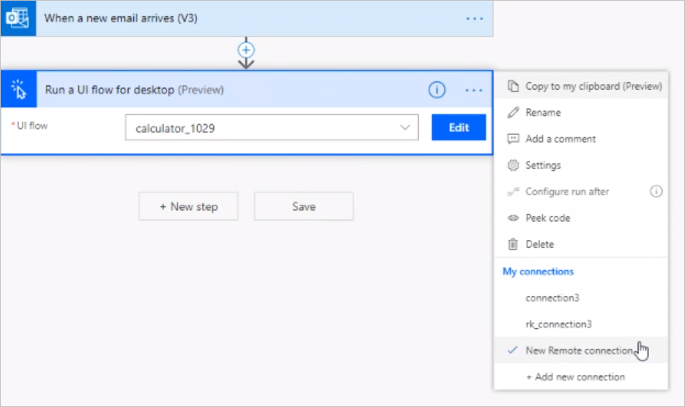
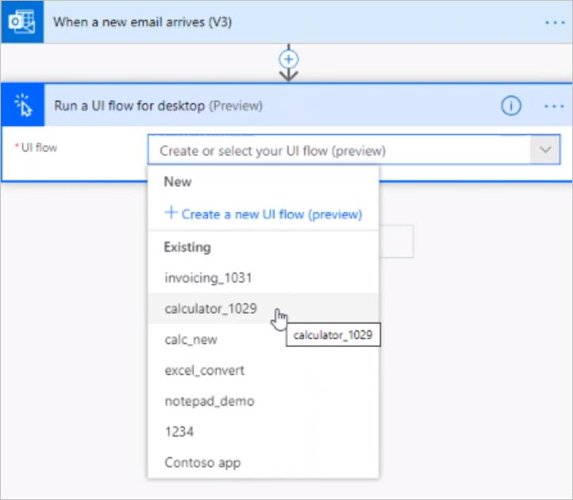
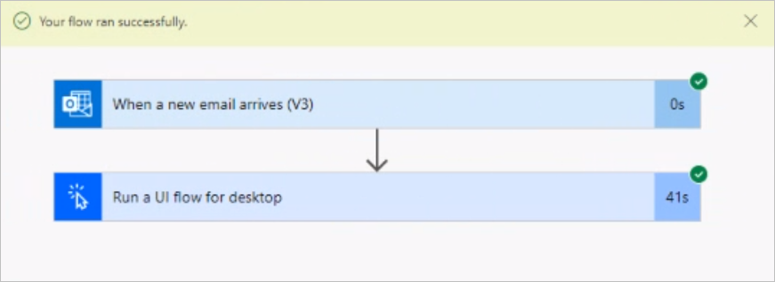
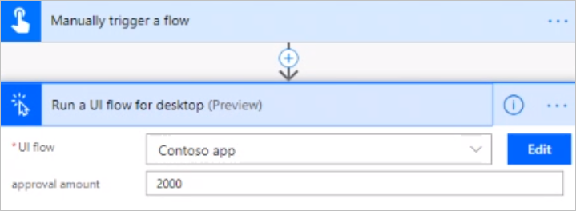

# Run UI flows
[!INCLUDE [view-pending-approvals](../includes/cc-rebrand.md)]

[This topic is pre-release documentation and is subject to change.]

After you've created and tested a UI flow, you can run it from an event, schedule, or button. To make this possible, add your UI flow to an [Automated flow](../get-started-logic-flow.md), a [Button flow](../introduction-to-button-flows.md), a [Scheduled flow](../run-scheduled-tasks.md), or a[Business process flows](../business-process-flows-overview.md).

## Prerequisites

- You need the [on-premises data gateway](https://go.microsoft.com/fwlink/?LinkID=820580&clcid=0x409) for your device to have the UI flow triggered by Microsoft Flow.
   
   The gateway is an enterprise-grade secure connection between Microsoft Flow and your device (where your UI flow runs). Microsoft Flow uses the gateway to access your on-premises device so that it can trigger your UI flows from an event, schedule, or button.
- A work or school account. 

   >[!IMPORTANT]
   >You must use the same work or school account to set up the gateway, to sign into Microsoft Flow, and to log into your Windows device.

<!--To do, no need for this here... it duplicates gateway content-->

<!-- 

You need to use the same work or school account in the gateway as on your
Windows device and Microsoft Flow.

1. Accept the terms of use and privacy statement  
    
    

1.  You will be prompted multiple times by Windows to accept changes made to
    your computer

1. Enter the email address for your work or school account that is used with
    Microsoft Flow and your Windows device and select **sign in**.

   

1. Sign in with your account. You may see a different screen at this stage
    depending on your account configuration.  
    
    

1. Register a new gateway if this is the first time that you do so  
    

    

1. Choose a name for the gateway, set a recovery key of your choice and select
    **Configure.**  
  
    

1. You are done and can close the summary screen

   

For more information you can look at the [on-premises data gateway installer
documentation](https://docs.microsoft.com/data-integration/gateway/service-gateway-app)
and the [gateway
management](https://docs.microsoft.com/flow/gateway-manage) documentation.

-->

## Run your UI flow from an event, button, schedule, or business process flow

In this example we will use an automated flow to trigger a UI flow when a new email arrives.

1. Navigate to [Microsoft Flow](https://flow.microsoft.com/).
1. Select **My flows** in the left navigation bar.
1. Select **New**, and then select **Automated-from blank**.

   >[!TIP]
   >You can choose any other type of flow to suit your needs.

1. Give your flow a name in the **Flow name** box.
1. Search for "new email", and then select **When a new email arrives (V3)** from the list of triggers. 
    
   

1. Select **Create**, and then select **New step**.

1. Search for **UI flows**, and then select **Run a UI flow for desktop** from the list of **Actions**. 

   

1. Provide the gateway information and device credentials. 

   You'll have to do this once per device:

    - **Connection name**: Choose a name for the device to Flow connection. It can be different than the gateway name.
    - **Username**: Provide your device’s work or school account.
    - **Authentication type**: Select Windows.
    - **Password**: Your work or school account’s password.
    - **Gateway**: Select the gateway that you created during the installation.

      

      >[!TIP]
      >If you don't see your gateway, you might need to select a different connection. To do this, select **...** from the top right side of the **Run a UI flow for desktop (preview)** card, and then select the connection you want to use from **My connections**.

      

1. Select the UI flow that you previously created.

   

1. Select **Save** to save your automated flow.

1. Test your flow by sending an email to trigger it. You will see your UI flow  playing back the steps you recorded. 

>[!TIP]
>Do not interact with your device while the flow runs.

## Use inputs and outputs

When you define inputs and outputs within a UI flow, you can pass information from and to those inputs.

1. When you add a UI flow to a flow, you can see the list of inputs that were defined in the UI flow.

   

1. You can populate each input field in the UI flow with values from previous steps in the flow. To do this, select the input field, and then select an input from the token picker.

   <!--todo: add image here-->

1. You can also use outputs from your UI flow as inputs for actions that appear later in the flow. To do this, select the input field, and then select an input from the token picker.

   <!--todo: add image here-->

## Limitations and known issues

- Gateway clusters are not supported.
- Since non US 
    (QWERTY) keyboards are not supported in this realease, playback of an input step where the key sequence was recorded from a non US (QWERTY) keyboard will result in key strokes in US (QWERTY).

## Learn more

 - Install the [on-premises data gateway](https://docs.microsoft.com/data-integration/gateway/service-gateway-app).
 - [Use the on-premises data gateway app](https://docs.microsoft.com/flow/gateway-manage) documentation.
 - [Troubleshoot](https://docs.microsoft.com/data-integration/gateway/service-gateway-tshoot) the on-premises data gateway.
