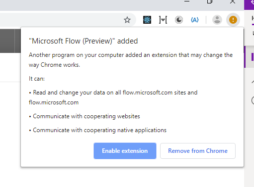

# Set up UI flows
[!INCLUDE [view-pending-approvals](../includes/cc-rebrand.md)]

[This topic is pre-release documentation and is subject to change.]

>[!TIP]
>Before you create a UI flow, check the [list of connectors](https://flow.microsoft.com/connectors/) to see if the application you want to automate already has a connector. If it does, consider creating a flow instead of a UI flow. You might also build your [own connector](https://docs.microsoft.com/connectors/custom-connectors/).

Before you can use your device to create UI flows, you'll need to ensure it meets the requirements outlined here.

## Prerequisites

- Either a [paid](https://flow.microsoft.com/pricing/) or [trial](https://flow.microsoft.com/manage/) Microsoft Flow plan.

- A work or school account to sign into both Microsoft Flow and your Windows device.

- A device that runs Windows 10, Windows Server 2016, or Windows Server 2019.
- A US (QWERTY) keyboard attached.

- The [next version of Microsoft Edge](https://www.microsoftedgeinsider.com)
    or Google Chrome.

- An [environment](https://docs.microsoft.com/power-platform/admin/environments-overview) with a [Common Data Service database](https://docs.microsoft.com/power-platform/admin/create-database).

## Limitations

UI flows (preview) is available in English.

The following are not supported:

-   Desktop UI Flows

    -   Multiple monitors
    -   Virtual machines
    -   Double click, mouse hover, touch/pen input
    -   Interactions on Windows (File explorer, startup menu, task bar, etc.)

-   Web UI Flows

    -   Right click
    -   User session information (e.g.: cookies) will not be reused during
        playback. You will have to edit the script to embed sign in information
        when required by websites.

UI flows is a preview feature and additional limitations are covered at the bottom of each section of the documentation.

## Get your device ready

Install the following components to create and run UI flows:

|  | **Name**                             | **Usage**  |                                                        
|---|--------------------------------------|----------------------------------------------------------------------|
|   | [The UI flows app](https://go.microsoft.com/fwlink/?linkid=2102613)                         | Record desktop Windows applications                                  |          |
|   | UI flows browser extension           | Record and test desktop Windows applications. Record Web applications. |                                                                                              |
|   | Webdriver                            | Test and run desktop Windows applications                            |                                                                                              |
|   | [Selenium IDE](https://go.microsoft.com/fwlink/?linkid=2107665) | Record and playback Web applications                                 |  |
|   | [Gateway](https://go.microsoft.com/fwlink/?LinkID=820580&clcid=0x409)                              | Used to enable events, scheduled flows, or button flows to connect to, trigger your UI flows (running inside your organization), and run them.              |  |

## Install the UI flows app

The UI flows installer contains all the components needed to record, edit and test UI flows.

Follow these steps to install the UI flows app:

1. [Download the UI flows app installer](https://go.microsoft.com/fwlink/?linkid=2102613).
1. Open the **Setup.Microsoft.Flow.UIflow.exe** file. This file is likely in your **Downloads** folder after your download it in the previous step.
1. Follow the instructions in the **UI flows (preview) setup** installer to complete the installation.

## Activate the UI flows browser extension 

Once the UI flows installer completes, you will be prompted by your browser to activate the extension.

- On Microsoft Edge (Chromium), select each warning icon in the top right  of the browser, and then select **Enable extension**.

    <!--Update the this pic     
         -->
-   On Google Chrome, select **Enable extension** when prompted.  
    
    <!---->

## Install Selenium IDE

The Selenium IDE is an open source tool that lets you record and playback human interactions on Websites.

With UI flows, you can run Selenium IDE scripts from Microsoft Flow and keep them stored securely (with appropriate IT governance) in Common Data Service.

Follow these steps to install Selenium IDE:

1. [Download and install](https://go.microsoft.com/fwlink/?linkid=2107665)  the Selenium IDE for the next version of Microsoft Edge or Google Chrome.

1. On Microsoft Edge (Chromium), select **Allow extensions from other stores**, and then select **Add to Chrome**.

<!-- 

-->

## Install the on-premises data gateway

You will need the gateway to trigger your UI flow from an [event, schedule, or button flow.](../getting-started.md/#types-of-flows).

>[!TIP]
>The gateway is not required if you only want to create, edit, and test your UI flows on your device.

<!--todo: confirm that -->
[Install the on-premises data gateway](../gateway-reference.md/#use-a-gateway), if you need it.

## Uninstall UI flows

1. Open the **start** menu > **Settings** > **Apps**.
1. Search for **UI flows (preview)**, and then select it.
1. Select **Uninstall**.

## Next steps

- Learn to [create desktop UI flows](create-desktop.md).
- Learn to [create Web UI flows](create-web.md).
- Learn how to run [UI flows](run-ui-flow.md).
- Learn to [manage UI flows](manage.md).
