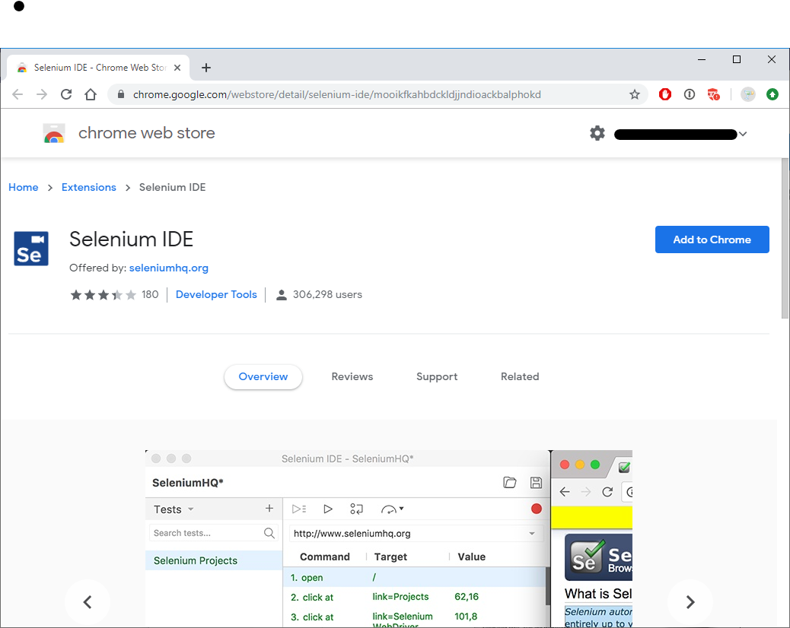

# Setup UI flows on your device

[This topic is pre-release documentation and is subject to change.]

Before you can use your device to create UI flows, you'll need to ensure it meets the requirements outlined here.

>[!TIP]
>Check the [list of connectors](https://flow.microsoft.com/connectors/) to see if the application you want to automate already has a connector. If it does, consider creating a flow instead of a UI flow. You might also build your [own connector](https://docs.microsoft.com/connectors/custom-connectors/).

## Prerequisites

-   Either a [paid](https://flow.microsoft.com/pricing/) or
    [trial](https://flow.microsoft.com/manage/) Microsoft Flow plan.

-   A work or school account to sign into both Microsoft Flow and your Windows
    device.

-   A device that runs Windows 10, Windows Server 2016 or Windows Server 2019 and a US (QWERTY) keyboard attached.

-   The [next version of Microsoft Edge](https://www.microsoftedgeinsider.com)
    or Google Chrome.

-   An [environment](https://docs.microsoft.com/power-platform/admin/environments-overview)
    with a [Common Data Service database](https://docs.microsoft.com/power-platform/admin/create-database).

<!--todo - Are these still relevant
#### Summary of the known limitations

UI flow (preview) is only available in English language and for US (QWERTY)
keyboard configurations.

The following are not supported:

-   Desktop UI Flows

    -   Multiple monitors

    -   Virtual machines

    -   Double click, mouse hover, touch/pen input

    -   Interactions on Windows (File explorer, startup menu, task bar, etc.)

-   Web UI Flows

    -   Right click

    -   User session information (e.g.: cookies) will not be reused during
        playback. You will have to edit the script to embed sign in information
        when required by websites.

The full list of limitations is available at the end of each section. -->

<!-- ## Get your device ready

To create and run UI flows, you need to install the following
components:

|  | **Name**                             | **Usage**  |                                                        
|---|--------------------------------------|----------------------------------------------------------------------|
|   | [The UI flows app](https://go.microsoft.com/fwlink/?linkid=2102613)                         | Record desktop Windows applications                                  |          |
|   | UI flows browser extension           | Record and test desktop Windows applications Record Web applications |                                                                                              |
|   | Webdriver                            | Test and run desktop Windows applications                            |                                                                                              |
|   | [Selenium IDE](https://go.microsoft.com/fwlink/?linkid=2107665) | Record and playback Web applications                                 |  |
|   | [Gateway](https://go.microsoft.com/fwlink/?LinkID=820580&clcid=0x409)                              | Trigger your UI flow from an event, schedule or button.              |  |

##### Run the UI flows installer

The UI flows installer contains all the components needed to record, edit and
test UI flows.

If you want to change the data collection setting, re-install UI flows and
change the setting. -->

## Activate the browser extension 

UI flows support [Microsoft Edge (Chromium)](https://microsoftedgeinsider.com/)
and Google Chrome.

Once you are done with the UI flows installer you will be prompted by your
browser to activate the extension.

-   On Microsoft Edge (Chromium)

    -   Click each warning icons in the top right  
        

        

    -   Then click on **Enable extension**

-   On Google Chrome select **Enable extension** when prompted.  
    

    

## Install Selenium IDE for web automation

Selenium IDE is an open source tool that lets you record and playback human
interactions on websites.

With UI flows you can run Selenium IDE scripts from Microsoft Flow and keep them
stored securely with appropriate IT governance in the Common Data Service.

You can download and learn more about Selenium IDE here from the next version of
Microsoft Edge or Google Chrome.

On Microsoft Edge (Chromium) you will need to **Allow extensions from other
stores** then select **Add to Chrome**

## On-premises data Gateway

The gateway is not required if you only want to create, edit and test your UI flow.

You will need the gateway to trigger your UI flow from an [event, schedule or button flow.](#automation-capabilities)

The gateway setup is covered in the following section: [install the On-premises data Gateway](#pre-requisites-install-the-on-premises-data-gateway)

## Uninstall UI Flows

1. Open the Start menu > **Settings** > **Apps & features**.
1. Search for **UI flows (preview)**, and then select it.
1. Select **Uninstall**.

## Next steps

