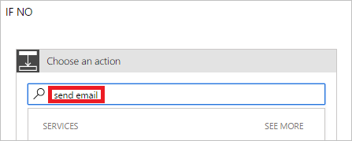

1. Select **Add an action** on the **IF NO, DO NOTHING** branch of the pre-approval condition.

1. Enter **Send email** into the search box of the **Choose an action** card.

     

1. Select the **Office 365 Outlook - Send an email** action.

     

1. Configure the **Send an email 3** card to suit your needs.

     This card represents the template for the email that's sent when the status of vacation requests change.