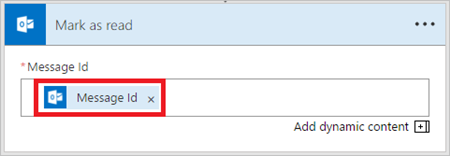

1. Select **New step** > **Add an action**.

1. Search for "read", and then select **Office 365 Outlook - Mark as read** from the list of actions.

     

1. Add the **MessageId** token into the **Message Id** box on the **Mark as read** card.

     If the **Message Id** token isn't visible, search for it by entering **Message Id** in the search box.

      